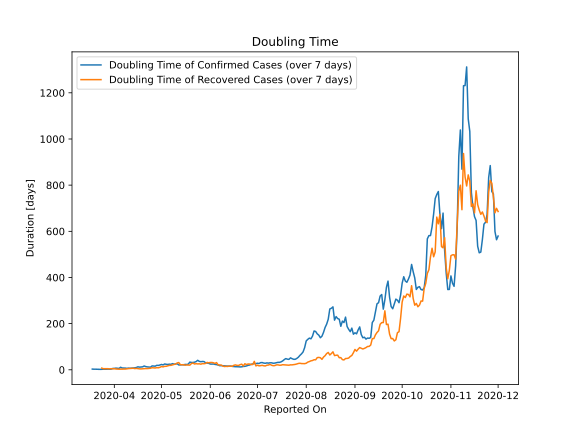

# Country Figures: New Infections in Previous 7 Days per 100,000 Population for Coted&#39;Ivoire 

<!--  --> 

| Reported On | &Delta; Confirmed (on the day) | &Delta; Confirmed (last 7 days) | New Cases in Previous 7 Days per 100,000 Population |
|-------------|--------------------------------|---------------------------------|-----------------------------------------------------|
| 2020-05-08 |  31  |  269  |  1.073  |
| 2020-05-07 |  55  |  296  |  1.181  |
| 2020-05-06 |  52  |  278  |  1.109  |
| 2020-05-05 |  32  |  281  |  1.121  |
| 2020-05-04 |  34  |  268  |  1.069  |
| 2020-05-03 |  36  |  248  |  0.989  |
| 2020-05-02 |  29  |  285  |  1.137  |
| 2020-05-01 |  58  |  256  |  1.021  |
| 2020-04-30 |  37  |  271  |  1.081  |
| 2020-04-29 |  55  |  286  |  1.141  |
| 2020-04-28 |  19  |  267  |  1.065  |
| 2020-04-27 |  14  |  317  |  1.264  |
| 2020-04-26 |  73  |  303  |  1.209  |
| 2020-04-25 |  None  |  276  |  1.101  |
| 2020-04-24 |  73  |  389  |  1.552  |
| 2020-04-23 |  52  |  350  |  1.396  |
| 2020-04-22 |  36  |  314  |  1.253  |
| 2020-04-21 |  69  |  278  |  1.109  |
| 2020-04-20 |  None  |  221  |  0.882  |
| 2020-04-19 |  46  |  273  |  1.089  |
| 2020-04-18 |  113  |  268  |  1.069  |
| 2020-04-17 |  34  |  244  |  0.973  |
| 2020-04-16 |  16  |  210  |  0.838  |
| 2020-04-15 |  None  |  254  |  1.013  |
| 2020-04-14 |  12  |  289  |  1.153  |
| 2020-04-13 |  52  |  303  |  1.209  |
| 2020-04-12 |  41  |  313  |  1.249  |
| 2020-04-11 |  89  |  288  |  1.149  |
| 2020-04-10 |  None  |  226  |  0.902  |
| 2020-04-09 |  60  |  250  |  0.997  |
| 2020-04-08 |  35  |  194  |  0.774  |
| 2020-04-07 |  26  |  170  |  0.678  |
| 2020-04-06 |  62  |  155  |  0.618  |
| 2020-04-05 |  16  |  96  |  0.383  |
| 2020-04-04 |  27  |  144  |  0.574  |
| 2020-04-03 |  24  |  117  |  0.467  |
| 2020-04-02 |  4  |  98  |  0.391  |
| 2020-04-01 |  11  |  110  |  0.439  |
| 2020-03-31 |  11  |  106  |  0.423  |
| 2020-03-30 |  3  |  143  |  0.570  |
| 2020-03-29 |  64  |  151  |  0.602  |
| 2020-03-28 |  None  |  87  |  0.347  |
| 2020-03-27 |  5  |  92  |  0.367  |
| 2020-03-26 |  16  |  87  |  0.347  |
| 2020-03-25 |  7  |  74  |  0.295  |
| 2020-03-24 |  48  |  68  |  0.271  |
| 2020-03-23 |  11  |  24  |  0.096  |
| 2020-03-22 |  None  |  13  |  0.052  |
| 2020-03-21 |  5  |  13  |  0.052  |
| 2020-03-20 |  None  |  8  |  0.032  |
| 2020-03-19 |  3  |  8  |  0.032  |
| 2020-03-18 |  1  |  5  |  0.020  |
| 2020-03-17 |  4  |  4  |  0.016  |
| 2020-03-16 |  None  |  None  |  None  |
| 2020-03-15 |  None  |  None  |  None  |
| 2020-03-14 |  None  |  None  |  None  |
| 2020-03-13 |  None  |  None  |  None  |
| 2020-03-12 |  None  |  None  |  None  |
| 2020-03-11 |  None  |  None  |  None  |
| 2020-01-27 |  None  |  None  |  None  |

