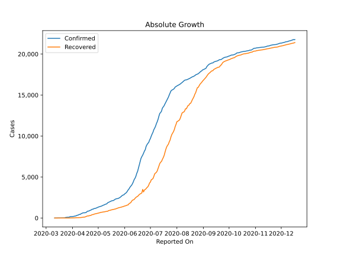

# Country Figures: Doubling Time of Infections for Coted&#39;Ivoire 

The doubling time below are calculated based on
* an exponential growth assumption
* for time difference of past seven (7) days.
The doubling time's unit is "days".

The first doubling time indicates the increase of confirmed (infected)
cases. There, the *higher* the number is, the better is to take control
of the disease.

The second doubling time indicates the increase of recovered (healed)
cases. There, the *lower* the number is, the better it is to take
control of the disease.

| Reported On | Confirmed | Doubling Time (Confirmed) | Recovered | Doubling Time (Recovered) |
|-------------|-----------|---------------------------|-----------|---------------------------|
| 2020-04-14 | 638 |  8.4 days  | 114 |  5.1 days  | 
| 2020-04-13 | 626 |  7.7 days  | 89 |  6.6 days  | 
| 2020-04-12 | 574 |  6.5 days  | 85 |  6.2 days  | 
| 2020-04-11 | 533 |  6.6 days  | 58 |  6.1 days  | 
| 2020-04-10 | 444 |  7.2 days  | 52 |  5.2 days  | 
| 2020-04-09 | 444 |  6.2 days  | 52 |  4.2 days  | 
| 2020-04-08 | 384 |  7.2 days  | 48 |  3.2 days  | 
| 2020-04-07 | 349 |  7.6 days  | 41 |  3.1 days  | 
| 2020-04-06 | 323 |  7.8 days  | 41 |  2.9 days  | 
| 2020-04-05 | 261 |  10.9 days  | 37 |  2.5 days  | 
| 2020-04-04 | 245 |  5.8 days  | 25 |  2.6 days  | 
| 2020-04-03 | 218 |  6.6 days  | 19 |  3.0 days  | 
| 2020-04-02 | 194 |  7.2 days  | 15 |  3.3 days  | 
| 2020-04-01 | 190 |  5.9 days  | 9 |  4.8 days  | 
| 2020-03-31 | 179 |  5.7 days  | 7 |  4.2 days  | 
| 2020-03-30 | 168 |  2.9 days  | 6 |  4.8 days  | 
| 2020-03-29 | 165 |  2.3 days  | 4 |  3.8 days  | 
| 2020-03-28 | 101 |  2.8 days  | 3 |  4.8 days  | 
| 2020-03-27 | 101 |  2.3 days  | 3 |  4.8 days  | 
| 2020-03-26 | 96 |  2.4 days  | 3 |  4.8 days  | 
| 2020-03-25 | 80 |  2.2 days  | 3 |  4.8 days  | 
| 2020-03-24 | 73 |  2.1 days  | 2 |  7.3 days  | 
| 2020-03-23 | 25 |  1.8 days  | 2 |  None  | 
| 2020-03-22 | 14 |  2.2 days  | 1 |  None  | 
| 2020-03-21 | 14 |  2.2 days  | 1 |  None  | 
| 2020-03-20 | 9 |  2.5 days  | 1 |  None  | 
| 2020-03-19 | 9 |  2.5 days  | 1 |  None  | 
| 2020-03-18 | 6 |  3.0 days  | 1 |  None  | 
| 2020-03-17 | 5 |  None  | 1 |  None  | 
| 2020-03-16 | 1 |  None  | 0 |  None  | 
| 2020-03-15 | 1 |  None  | 0 |  None  | 
| 2020-03-14 | 1 |  None  | 0 |  None  | 
| 2020-03-13 | 1 |  None  | 0 |  None  | 
| 2020-03-12 | 1 |  None  | 0 |  None  | 
| 2020-03-11 | 1 |  None  | 0 |  None  | 

