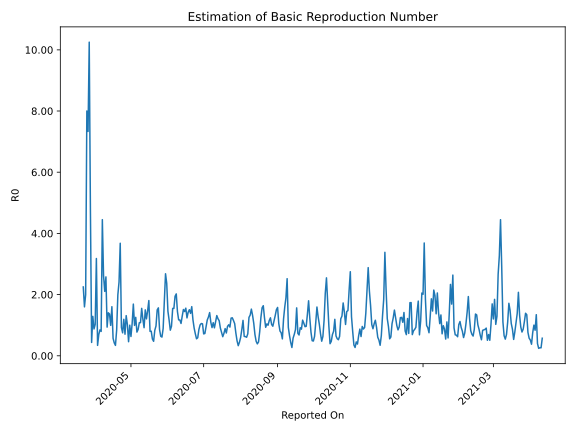

# Country Figures: Time Series for Basic Reproduction Number of Coted&#39;Ivoire 

| Reported On | &Delta; Confirmed | Total &Delta; Confirmed First Interval | Total &Delta; Confirmed Second Interval | Estimated Basic Reproduction Number R0 | 
|-------------|-------------------|----------------------------------------|-----------------------------------------|---------------------------------------------------|
| 2020-04-27 | 14 |  198  |  151  |  1.31  | 
| 2020-04-26 | 73 |  161  |  228  |  0.71  | 
| 2020-04-25 | 0 |  230  |  193  |  1.19  | 
| 2020-04-24 | 73 |  157  |  209  |  0.75  | 
| 2020-04-23 | 52 |  151  |  163  |  0.93  | 
| 2020-04-22 | 36 |  228  |  62  |  3.68  | 
| 2020-04-21 | 69 |  193  |  80  |  2.41  | 
| 2020-04-20 | 0 |  209  |  105  |  1.99  | 
| 2020-04-19 | 46 |  163  |  194  |  0.84  | 
| 2020-04-18 | 113 |  62  |  182  |  0.34  | 
| 2020-04-17 | 34 |  80  |  190  |  0.42  | 
| 2020-04-16 | 16 |  105  |  184  |  0.57  | 
| 2020-04-15 | 0 |  194  |  121  |  1.60  | 
| 2020-04-14 | 12 |  182  |  183  |  0.99  | 
| 2020-04-13 | 52 |  190  |  139  |  1.37  | 
| 2020-04-12 | 41 |  184  |  131  |  1.40  | 
| 2020-04-11 | 89 |  121  |  129  |  0.94  | 
| 2020-04-10 | 0 |  183  |  71  |  2.58  | 
| 2020-04-09 | 60 |  139  |  66  |  2.11  | 
| 2020-04-08 | 35 |  131  |  50  |  2.62  | 
| 2020-04-07 | 26 |  129  |  29  |  4.45  | 
| 2020-04-06 | 62 |  71  |  89  |  0.80  | 
| 2020-04-05 | 16 |  66  |  78  |  0.85  | 
| 2020-04-04 | 27 |  50  |  72  |  0.69  | 
| 2020-04-03 | 24 |  29  |  85  |  0.34  | 
| 2020-04-02 | 4 |  89  |  28  |  3.18  | 
| 2020-04-01 | 11 |  78  |  76  |  1.03  | 
| 2020-03-31 | 11 |  72  |  82  |  0.88  | 
| 2020-03-30 | 3 |  85  |  66  |  1.29  | 
| 2020-03-29 | 64 |  28  |  64  |  0.44  | 
| 2020-03-28 | 0 |  76  |  16  |  4.75  | 
| 2020-03-27 | 5 |  82  |  8  |  10.25  | 
| 2020-03-26 | 16 |  66  |  9  |  7.33  | 
| 2020-03-25 | 7 |  64  |  8  |  8.00  | 
| 2020-03-24 | 48 |  16  |  8  |  2.00  | 
| 2020-03-23 | 11 |  8  |  5  |  1.60  | 
| 2020-03-22 | 0 |  9  |  4  |  2.25  | 
| 2020-03-21 | 5 |  8  |  None  |  None  | 
| 2020-03-20 | 0 |  8  |  None  |  None  | 
| 2020-03-19 | 3 |  5  |  None  |  None  | 
| 2020-03-18 | 1 |  4  |  None  |  None  | 
| 2020-03-17 | 4 |  None  |  None  |  None  | 
| 2020-03-16 | 0 |  None  |  None  |  None  | 
| 2020-03-15 | 0 |  None  |  None  |  None  | 
| 2020-03-14 | 0 |  None  |  None  |  None  | 
| 2020-03-13 | 0 |  None  |  None  |  None  | 
| 2020-03-12 | 0 |  None  |  None  |  None  | 
| 2020-03-11 | 0 |  None  |  None  |  None  | 
| 2020-01-27 | None |  None  |  None  |  None  | 

