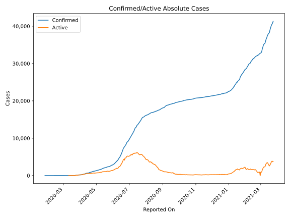
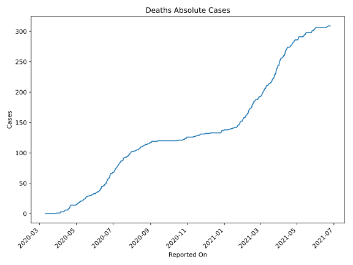
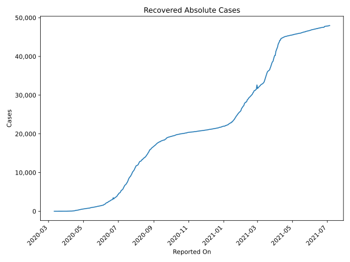
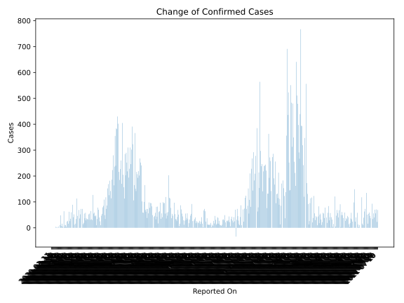
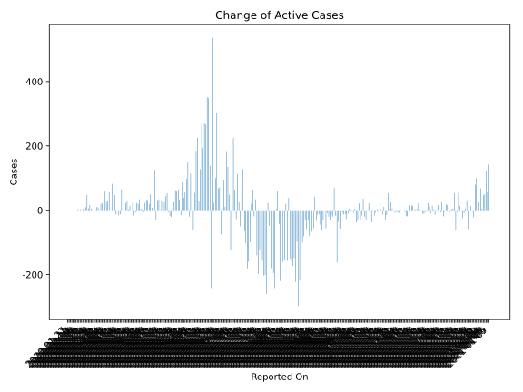
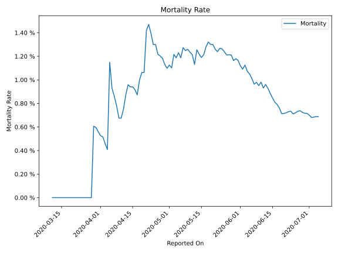

# Country Figures: Time Series for Coted&#39;Ivoire 

| Reported On | Confirmed | Deaths | Recovered | Active | Mortality | &Delta; Confirmed | &Delta; Deaths | &Delta; Recovered | &Delta; Active | % Active of Population |
|-------------|-----------|--------|-----------|--------|-----------|-------------------|----------------|-------------------|----------------|------------------------|
| 2020-05-09 | 1667 | 21 | 769 | 877 |  1.26 %  | 65 | 1 | 15 | 49 |  0.003 %  | 
| 2020-05-08 | 1602 | 20 | 754 | 828 |  1.25 %  | 31 | 0 | 12 | 19 |  0.003 %  | 
| 2020-05-07 | 1571 | 20 | 742 | 809 |  1.27 %  | 55 | 2 | 21 | 32 |  0.003 %  | 
| 2020-05-06 | 1516 | 18 | 721 | 777 |  1.19 %  | 52 | 0 | 20 | 32 |  0.003 %  | 
| 2020-05-05 | 1464 | 18 | 701 | 745 |  1.23 %  | 32 | 1 | 8 | 23 |  0.003 %  | 
| 2020-05-04 | 1432 | 17 | 693 | 722 |  1.19 %  | 34 | 0 | 40 | -6 |  0.003 %  | 
| 2020-05-03 | 1398 | 17 | 653 | 728 |  1.22 %  | 36 | 2 | 31 | 3 |  0.003 %  | 
| 2020-05-02 | 1362 | 15 | 622 | 725 |  1.10 %  | 29 | 0 | 25 | 4 |  0.003 %  | 
| 2020-05-01 | 1333 | 15 | 597 | 721 |  1.13 %  | 58 | 1 | 23 | 34 |  0.003 %  | 
| 2020-04-30 | 1275 | 14 | 574 | 687 |  1.10 %  | 37 | 0 | 17 | 20 |  0.003 %  | 
| 2020-04-29 | 1238 | 14 | 557 | 667 |  1.13 %  | 55 | 0 | 32 | 23 |  0.003 %  | 
| 2020-04-28 | 1183 | 14 | 525 | 644 |  1.18 %  | 19 | 0 | 26 | -7 |  0.003 %  | 
| 2020-04-27 | 1164 | 14 | 499 | 651 |  1.20 %  | 14 | 0 | 31 | -17 |  0.003 %  | 
| 2020-04-26 | 1150 | 14 | 468 | 668 |  1.22 %  | 73 | 0 | 49 | 24 |  0.003 %  | 
| 2020-04-25 | 1077 | 14 | 419 | 644 |  1.30 %  | 0 | 0 | 0 | 0 |  0.003 %  | 
| 2020-04-24 | 1077 | 14 | 419 | 644 |  1.30 %  | 73 | 0 | 60 | 13 |  0.003 %  | 
| 2020-04-23 | 1004 | 14 | 359 | 631 |  1.39 %  | 52 | 0 | 49 | 3 |  0.003 %  | 
| 2020-04-22 | 952 | 14 | 310 | 628 |  1.47 %  | 36 | 1 | 7 | 28 |  0.003 %  | 
| 2020-04-21 | 916 | 13 | 303 | 600 |  1.42 %  | 69 | 4 | 43 | 22 |  0.002 %  | 
| 2020-04-20 | 847 | 9 | 260 | 578 |  1.06 %  | 0 | 0 | 0 | 0 |  0.002 %  | 
| 2020-04-19 | 847 | 9 | 260 | 578 |  1.06 %  | 46 | 1 | 21 | 24 |  0.002 %  | 
| 2020-04-18 | 801 | 8 | 239 | 554 |  1.00 %  | 113 | 2 | 46 | 65 |  0.002 %  | 
| 2020-04-17 | 688 | 6 | 193 | 489 |  0.87 %  | 34 | 0 | 47 | -13 |  0.002 %  | 
| 2020-04-16 | 654 | 6 | 146 | 502 |  0.92 %  | 16 | 0 | 32 | -16 |  0.002 %  | 
| 2020-04-15 | 638 | 6 | 114 | 518 |  0.94 %  | 0 | 0 | 0 | 0 |  0.002 %  | 
| 2020-04-14 | 638 | 6 | 114 | 518 |  0.94 %  | 12 | 0 | 25 | -13 |  0.002 %  | 
| 2020-04-13 | 626 | 6 | 89 | 531 |  0.96 %  | 52 | 1 | 4 | 47 |  0.002 %  | 
| 2020-04-12 | 574 | 5 | 85 | 484 |  0.87 %  | 41 | 1 | 27 | 13 |  0.002 %  | 
| 2020-04-11 | 533 | 4 | 58 | 471 |  0.75 %  | 89 | 1 | 6 | 82 |  0.002 %  | 
| 2020-04-10 | 444 | 3 | 52 | 389 |  0.68 %  | 0 | 0 | 0 | 0 |  0.002 %  | 
| 2020-04-09 | 444 | 3 | 52 | 389 |  0.68 %  | 60 | 0 | 4 | 56 |  0.002 %  | 
| 2020-04-08 | 384 | 3 | 48 | 333 |  0.78 %  | 35 | 0 | 7 | 28 |  0.001 %  | 
| 2020-04-07 | 349 | 3 | 41 | 305 |  0.86 %  | 26 | 0 | 0 | 26 |  0.001 %  | 
| 2020-04-06 | 323 | 3 | 41 | 279 |  0.93 %  | 62 | 0 | 4 | 58 |  0.001 %  | 
| 2020-04-05 | 261 | 3 | 37 | 221 |  1.15 %  | 16 | 2 | 12 | 2 |  0.001 %  | 
| 2020-04-04 | 245 | 1 | 25 | 219 |  0.41 %  | 27 | 0 | 6 | 21 |  0.001 %  | 
| 2020-04-03 | 218 | 1 | 19 | 198 |  0.46 %  | 24 | 0 | 4 | 20 |  0.001 %  | 
| 2020-04-02 | 194 | 1 | 15 | 178 |  0.52 %  | 4 | 0 | 6 | -2 |  0.001 %  | 
| 2020-04-01 | 190 | 1 | 9 | 180 |  0.53 %  | 11 | 0 | 2 | 9 |  0.001 %  | 
| 2020-03-31 | 179 | 1 | 7 | 171 |  0.56 %  | 11 | 0 | 1 | 10 |  0.001 %  | 
| 2020-03-30 | 168 | 1 | 6 | 161 |  0.60 %  | 3 | 0 | 2 | 1 |  0.001 %  | 
| 2020-03-29 | 165 | 1 | 4 | 160 |  0.61 %  | 64 | 1 | 1 | 62 |  0.001 %  | 
| 2020-03-28 | 101 | 0 | 3 | 98 |  None  | 0 | 0 | 0 | 0 |  0.000 %  | 
| 2020-03-27 | 101 | 0 | 3 | 98 |  None  | 5 | 0 | 0 | 5 |  0.000 %  | 
| 2020-03-26 | 96 | 0 | 3 | 93 |  None  | 16 | 0 | 0 | 16 |  0.000 %  | 
| 2020-03-25 | 80 | 0 | 3 | 77 |  None  | 7 | 0 | 1 | 6 |  0.000 %  | 
| 2020-03-24 | 73 | 0 | 2 | 71 |  None  | 48 | 0 | 0 | 48 |  0.000 %  | 
| 2020-03-23 | 25 | 0 | 2 | 23 |  None  | 11 | 0 | 1 | 10 |  0.000 %  | 
| 2020-03-22 | 14 | 0 | 1 | 13 |  None  | 0 | 0 | 0 | 0 |  0.000 %  | 
| 2020-03-21 | 14 | 0 | 1 | 13 |  None  | 5 | 0 | 0 | 5 |  0.000 %  | 
| 2020-03-20 | 9 | 0 | 1 | 8 |  None  | 0 | 0 | 0 | 0 |  0.000 %  | 
| 2020-03-19 | 9 | 0 | 1 | 8 |  None  | 3 | 0 | 0 | 3 |  0.000 %  | 
| 2020-03-18 | 6 | 0 | 1 | 5 |  None  | 1 | 0 | 0 | 1 |  0.000 %  | 
| 2020-03-17 | 5 | 0 | 1 | 4 |  None  | 4 | 0 | 1 | 3 |  0.000 %  | 
| 2020-03-16 | 1 | 0 | 0 | 1 |  None  | 0 | 0 | 0 | 0 |  0.000 %  | 
| 2020-03-15 | 1 | 0 | 0 | 1 |  None  | 0 | 0 | 0 | 0 |  0.000 %  | 
| 2020-03-14 | 1 | 0 | 0 | 1 |  None  | 0 | 0 | 0 | 0 |  0.000 %  | 
| 2020-03-13 | 1 | 0 | 0 | 1 |  None  | 0 | 0 | 0 | 0 |  0.000 %  | 
| 2020-03-12 | 1 | 0 | 0 | 1 |  None  | 0 | 0 | 0 | 0 |  0.000 %  | 
| 2020-03-11 | 1 | 0 | 0 | 1 |  None  | 0 | None | None | None |  0.000 %  | 
| 2020-01-27 | 1 | None | None | None |  None  | None | None | None | None |  n/a  | 

