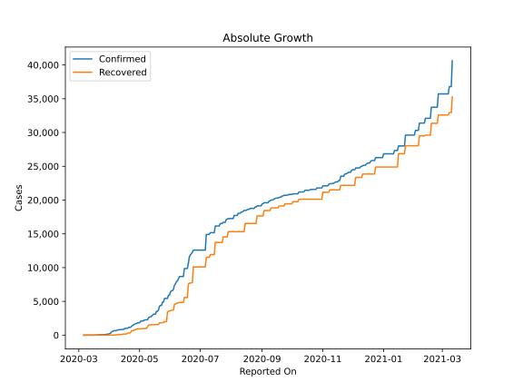
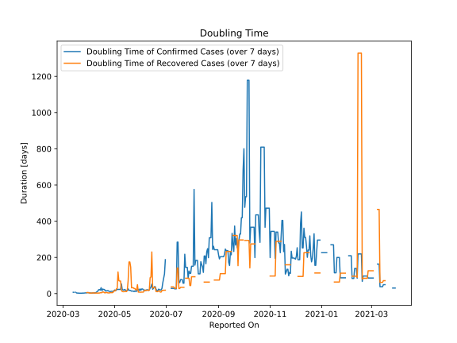

# Country Figures: Doubling Time of Infections for Cameroon 

The doubling time below are calculated based on
* an exponential growth assumption
* for time difference of past seven (7) days.
The doubling time's unit is "days".

The first doubling time indicates the increase of confirmed (infected)
cases. There, the *higher* the number is, the better is to take control
of the disease.

The second doubling time indicates the increase of recovered (healed)
cases. There, the *lower* the number is, the better it is to take
control of the disease.

| Reported On | Confirmed | Doubling Time (Confirmed) | Recovered | Doubling Time (Recovered) |
|-------------|-----------|---------------------------|-----------|---------------------------|
| 2020-05-04 | 2104 |  23.4 days  | 953 |  29.1 days  | 
| 2020-05-03 | 2077 |  19.9 days  | 953 |  25.5 days  | 
| 2020-05-02 | 2077 |  15.8 days  | 953 |  15.9 days  | 
| 2020-05-01 | 1832 |  19.9 days  | 934 |  14.8 days  | 
| 2020-04-30 | 1832 |  15.6 days  | 934 |  14.8 days  | 
| 2020-04-29 | 1832 |  11.0 days  | 934 |  6.0 days  | 
| 2020-04-28 | 1705 |  13.0 days  | 915 |  5.1 days  | 
| 2020-04-27 | 1705 |  13.0 days  | 805 |  5.3 days  | 
| 2020-04-26 | 1621 |  10.8 days  | 786 |  5.5 days  | 
| 2020-04-25 | 1518 |  12.5 days  | 697 |  3.9 days  | 
| 2020-04-24 | 1430 |  13.8 days  | 668 |  3.8 days  | 
| 2020-04-23 | 1334 |  16.9 days  | 668 |  3.8 days  | 
| 2020-04-22 | 1163 |  15.7 days  | 397 |  5.9 days  | 
| 2020-04-21 | 1163 |  15.7 days  | 329 |  5.6 days  | 
| 2020-04-20 | 1163 |  14.2 days  | 305 |  4.6 days  | 
| 2020-04-19 | 1017 |  22.9 days  | 305 |  4.6 days  | 
| 2020-04-18 | 1017 |  22.9 days  | 177 |  8.5 days  | 
| 2020-04-17 | 996 |  25.3 days  | 164 |  9.8 days  | 
| 2020-04-16 | 996 |  16.0 days  | 164 |  5.2 days  | 
| 2020-04-15 | 848 |  32.7 days  | 165 |  5.1 days  | 
| 2020-04-14 | 848 |  19.5 days  | 130 |  4.7 days  | 
| 2020-04-13 | 820 |  22.4 days  | 98 |  3.1 days  | 
| 2020-04-12 | 820 |  21.2 days  | 98 |  3.1 days  | 
| 2020-04-11 | 820 |  12.8 days  | 98 |  3.1 days  | 
| 2020-04-10 | 820 |  10.5 days  | 98 |  3.1 days  | 
| 2020-04-09 | 730 |  5.9 days  | 60 |  3.0 days  | 
| 2020-04-08 | 730 |  4.6 days  | 60 |  3.0 days  | 
| 2020-04-07 | 658 |  4.3 days  | 43 |  2.6 days  | 
| 2020-04-06 | 658 |  3.5 days  | 17 |  4.3 days  | 
| 2020-04-05 | 650 |  3.5 days  | 17 |  4.3 days  | 
| 2020-04-04 | 555 |  3.0 days  | 17 |  2.6 days  | 
| 2020-04-03 | 509 |  3.2 days  | 17 |  2.6 days  | 
| 2020-04-02 | 306 |  3.8 days  | 10 |  3.3 days  | 
| 2020-04-01 | 233 |  4.6 days  | 10 |  3.3 days  | 
| 2020-03-31 | 193 |  4.9 days  | 5 |  5.6 days  | 
| 2020-03-30 | 139 |  5.7 days  | 5 |  5.6 days  | 
| 2020-03-29 | 139 |  4.2 days  | 5 |  5.6 days  | 
| 2020-03-28 | 91 |  4.3 days  | 2 |  None  | 
| 2020-03-27 | 91 |  3.5 days  | 2 |  None  | 
| 2020-03-26 | 75 |  3.1 days  | 2 |  None  | 
| 2020-03-25 | 75 |  2.7 days  | 2 |  None  | 
| 2020-03-24 | 66 |  2.9 days  | 2 |  None  | 
| 2020-03-23 | 56 |  2.2 days  | 2 |  None  | 
| 2020-03-22 | 40 |  1.9 days  | 2 |  None  | 
| 2020-03-21 | 27 |  2.2 days  | 0 |  None  | 
| 2020-03-20 | 20 |  2.4 days  | 0 |  None  | 
| 2020-03-19 | 13 |  2.9 days  | 0 |  None  | 
| 2020-03-18 | 10 |  3.3 days  | 0 |  None  | 
| 2020-03-17 | 10 |  3.3 days  | 0 |  None  | 
| 2020-03-16 | 4 |  7.3 days  | 0 |  None  | 
| 2020-03-15 | 2 |  None  | 0 |  None  | 
| 2020-03-14 | 2 |  7.3 days  | 0 |  None  | 
| 2020-03-13 | 2 |  7.3 days  | 0 |  None  | 
| 2020-03-12 | 2 |  None  | 0 |  None  | 
| 2020-03-11 | 2 |  None  | 0 |  None  | 
| 2020-03-10 | 2 |  None  | 0 |  None  | 
| 2020-03-09 | 2 |  None  | 0 |  None  | 
| 2020-03-08 | 2 |  None  | 0 |  None  | 
| 2020-03-07 | 1 |  None  | 0 |  None  | 
| 2020-03-06 | 1 |  None  | 0 |  None  | 

