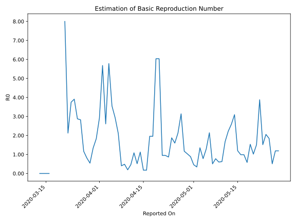

# Country Figures: Time Series for Basic Reproduction Number of Cameroon 

| Reported On | &Delta; Confirmed | Total &Delta; Confirmed First Interval | Total &Delta; Confirmed Second Interval | Estimated Basic Reproduction Number R0 | 
|-------------|-------------------|----------------------------------------|-----------------------------------------|---------------------------------------------------|
| 2020-05-01 | 0 |  211  |  458  |  0.46  | 
| 2020-04-30 | 0 |  314  |  355  |  0.88  | 
| 2020-04-29 | 127 |  275  |  267  |  1.03  | 
| 2020-04-28 | 0 |  371  |  317  |  1.17  | 
| 2020-04-27 | 84 |  458  |  146  |  3.14  | 
| 2020-04-26 | 103 |  355  |  167  |  2.13  | 
| 2020-04-25 | 88 |  267  |  167  |  1.60  | 
| 2020-04-24 | 96 |  317  |  169  |  1.88  | 
| 2020-04-23 | 171 |  146  |  169  |  0.86  | 
| 2020-04-22 | 0 |  167  |  176  |  0.95  | 
| 2020-04-21 | 0 |  167  |  176  |  0.95  | 
| 2020-04-20 | 146 |  169  |  28  |  6.04  | 
| 2020-04-19 | 0 |  169  |  28  |  6.04  | 
| 2020-04-18 | 21 |  176  |  90  |  1.96  | 
| 2020-04-17 | 0 |  176  |  90  |  1.96  | 
| 2020-04-16 | 148 |  28  |  162  |  0.17  | 
| 2020-04-15 | 0 |  28  |  162  |  0.17  | 
| 2020-04-14 | 28 |  90  |  80  |  1.12  | 
| 2020-04-13 | 0 |  90  |  175  |  0.51  | 
| 2020-04-12 | 0 |  162  |  149  |  1.09  | 
| 2020-04-11 | 0 |  162  |  352  |  0.46  | 
| 2020-04-10 | 90 |  80  |  417  |  0.19  | 
| 2020-04-09 | 0 |  175  |  362  |  0.48  | 
| 2020-04-08 | 72 |  149  |  370  |  0.40  | 
| 2020-04-07 | 0 |  352  |  167  |  2.11  | 
| 2020-04-06 | 8 |  417  |  142  |  2.94  | 
| 2020-04-05 | 95 |  362  |  102  |  3.55  | 
| 2020-04-04 | 46 |  370  |  64  |  5.78  | 
| 2020-04-03 | 203 |  167  |  64  |  2.61  | 
| 2020-04-02 | 73 |  142  |  25  |  5.68  | 
| 2020-04-01 | 40 |  102  |  35  |  2.91  | 
| 2020-03-31 | 54 |  64  |  35  |  1.83  | 
| 2020-03-30 | 0 |  64  |  48  |  1.33  | 
| 2020-03-29 | 48 |  25  |  46  |  0.54  | 
| 2020-03-28 | 0 |  35  |  43  |  0.81  | 
| 2020-03-27 | 16 |  35  |  30  |  1.17  | 
| 2020-03-26 | 0 |  48  |  17  |  2.82  | 
| 2020-03-25 | 9 |  46  |  16  |  2.88  | 
| 2020-03-24 | 10 |  43  |  11  |  3.91  | 
| 2020-03-23 | 16 |  30  |  8  |  3.75  | 
| 2020-03-22 | 13 |  17  |  8  |  2.12  | 
| 2020-03-21 | 7 |  16  |  2  |  8.00  | 
| 2020-03-20 | 7 |  11  |  None  |  None  | 
| 2020-03-19 | 3 |  8  |  None  |  None  | 
| 2020-03-18 | 0 |  8  |  None  |  None  | 
| 2020-03-17 | 6 |  2  |  None  |  None  | 
| 2020-03-16 | 2 |  None  |  1  |  None  | 
| 2020-03-15 | 0 |  None  |  1  |  None  | 
| 2020-03-14 | 0 |  None  |  1  |  None  | 
| 2020-03-13 | 0 |  None  |  1  |  None  | 
| 2020-03-12 | 0 |  1  |  None  |  None  | 
| 2020-03-11 | 0 |  1  |  None  |  None  | 
| 2020-03-10 | 0 |  1  |  None  |  None  | 
| 2020-03-09 | 0 |  1  |  None  |  None  | 
| 2020-03-08 | 1 |  None  |  None  |  None  | 
| 2020-03-07 | 0 |  None  |  None  |  None  | 
| 2020-03-06 | None |  None  |  None  |  None  | 

