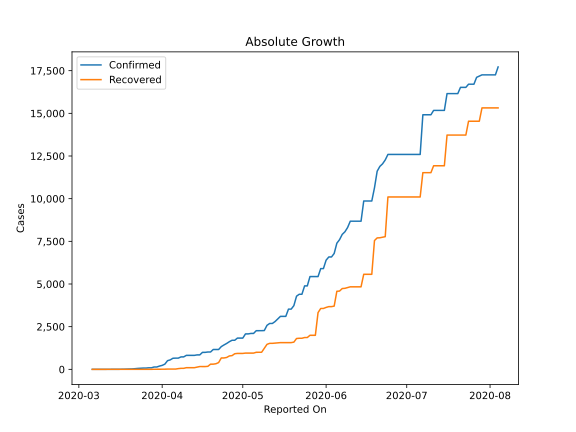
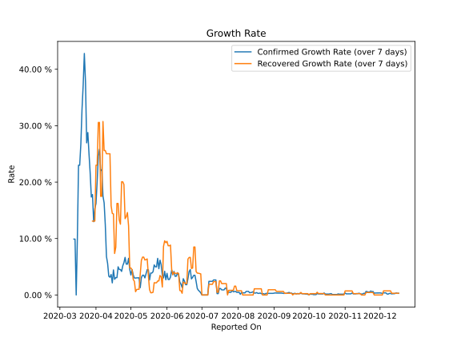

# Country Figures: Growth Rate for Cameroon 

The growth rates below are calculated based on
* an exponential growth assumption
* for time difference of past seven (7) days.
The growth rate is to be understood as on "growth per day".

The first growth rate indicates the increase of confirmed (infected) cases.

The second growth rate indicates the increase of recovered (healed) cases.

| Reported On | Confirmed | Growth Rate (Confirmed) | Recovered | Growth Rate (Recovered) |
|-------------|-----------|-------------------------|-----------|-------------------------|
| 2020-05-08 | 2267 |  3.04 %  | 1002 |  1.004 %  | 
| 2020-05-07 | 2267 |  3.04 %  | 1002 |  1.004 %  | 
| 2020-05-06 | 2265 |  3.03 %  | 1000 |  0.975 %  | 
| 2020-05-05 | 2104 |  3.00 %  | 953 |  0.581 %  | 
| 2020-05-04 | 2104 |  3.00 %  | 953 |  2.411 %  | 
| 2020-05-03 | 2077 |  3.54 %  | 953 |  2.752 %  | 
| 2020-05-02 | 2077 |  4.48 %  | 953 |  4.469 %  | 
| 2020-05-01 | 1832 |  3.54 %  | 934 |  4.788 %  | 
| 2020-04-30 | 1832 |  4.53 %  | 934 |  4.788 %  | 
| 2020-04-29 | 1832 |  6.49 %  | 934 |  12.222 %  | 
| 2020-04-28 | 1705 |  5.47 %  | 915 |  14.612 %  | 
| 2020-04-27 | 1705 |  5.47 %  | 805 |  13.865 %  | 
| 2020-04-26 | 1621 |  6.66 %  | 786 |  13.524 %  | 
| 2020-04-25 | 1518 |  5.72 %  | 697 |  19.581 %  | 
| 2020-04-24 | 1430 |  5.17 %  | 668 |  20.063 %  | 
| 2020-04-23 | 1334 |  4.17 %  | 668 |  20.063 %  | 
| 2020-04-22 | 1163 |  4.51 %  | 397 |  12.543 %  | 
| 2020-04-21 | 1163 |  4.51 %  | 329 |  13.265 %  | 
| 2020-04-20 | 1163 |  4.99 %  | 305 |  16.219 %  | 
| 2020-04-19 | 1017 |  3.08 %  | 305 |  16.219 %  | 
| 2020-04-18 | 1017 |  3.08 %  | 177 |  8.445 %  | 
| 2020-04-17 | 996 |  2.78 %  | 164 |  7.356 %  | 
| 2020-04-16 | 996 |  4.44 %  | 164 |  14.365 %  | 
| 2020-04-15 | 848 |  2.14 %  | 165 |  14.451 %  | 
| 2020-04-14 | 848 |  3.62 %  | 130 |  15.805 %  | 
| 2020-04-13 | 820 |  3.14 %  | 98 |  25.025 %  | 
| 2020-04-12 | 820 |  3.32 %  | 98 |  25.025 %  | 
| 2020-04-11 | 820 |  5.58 %  | 98 |  25.025 %  | 
| 2020-04-10 | 820 |  6.81 %  | 98 |  25.025 %  | 
| 2020-04-09 | 730 |  12.42 %  | 60 |  25.597 %  | 
| 2020-04-08 | 730 |  16.31 %  | 60 |  25.597 %  | 
| 2020-04-07 | 658 |  17.52 %  | 43 |  30.739 %  | 
| 2020-04-06 | 658 |  22.21 %  | 17 |  17.483 %  | 
| 2020-04-05 | 650 |  22.04 %  | 17 |  17.483 %  | 
| 2020-04-04 | 555 |  25.83 %  | 17 |  30.572 %  | 
| 2020-04-03 | 509 |  24.59 %  | 17 |  30.572 %  | 
| 2020-04-02 | 306 |  20.09 %  | 10 |  22.992 %  | 
| 2020-04-01 | 233 |  16.19 %  | 10 |  22.992 %  | 
| 2020-03-31 | 193 |  15.33 %  | 5 |  13.090 %  | 
| 2020-03-30 | 139 |  12.99 %  | 5 |  13.090 %  | 
| 2020-03-29 | 139 |  17.79 %  | 5 |  13.090 %  | 
| 2020-03-28 | 91 |  17.36 %  | 2 |  None  | 
| 2020-03-27 | 91 |  21.64 %  | 2 |  None  | 
| 2020-03-26 | 75 |  25.04 %  | 2 |  None  | 
| 2020-03-25 | 75 |  28.78 %  | 2 |  None  | 
| 2020-03-24 | 66 |  26.96 %  | 2 |  None  | 
| 2020-03-23 | 56 |  37.70 %  | 2 |  None  | 
| 2020-03-22 | 40 |  42.80 %  | 2 |  None  | 
| 2020-03-21 | 27 |  37.18 %  | 0 |  None  | 
| 2020-03-20 | 20 |  32.89 %  | 0 |  None  | 
| 2020-03-19 | 13 |  26.74 %  | 0 |  None  | 
| 2020-03-18 | 10 |  22.99 %  | 0 |  None  | 
| 2020-03-17 | 10 |  22.99 %  | 0 |  None  | 
| 2020-03-16 | 4 |  9.90 %  | 0 |  None  | 
| 2020-03-15 | 2 |  None  | 0 |  None  | 
| 2020-03-14 | 2 |  9.90 %  | 0 |  None  | 
| 2020-03-13 | 2 |  9.90 %  | 0 |  None  | 
| 2020-03-12 | 2 |  None  | 0 |  None  | 
| 2020-03-11 | 2 |  None  | 0 |  None  | 
| 2020-03-10 | 2 |  None  | 0 |  None  | 
| 2020-03-09 | 2 |  None  | 0 |  None  | 
| 2020-03-08 | 2 |  None  | 0 |  None  | 
| 2020-03-07 | 1 |  None  | 0 |  None  | 
| 2020-03-06 | 1 |  None  | 0 |  None  | 

