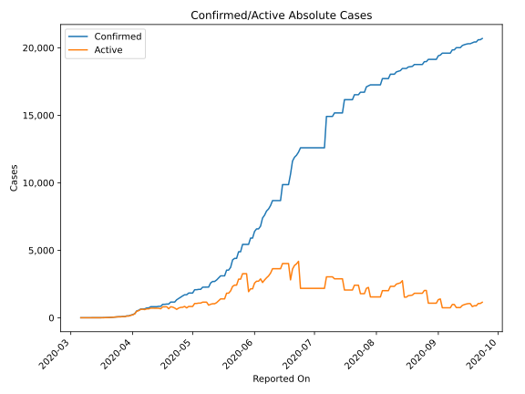
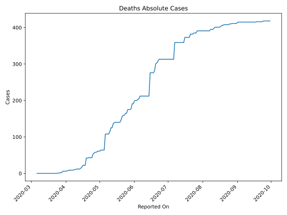
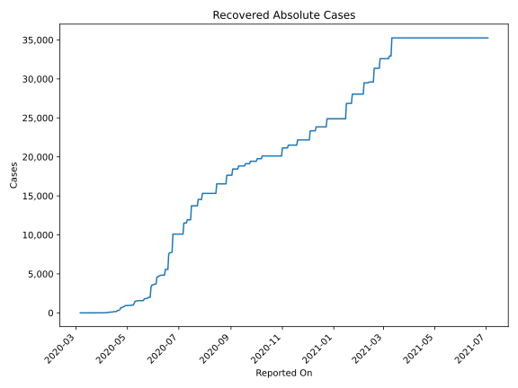
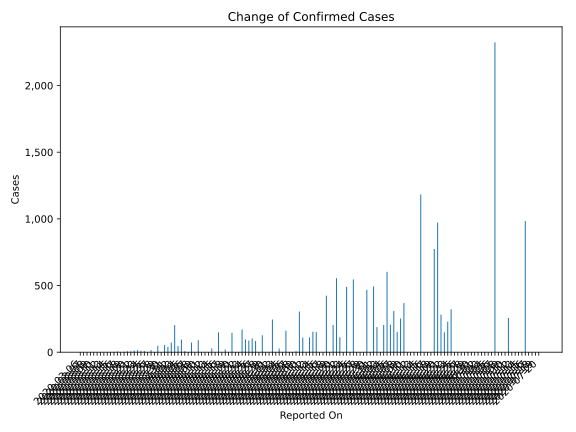
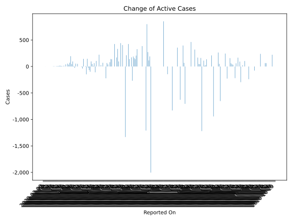
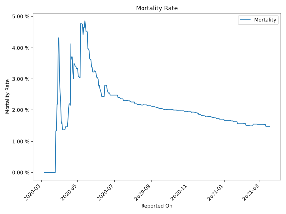

# Country Figures: Time Series for Cameroon 

| Reported On | Confirmed | Deaths | Recovered | Active | Mortality | &Delta; Confirmed | &Delta; Deaths | &Delta; Active | % Active of Population |
|-------------|-----------|--------|-----------|--------|-----------|-------------------|----------------|----------------|------------------------|
| 2020-04-01 | 233 | 6 | 10 | 217 |  2.58 %  | 40 | 0 | 35 |  0.001 %  | 
| 2020-03-31 | 193 | 6 | 5 | 182 |  3.11 %  | 54 | 0 | 54 |  0.001 %  | 
| 2020-03-30 | 139 | 6 | 5 | 128 |  4.32 %  | 0 | 0 | 0 |  0.001 %  | 
| 2020-03-29 | 139 | 6 | 5 | 128 |  4.32 %  | 48 | 4 | 41 |  0.001 %  | 
| 2020-03-28 | 91 | 2 | 2 | 87 |  2.20 %  | 0 | 0 | 0 |  0.000 %  | 
| 2020-03-27 | 91 | 2 | 2 | 87 |  2.20 %  | 16 | 1 | 15 |  0.000 %  | 
| 2020-03-26 | 75 | 1 | 2 | 72 |  1.33 %  | 0 | 0 | 0 |  0.000 %  | 
| 2020-03-25 | 75 | 1 | 2 | 72 |  1.33 %  | 9 | 1 | 8 |  0.000 %  | 
| 2020-03-24 | 66 | 0 | 2 | 64 |  None  | 10 | 0 | 10 |  0.000 %  | 
| 2020-03-23 | 56 | 0 | 2 | 54 |  None  | 16 | 0 | 16 |  0.000 %  | 
| 2020-03-22 | 40 | 0 | 2 | 38 |  None  | 13 | 0 | 11 |  0.000 %  | 
| 2020-03-21 | 27 | 0 | 0 | 27 |  None  | 7 | 0 | 7 |  0.000 %  | 
| 2020-03-20 | 20 | 0 | 0 | 20 |  None  | 7 | 0 | 7 |  0.000 %  | 
| 2020-03-19 | 13 | 0 | 0 | 13 |  None  | 3 | 0 | 3 |  0.000 %  | 
| 2020-03-18 | 10 | 0 | 0 | 10 |  None  | 0 | 0 | 0 |  0.000 %  | 
| 2020-03-17 | 10 | 0 | 0 | 10 |  None  | 6 | 0 | 6 |  0.000 %  | 
| 2020-03-16 | 4 | 0 | 0 | 4 |  None  | 2 | 0 | 2 |  0.000 %  | 
| 2020-03-15 | 2 | 0 | 0 | 2 |  None  | 0 | 0 | 0 |  0.000 %  | 
| 2020-03-14 | 2 | 0 | 0 | 2 |  None  | 0 | 0 | 0 |  0.000 %  | 
| 2020-03-13 | 2 | 0 | 0 | 2 |  None  | 0 | 0 | 0 |  0.000 %  | 
| 2020-03-12 | 2 | 0 | 0 | 2 |  None  | 0 | 0 | 0 |  0.000 %  | 
| 2020-03-11 | 2 | 0 | 0 | 2 |  None  | 0 | 0 | 0 |  0.000 %  | 
| 2020-03-10 | 2 | 0 | 0 | 2 |  None  | 0 | 0 | 0 |  0.000 %  | 
| 2020-03-09 | 2 | 0 | 0 | 2 |  None  | 0 | 0 | 0 |  0.000 %  | 
| 2020-03-08 | 2 | 0 | 0 | 2 |  None  | 1 | 0 | 1 |  0.000 %  | 
| 2020-03-07 | 1 | 0 | 0 | 1 |  None  | 0 | 0 | 0 |  0.000 %  | 
| 2020-03-06 | 1 | 0 | 0 | 1 |  None  | None | None | None |  0.000 %  | 

