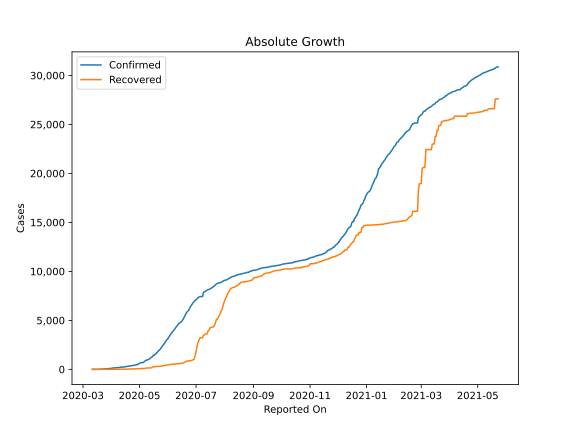
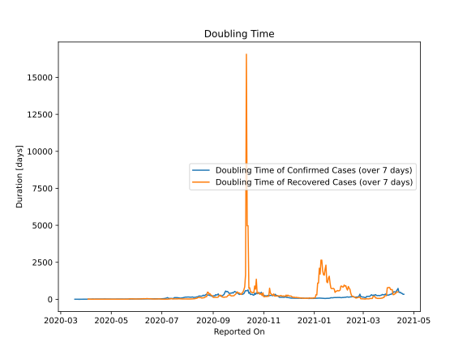

# Country Figures: Doubling Time of Infections for Congo(Kinshasa) 

The doubling time below are calculated based on
* an exponential growth assumption
* for time difference of past seven (7) days.
The doubling time's unit is "days".

The first doubling time indicates the increase of confirmed (infected)
cases. There, the *higher* the number is, the better is to take control
of the disease.

The second doubling time indicates the increase of recovered (healed)
cases. There, the *lower* the number is, the better it is to take
control of the disease.

| Reported On | Confirmed | Doubling Time (Confirmed) | Recovered | Doubling Time (Recovered) |
|-------------|-----------|---------------------------|-----------|---------------------------|
| 2020-05-01 | 604 |  11.7 days  | 75 |  11.2 days  | 
| 2020-04-30 | 572 |  12.0 days  | 73 |  11.4 days  | 
| 2020-04-29 | 491 |  15.8 days  | 59 |  18.3 days  | 
| 2020-04-28 | 471 |  16.7 days  | 56 |  10.7 days  | 
| 2020-04-27 | 459 |  15.3 days  | 50 |  8.2 days  | 
| 2020-04-26 | 442 |  16.4 days  | 50 |  7.8 days  | 
| 2020-04-25 | 416 |  16.3 days  | 49 |  8.0 days  | 
| 2020-04-24 | 394 |  15.7 days  | 48 |  7.8 days  | 
| 2020-04-23 | 377 |  14.4 days  | 47 |  7.1 days  | 
| 2020-04-22 | 359 |  14.4 days  | 45 |  6.7 days  | 
| 2020-04-21 | 350 |  13.3 days  | 35 |  9.0 days  | 
| 2020-04-20 | 332 |  14.4 days  | 27 |  10.8 days  | 
| 2020-04-19 | 327 |  14.8 days  | 26 |  10.3 days  | 
| 2020-04-18 | 307 |  15.5 days  | 26 |  10.3 days  | 
| 2020-04-17 | 287 |  17.1 days  | 25 |  7.8 days  | 
| 2020-04-16 | 267 |  12.6 days  | 23 |  5.5 days  | 
| 2020-04-15 | 254 |  14.4 days  | 21 |  6.1 days  | 
| 2020-04-14 | 241 |  17.0 days  | 20 |  6.4 days  | 
| 2020-04-13 | 235 |  13.2 days  | 17 |  4.3 days  | 
| 2020-04-12 | 234 |  11.9 days  | 16 |  3.2 days  | 
| 2020-04-11 | 223 |  13.4 days  | 16 |  3.2 days  | 
| 2020-04-10 | 215 |  10.6 days  | 13 |  3.6 days  | 
| 2020-04-09 | 180 |  16.8 days  | 9 |  4.8 days  | 
| 2020-04-08 | 180 |  10.0 days  | 9 |  4.8 days  | 
| 2020-04-07 | 180 |  8.3 days  | 9 |  3.6 days  | 
| 2020-04-06 | 161 |  7.4 days  | 5 |  5.6 days  | 
| 2020-04-05 | 154 |  6.0 days  | 3 |  12.3 days  | 
| 2020-04-04 | 154 |  6.0 days  | 3 |  12.3 days  | 
| 2020-04-03 | 134 |  5.4 days  | 3 |  12.3 days  | 
| 2020-04-02 | 134 |  5.4 days  | 3 |  None  | 
| 2020-04-01 | 109 |  6.3 days  | 3 |  None  | 
| 2020-03-31 | 98 |  6.6 days  | 2 |  None  | 
| 2020-03-30 | 81 |  6.3 days  | 2 |  None  | 
| 2020-03-29 | 65 |  6.6 days  | 2 |  None  | 
| 2020-03-28 | 65 |  5.0 days  | 2 |  None  | 
| 2020-03-27 | 51 |  5.0 days  | 2 |  None  | 
| 2020-03-26 | 51 |  4.1 days  | 0 |  None  | 
| 2020-03-25 | 48 |  2.3 days  | 0 |  None  | 
| 2020-03-24 | 45 |  2.1 days  | 0 |  None  | 
| 2020-03-23 | 36 |  2.0 days  | 0 |  None  | 
| 2020-03-22 | 30 |  2.1 days  | 0 |  None  | 
| 2020-03-21 | 23 |  2.3 days  | 0 |  None  | 
| 2020-03-20 | 18 |  2.5 days  | 0 |  None  | 
| 2020-03-19 | 14 |  2.2 days  | 0 |  None  | 
| 2020-03-18 | 4 |  3.8 days  | 0 |  None  | 
| 2020-03-17 | 3 |  None  | 0 |  None  | 
| 2020-03-16 | 1 |  None  | 0 |  None  | 
| 2020-03-16 | 2 |  None  | 0 |  None  | 
| 2020-03-15 | 2 |  None  | 0 |  None  | 
| 2020-03-14 | 2 |  None  | 0 |  None  | 
| 2020-03-13 | 2 |  None  | 0 |  None  | 
| 2020-03-12 | 1 |  None  | 0 |  None  | 
| 2020-03-11 | 1 |  None  | 0 |  None  | 

