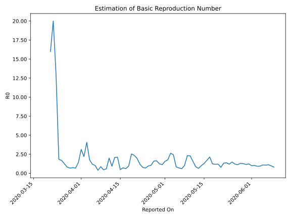

# Country Figures: Time Series for Basic Reproduction Number of Congo(Kinshasa) 

| Reported On | &Delta; Confirmed | Total &Delta; Confirmed First Interval | Total &Delta; Confirmed Second Interval | Estimated Basic Reproduction Number R0 | 
|-------------|-------------------|----------------------------------------|-----------------------------------------|---------------------------------------------------|
| 2020-04-28 | 12 |  82  |  50  |  1.64  | 
| 2020-04-27 | 17 |  83  |  52  |  1.60  | 
| 2020-04-26 | 26 |  66  |  63  |  1.05  | 
| 2020-04-25 | 22 |  62  |  65  |  0.95  | 
| 2020-04-24 | 17 |  50  |  73  |  0.68  | 
| 2020-04-23 | 18 |  52  |  66  |  0.79  | 
| 2020-04-22 | 9 |  63  |  52  |  1.21  | 
| 2020-04-21 | 18 |  65  |  33  |  1.97  | 
| 2020-04-20 | 5 |  73  |  31  |  2.35  | 
| 2020-04-19 | 20 |  66  |  26  |  2.54  | 
| 2020-04-18 | 20 |  52  |  55  |  0.95  | 
| 2020-04-17 | 20 |  33  |  54  |  0.61  | 
| 2020-04-16 | 13 |  31  |  43  |  0.72  | 
| 2020-04-15 | 13 |  26  |  54  |  0.48  | 
| 2020-04-14 | 6 |  55  |  26  |  2.12  | 
| 2020-04-13 | 1 |  54  |  26  |  2.08  | 
| 2020-04-12 | 11 |  43  |  46  |  0.93  | 
| 2020-04-11 | 8 |  54  |  27  |  2.00  | 
| 2020-04-10 | 35 |  26  |  45  |  0.58  | 
| 2020-04-09 | 0 |  26  |  56  |  0.46  | 
| 2020-04-08 | 0 |  46  |  53  |  0.87  | 
| 2020-04-07 | 19 |  27  |  69  |  0.39  | 
| 2020-04-06 | 7 |  45  |  44  |  1.02  | 
| 2020-04-05 | 0 |  56  |  47  |  1.19  | 
| 2020-04-04 | 20 |  53  |  30  |  1.77  | 
| 2020-04-03 | 0 |  69  |  17  |  4.06  | 
| 2020-04-02 | 25 |  44  |  20  |  2.20  | 
| 2020-04-01 | 11 |  47  |  15  |  3.13  | 
| 2020-03-31 | 17 |  30  |  21  |  1.43  | 
| 2020-03-30 | 16 |  17  |  25  |  0.68  | 
| 2020-03-29 | 0 |  20  |  27  |  0.74  | 
| 2020-03-28 | 14 |  15  |  22  |  0.68  | 
| 2020-03-27 | 0 |  21  |  26  |  0.81  | 
| 2020-03-26 | 3 |  25  |  20  |  1.25  | 
| 2020-03-25 | 3 |  27  |  16  |  1.69  | 
| 2020-03-24 | 9 |  22  |  12  |  1.83  | 
| 2020-03-23 | 6 |  26  |  2  |  13.00  | 
| 2020-03-22 | 7 |  20  |  1  |  20.00  | 
| 2020-03-21 | 5 |  16  |  1  |  16.00  | 
| 2020-03-21 | 0 |  -1  |  None  |  None  | 
| 2020-03-20 | 4 |  12  |  1  |  12.00  | 
| 2020-03-20 | 0 |  -1  |  None  |  None  | 
| 2020-03-19 | 0 |  -1  |  None  |  None  | 
| 2020-03-19 | 10 |  2  |  1  |  2.00  | 
| 2020-03-18 | 1 |  1  |  1  |  1.00  | 
| 2020-03-18 | 0 |  -1  |  None  |  None  | 
| 2020-03-17 | -1 |  None  |  None  |  None  | 
| 2020-03-17 | 1 |  1  |  None  |  None  | 
| 2020-03-16 | None |  None  |  None  |  None  | 
| 2020-03-16 | 0 |  1  |  None  |  None  | 
| 2020-03-15 | 0 |  1  |  None  |  None  | 
| 2020-03-14 | 0 |  1  |  None  |  None  | 
| 2020-03-13 | 1 |  None  |  None  |  None  | 
| 2020-03-12 | 0 |  None  |  None  |  None  | 
| 2020-03-11 | None |  None  |  None  |  None  | 

