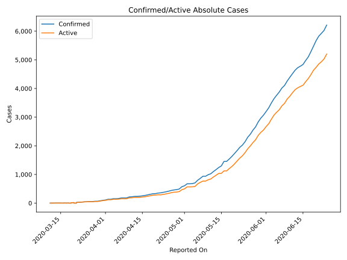
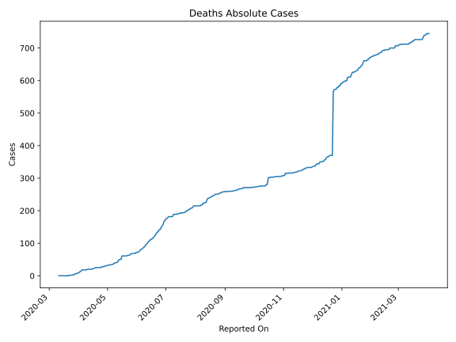
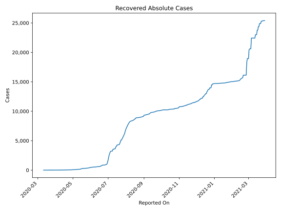
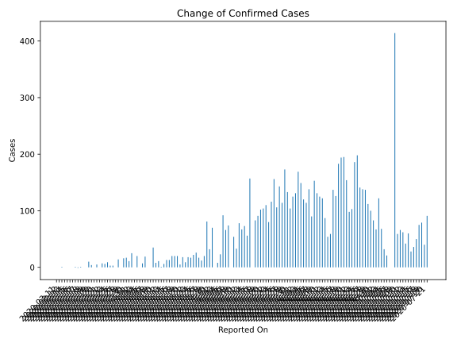
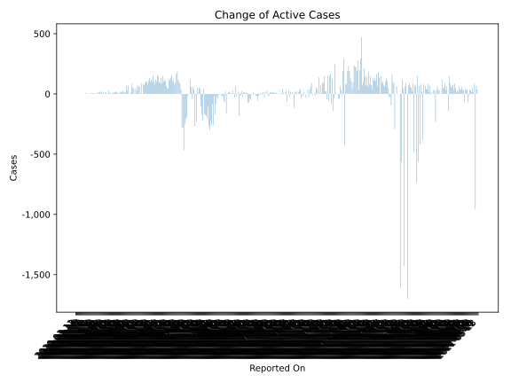
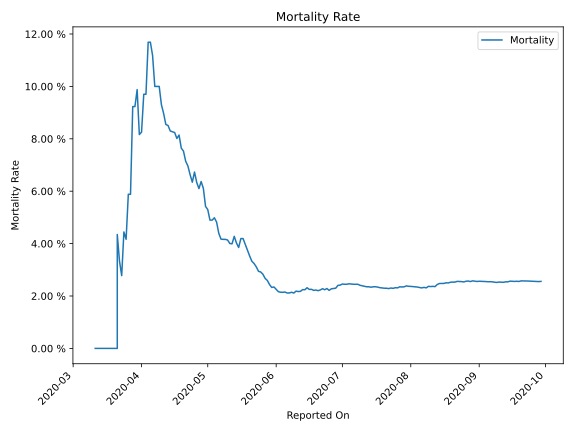

# Country Figures: Time Series for Congo(Kinshasa) 

| Reported On | Confirmed | Deaths | Recovered | Active | Mortality | &Delta; Confirmed | &Delta; Deaths | &Delta; Active | % Active of Population |
|-------------|-----------|--------|-----------|--------|-----------|-------------------|----------------|----------------|------------------------|
| 2020-03-22 | 30 | 1 | 0 | 29 |  3.33 %  | 7 | 0 | 7 |  0.000 %  | 
| 2020-03-21 | 23 | 1 | 0 | 22 |  4.35 %  | 5 | 1 | 4 |  0.000 %  | 
| 2020-03-20 | 18 | 0 | 0 | 18 |  None  | 4 | 0 | 4 |  0.000 %  | 
| 2020-03-19 | 14 | 0 | 0 | 14 |  None  | 10 | 0 | 10 |  0.000 %  | 
| 2020-03-18 | 4 | 0 | 0 | 4 |  None  | 1 | 0 | 1 |  0.000 %  | 
| 2020-03-17 | 3 | 0 | 0 | 3 |  None  | 1 | 0 | 1 |  0.000 %  | 
| 2020-03-16 | 2 | 0 | 0 | 2 |  None  | 0 | 0 | 0 |  0.000 %  | 
| 2020-03-15 | 2 | 0 | 0 | 2 |  None  | 0 | 0 | 0 |  0.000 %  | 
| 2020-03-14 | 2 | 0 | 0 | 2 |  None  | 0 | 0 | 0 |  0.000 %  | 
| 2020-03-13 | 2 | 0 | 0 | 2 |  None  | 1 | 0 | 1 |  0.000 %  | 
| 2020-03-12 | 1 | 0 | 0 | 1 |  None  | 0 | 0 | 0 |  0.000 %  | 
| 2020-03-11 | 1 | 0 | 0 | 1 |  None  | None | None | None |  0.000 %  | 

