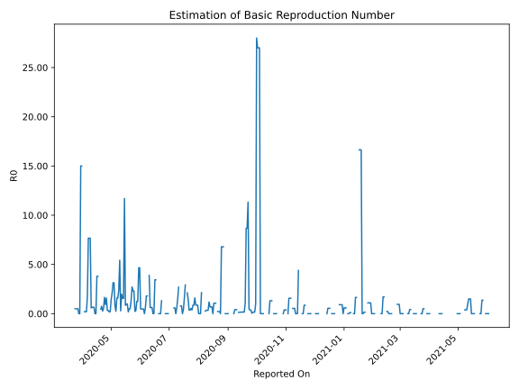

# Country Figures: Time Series for Basic Reproduction Number of Congo(Brazzaville) 

| Reported On | &Delta; Confirmed | Total &Delta; Confirmed First Interval | Total &Delta; Confirmed Second Interval | Estimated Basic Reproduction Number R0 | 
|-------------|-------------------|----------------------------------------|-----------------------------------------|---------------------------------------------------|
| 2020-05-04 | 7 |  22  |  7  |  3.14  | 
| 2020-05-03 | 0 |  22  |  7  |  3.14  | 
| 2020-05-02 | 0 |  29  |  14  |  2.07  | 
| 2020-05-01 | 9 |  20  |  14  |  1.43  | 
| 2020-04-30 | 13 |  7  |  35  |  0.20  | 
| 2020-04-29 | 0 |  7  |  40  |  0.17  | 
| 2020-04-28 | 7 |  14  |  43  |  0.33  | 
| 2020-04-27 | 0 |  14  |  43  |  0.33  | 
| 2020-04-26 | 0 |  35  |  22  |  1.59  | 
| 2020-04-25 | 0 |  40  |  43  |  0.93  | 
| 2020-04-24 | 14 |  43  |  26  |  1.65  | 
| 2020-04-23 | 0 |  43  |  83  |  0.52  | 
| 2020-04-22 | 21 |  22  |  83  |  0.27  | 
| 2020-04-21 | 5 |  43  |  57  |  0.75  | 
| 2020-04-20 | 17 |  26  |  57  |  0.46  | 
| 2020-04-19 | 0 |  83  |  None  |  None  | 
| 2020-04-18 | 0 |  83  |  None  |  None  | 
| 2020-04-17 | 26 |  57  |  15  |  3.80  | 
| 2020-04-16 | 0 |  57  |  15  |  3.80  | 
| 2020-04-15 | 57 |  None  |  15  |  None  | 
| 2020-04-14 | 0 |  None  |  15  |  None  | 
| 2020-04-13 | 0 |  15  |  23  |  0.65  | 
| 2020-04-12 | 0 |  15  |  23  |  0.65  | 
| 2020-04-11 | 0 |  15  |  23  |  0.65  | 
| 2020-04-10 | 0 |  15  |  26  |  0.58  | 
| 2020-04-09 | 15 |  23  |  3  |  7.67  | 
| 2020-04-08 | 0 |  23  |  3  |  7.67  | 
| 2020-04-07 | 0 |  23  |  3  |  7.67  | 
| 2020-04-06 | 0 |  26  |  15  |  1.73  | 
| 2020-04-05 | 23 |  3  |  15  |  0.20  | 
| 2020-04-04 | 0 |  3  |  15  |  0.20  | 
| 2020-04-03 | 0 |  3  |  15  |  0.20  | 
| 2020-04-02 | 3 |  15  |  None  |  None  | 
| 2020-04-01 | 0 |  15  |  None  |  None  | 
| 2020-03-31 | 0 |  15  |  1  |  15.00  | 
| 2020-03-30 | 0 |  15  |  1  |  15.00  | 
| 2020-03-29 | 15 |  None  |  1  |  None  | 
| 2020-03-28 | 0 |  None  |  1  |  None  | 
| 2020-03-27 | 0 |  1  |  2  |  0.50  | 
| 2020-03-26 | 0 |  1  |  2  |  0.50  | 
| 2020-03-25 | 0 |  1  |  2  |  0.50  | 
| 2020-03-24 | 0 |  1  |  2  |  0.50  | 
| 2020-03-23 | 1 |  2  |  None  |  None  | 
| 2020-03-22 | 0 |  2  |  None  |  None  | 
| 2020-03-21 | 0 |  2  |  None  |  None  | 
| 2020-03-20 | 0 |  2  |  None  |  None  | 
| 2020-03-19 | 2 |  None  |  None  |  None  | 
| 2020-03-18 | 0 |  None  |  None  |  None  | 
| 2020-03-17 | 0 |  None  |  None  |  None  | 
| 2020-03-16 | 0 |  None  |  None  |  None  | 
| 2020-03-15 | None |  None  |  None  |  None  | 

