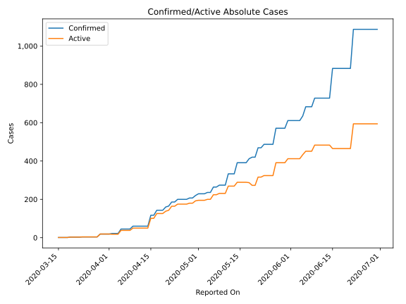
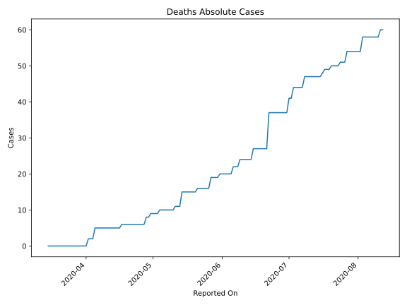
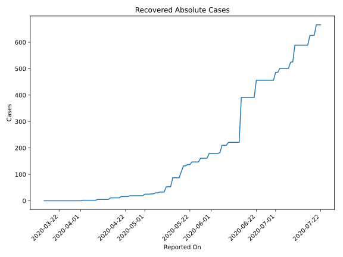
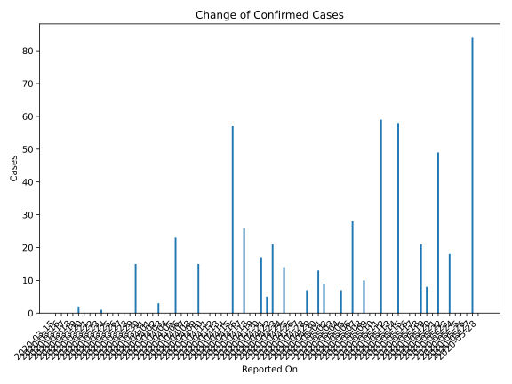
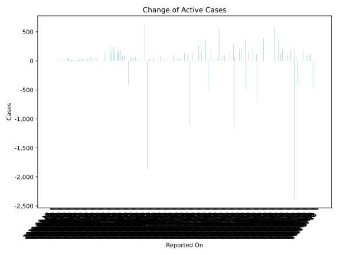
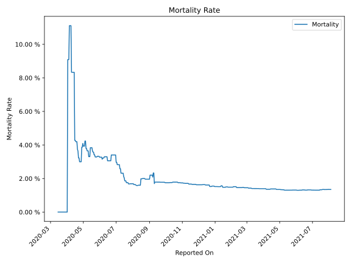

# Country Figures: Time Series for Congo(Brazzaville) 

| Reported On | Confirmed | Deaths | Recovered | Active | Mortality | &Delta; Confirmed | &Delta; Deaths | &Delta; Recovered | &Delta; Active | % Active of Population |
|-------------|-----------|--------|-----------|--------|-----------|-------------------|----------------|-------------------|----------------|------------------------|
| 2020-05-08 | 274 | 10 | 33 | 231 |  3.65 %  | 10 | 0 | 3 | 7 |  0.004 %  | 
| 2020-05-07 | 264 | 10 | 30 | 224 |  3.79 %  | 0 | 0 | 0 | 0 |  0.004 %  | 
| 2020-05-06 | 264 | 10 | 30 | 224 |  3.79 %  | 28 | 0 | 4 | 24 |  0.004 %  | 
| 2020-05-05 | 236 | 10 | 26 | 200 |  4.24 %  | 0 | 0 | 0 | 0 |  0.004 %  | 
| 2020-05-04 | 236 | 10 | 26 | 200 |  4.24 %  | 7 | 1 | 1 | 5 |  0.004 %  | 
| 2020-05-03 | 229 | 9 | 25 | 195 |  3.93 %  | 0 | 0 | 0 | 0 |  0.004 %  | 
| 2020-05-02 | 229 | 9 | 25 | 195 |  3.93 %  | 0 | 0 | 0 | 0 |  0.004 %  | 
| 2020-05-01 | 229 | 9 | 25 | 195 |  3.93 %  | 9 | 0 | 6 | 3 |  0.004 %  | 
| 2020-04-30 | 220 | 9 | 19 | 192 |  4.09 %  | 13 | 1 | 0 | 12 |  0.004 %  | 
| 2020-04-29 | 207 | 8 | 19 | 180 |  3.86 %  | 0 | 0 | 0 | 0 |  0.003 %  | 
| 2020-04-28 | 207 | 8 | 19 | 180 |  3.86 %  | 7 | 2 | 0 | 5 |  0.003 %  | 
| 2020-04-27 | 200 | 6 | 19 | 175 |  3.00 %  | 0 | 0 | 0 | 0 |  0.003 %  | 
| 2020-04-26 | 200 | 6 | 19 | 175 |  3.00 %  | 0 | 0 | 0 | 0 |  0.003 %  | 
| 2020-04-25 | 200 | 6 | 19 | 175 |  3.00 %  | 0 | 0 | 0 | 0 |  0.003 %  | 
| 2020-04-24 | 200 | 6 | 19 | 175 |  3.00 %  | 14 | 0 | 3 | 11 |  0.003 %  | 
| 2020-04-23 | 186 | 6 | 16 | 164 |  3.23 %  | 0 | 0 | 0 | 0 |  0.003 %  | 
| 2020-04-22 | 186 | 6 | 16 | 164 |  3.23 %  | 21 | 0 | 0 | 21 |  0.003 %  | 
| 2020-04-21 | 165 | 6 | 16 | 143 |  3.64 %  | 5 | 0 | 0 | 5 |  0.003 %  | 
| 2020-04-20 | 160 | 6 | 16 | 138 |  3.75 %  | 17 | 0 | 5 | 12 |  0.003 %  | 
| 2020-04-19 | 143 | 6 | 11 | 126 |  4.20 %  | 0 | 0 | 0 | 0 |  0.002 %  | 
| 2020-04-18 | 143 | 6 | 11 | 126 |  4.20 %  | 0 | 0 | 0 | 0 |  0.002 %  | 
| 2020-04-17 | 143 | 6 | 11 | 126 |  4.20 %  | 26 | 1 | 0 | 25 |  0.002 %  | 
| 2020-04-16 | 117 | 5 | 11 | 101 |  4.27 %  | 0 | 0 | 0 | 0 |  0.002 %  | 
| 2020-04-15 | 117 | 5 | 11 | 101 |  4.27 %  | 57 | 0 | 6 | 51 |  0.002 %  | 
| 2020-04-14 | 60 | 5 | 5 | 50 |  8.33 %  | 0 | 0 | 0 | 0 |  0.001 %  | 
| 2020-04-13 | 60 | 5 | 5 | 50 |  8.33 %  | 0 | 0 | 0 | 0 |  0.001 %  | 
| 2020-04-12 | 60 | 5 | 5 | 50 |  8.33 %  | 0 | 0 | 0 | 0 |  0.001 %  | 
| 2020-04-11 | 60 | 5 | 5 | 50 |  8.33 %  | 0 | 0 | 0 | 0 |  0.001 %  | 
| 2020-04-10 | 60 | 5 | 5 | 50 |  8.33 %  | 0 | 0 | 0 | 0 |  0.001 %  | 
| 2020-04-09 | 60 | 5 | 5 | 50 |  8.33 %  | 15 | 0 | 3 | 12 |  0.001 %  | 
| 2020-04-08 | 45 | 5 | 2 | 38 |  11.11 %  | 0 | 0 | 0 | 0 |  0.001 %  | 
| 2020-04-07 | 45 | 5 | 2 | 38 |  11.11 %  | 0 | 0 | 0 | 0 |  0.001 %  | 
| 2020-04-06 | 45 | 5 | 2 | 38 |  11.11 %  | 0 | 0 | 0 | 0 |  0.001 %  | 
| 2020-04-05 | 45 | 5 | 2 | 38 |  11.11 %  | 23 | 3 | 0 | 20 |  0.001 %  | 
| 2020-04-04 | 22 | 2 | 2 | 18 |  9.09 %  | 0 | 0 | 0 | 0 |  0.000 %  | 
| 2020-04-03 | 22 | 2 | 2 | 18 |  9.09 %  | 0 | 0 | 0 | 0 |  0.000 %  | 
| 2020-04-02 | 22 | 2 | 2 | 18 |  9.09 %  | 3 | 2 | 2 | -1 |  0.000 %  | 
| 2020-04-01 | 19 | 0 | 0 | 19 |  None  | 0 | 0 | 0 | 0 |  0.000 %  | 
| 2020-03-31 | 19 | 0 | 0 | 19 |  None  | 0 | 0 | 0 | 0 |  0.000 %  | 
| 2020-03-30 | 19 | 0 | 0 | 19 |  None  | 0 | 0 | 0 | 0 |  0.000 %  | 
| 2020-03-29 | 19 | 0 | 0 | 19 |  None  | 15 | 0 | 0 | 15 |  0.000 %  | 
| 2020-03-28 | 4 | 0 | 0 | 4 |  None  | 0 | 0 | 0 | 0 |  0.000 %  | 
| 2020-03-27 | 4 | 0 | 0 | 4 |  None  | 0 | 0 | 0 | 0 |  0.000 %  | 
| 2020-03-26 | 4 | 0 | 0 | 4 |  None  | 0 | 0 | 0 | 0 |  0.000 %  | 
| 2020-03-25 | 4 | 0 | 0 | 4 |  None  | 0 | 0 | 0 | 0 |  0.000 %  | 
| 2020-03-24 | 4 | 0 | 0 | 4 |  None  | 0 | 0 | 0 | 0 |  0.000 %  | 
| 2020-03-23 | 4 | 0 | 0 | 4 |  None  | 1 | 0 | 0 | 1 |  0.000 %  | 
| 2020-03-22 | 3 | 0 | 0 | 3 |  None  | 0 | 0 | 0 | 0 |  0.000 %  | 
| 2020-03-21 | 3 | 0 | 0 | 3 |  None  | 0 | 0 | 0 | 0 |  0.000 %  | 
| 2020-03-20 | 3 | 0 | 0 | 3 |  None  | 0 | 0 | 0 | 0 |  0.000 %  | 
| 2020-03-19 | 3 | 0 | 0 | 3 |  None  | 2 | 0 | 0 | 2 |  0.000 %  | 
| 2020-03-18 | 1 | 0 | 0 | 1 |  None  | 0 | 0 | 0 | 0 |  0.000 %  | 
| 2020-03-17 | 1 | 0 | 0 | 1 |  None  | 0 | 0 | 0 | 0 |  0.000 %  | 
| 2020-03-16 | 1 | 0 | 0 | 1 |  None  | 0 | 0 | 0 | 0 |  0.000 %  | 
| 2020-03-15 | 1 | 0 | 0 | 1 |  None  | None | None | None | None |  0.000 %  | 

