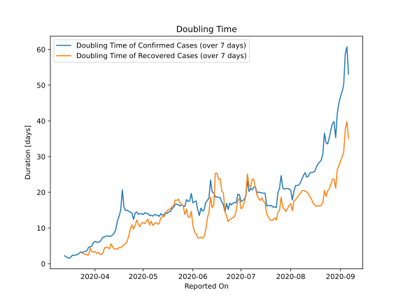

# Country Figures: New Infections in Previous 7 Days per 100,000 Population for Colombia 

<!--  --> 

| Reported On | &Delta; Confirmed (on the day) | &Delta; Confirmed (last 7 days) | New Cases in Previous 7 Days per 100,000 Population |
|-------------|--------------------------------|---------------------------------|-----------------------------------------------------|
| 2020-05-09 |  444  |  3210  |  6.465  |
| 2020-05-08 |  595  |  3045  |  6.133  |
| 2020-05-07 |  497  |  2949  |  5.940  |
| 2020-05-06 |  346  |  2752  |  5.543  |
| 2020-05-05 |  640  |  2664  |  5.366  |
| 2020-05-04 |  305  |  2376  |  4.786  |
| 2020-05-03 |  383  |  2289  |  4.610  |
| 2020-05-02 |  279  |  2143  |  4.316  |
| 2020-05-01 |  499  |  2125  |  4.280  |
| 2020-04-30 |  300  |  1946  |  3.920  |
| 2020-04-29 |  258  |  1851  |  3.728  |
| 2020-04-28 |  352  |  1800  |  3.625  |
| 2020-04-27 |  218  |  1620  |  3.263  |
| 2020-04-26 |  237  |  1587  |  3.196  |
| 2020-04-25 |  261  |  1703  |  3.430  |
| 2020-04-24 |  320  |  1442  |  2.904  |
| 2020-04-23 |  205  |  1328  |  2.675  |
| 2020-04-22 |  207  |  1251  |  2.520  |
| 2020-04-21 |  172  |  1170  |  2.357  |
| 2020-04-20 |  185  |  1125  |  2.266  |
| 2020-04-19 |  353  |  1016  |  2.046  |
| 2020-04-18 |  None  |  730  |  1.470  |
| 2020-04-17 |  206  |  966  |  1.946  |
| 2020-04-16 |  128  |  1010  |  2.034  |
| 2020-04-15 |  126  |  1051  |  2.117  |
| 2020-04-14 |  127  |  1199  |  2.415  |
| 2020-04-13 |  76  |  1273  |  2.564  |
| 2020-04-12 |  67  |  1291  |  2.600  |
| 2020-04-11 |  236  |  1303  |  2.624  |
| 2020-04-10 |  250  |  1206  |  2.429  |
| 2020-04-09 |  169  |  1062  |  2.139  |
| 2020-04-08 |  274  |  989  |  1.992  |
| 2020-04-07 |  201  |  874  |  1.760  |
| 2020-04-06 |  94  |  781  |  1.573  |
| 2020-04-05 |  79  |  783  |  1.577  |
| 2020-04-04 |  139  |  798  |  1.607  |
| 2020-04-03 |  106  |  728  |  1.466  |
| 2020-04-02 |  96  |  670  |  1.349  |
| 2020-04-01 |  159  |  595  |  1.198  |
| 2020-03-31 |  108  |  528  |  1.063  |
| 2020-03-30 |  96  |  521  |  1.049  |
| 2020-03-29 |  94  |  471  |  0.949  |
| 2020-03-28 |  69  |  412  |  0.830  |
| 2020-03-27 |  48  |  411  |  0.828  |
| 2020-03-26 |  21  |  389  |  0.784  |
| 2020-03-25 |  92  |  377  |  0.759  |
| 2020-03-24 |  101  |  313  |  0.630  |
| 2020-03-23 |  46  |  223  |  0.449  |
| 2020-03-22 |  35  |  197  |  0.397  |
| 2020-03-21 |  68  |  174  |  0.350  |
| 2020-03-20 |  26  |  115  |  0.232  |
| 2020-03-19 |  9  |  93  |  0.187  |
| 2020-03-18 |  28  |  84  |  0.169  |
| 2020-03-17 |  11  |  62  |  0.125  |
| 2020-03-16 |  20  |  53  |  0.107  |
| 2020-03-15 |  12  |  33  |  0.066  |
| 2020-03-14 |  9  |  21  |  0.042  |
| 2020-03-13 |  4  |  12  |  0.024  |
| 2020-03-12 |  None  |  8  |  0.016  |
| 2020-03-11 |  6  |  8  |  0.016  |
| 2020-03-10 |  2  |  2  |  0.004  |
| 2020-03-09 |  None  |  None  |  None  |
| 2020-03-08 |  None  |  None  |  None  |
| 2020-03-07 |  None  |  None  |  None  |
| 2020-03-06 |  None  |  None  |  None  |
| 2020-01-23 |  None  |  None  |  None  |

