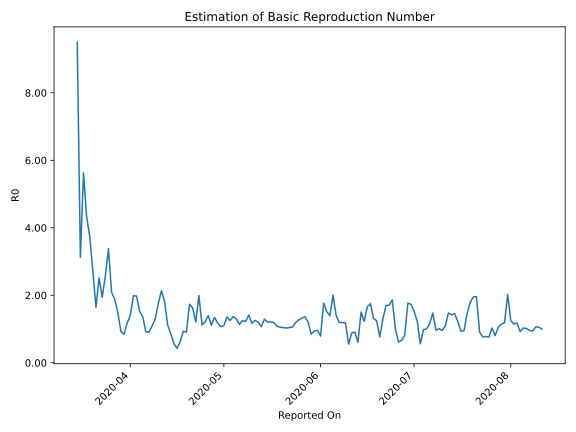

# Country Figures: Time Series for Basic Reproduction Number of Colombia 

| Reported On | &Delta; Confirmed | Total &Delta; Confirmed First Interval | Total &Delta; Confirmed Second Interval | Estimated Basic Reproduction Number R0 | 
|-------------|-------------------|----------------------------------------|-----------------------------------------|---------------------------------------------------|
| 2020-04-28 | 352 |  1036  |  769  |  1.35  | 
| 2020-04-27 | 218 |  1023  |  917  |  1.12  | 
| 2020-04-26 | 237 |  993  |  710  |  1.40  | 
| 2020-04-25 | 261 |  904  |  744  |  1.22  | 
| 2020-04-24 | 320 |  769  |  687  |  1.12  | 
| 2020-04-23 | 205 |  917  |  460  |  1.99  | 
| 2020-04-22 | 207 |  710  |  587  |  1.21  | 
| 2020-04-21 | 172 |  744  |  457  |  1.63  | 
| 2020-04-20 | 185 |  687  |  396  |  1.73  | 
| 2020-04-19 | 353 |  460  |  506  |  0.91  | 
| 2020-04-18 | 0 |  587  |  629  |  0.93  | 
| 2020-04-17 | 206 |  457  |  722  |  0.63  | 
| 2020-04-16 | 128 |  396  |  929  |  0.43  | 
| 2020-04-15 | 126 |  506  |  894  |  0.57  | 
| 2020-04-14 | 127 |  629  |  738  |  0.85  | 
| 2020-04-13 | 76 |  722  |  648  |  1.11  | 
| 2020-04-12 | 67 |  929  |  513  |  1.81  | 
| 2020-04-11 | 236 |  894  |  418  |  2.14  | 
| 2020-04-10 | 250 |  738  |  420  |  1.76  | 
| 2020-04-09 | 169 |  648  |  500  |  1.30  | 
| 2020-04-08 | 274 |  513  |  469  |  1.09  | 
| 2020-04-07 | 201 |  418  |  459  |  0.91  | 
| 2020-04-06 | 94 |  420  |  457  |  0.92  | 
| 2020-04-05 | 79 |  500  |  367  |  1.36  | 
| 2020-04-04 | 139 |  469  |  307  |  1.53  | 
| 2020-04-03 | 106 |  459  |  232  |  1.98  | 
| 2020-04-02 | 96 |  457  |  230  |  1.99  | 
| 2020-04-01 | 159 |  367  |  262  |  1.40  | 
| 2020-03-31 | 108 |  307  |  260  |  1.18  | 
| 2020-03-30 | 96 |  232  |  274  |  0.85  | 
| 2020-03-29 | 94 |  230  |  250  |  0.92  | 
| 2020-03-28 | 69 |  262  |  175  |  1.50  | 
| 2020-03-27 | 48 |  260  |  138  |  1.88  | 
| 2020-03-26 | 21 |  274  |  131  |  2.09  | 
| 2020-03-25 | 92 |  250  |  74  |  3.38  | 
| 2020-03-24 | 101 |  175  |  68  |  2.57  | 
| 2020-03-23 | 46 |  138  |  71  |  1.94  | 
| 2020-03-22 | 35 |  131  |  52  |  2.52  | 
| 2020-03-21 | 68 |  74  |  45  |  1.64  | 
| 2020-03-20 | 26 |  68  |  25  |  2.72  | 
| 2020-03-19 | 9 |  71  |  19  |  3.74  | 
| 2020-03-18 | 28 |  52  |  12  |  4.33  | 
| 2020-03-17 | 11 |  45  |  8  |  5.62  | 
| 2020-03-16 | 20 |  25  |  8  |  3.12  | 
| 2020-03-15 | 12 |  19  |  2  |  9.50  | 
| 2020-03-14 | 9 |  12  |  None  |  None  | 
| 2020-03-13 | 4 |  8  |  None  |  None  | 
| 2020-03-12 | 0 |  8  |  None  |  None  | 
| 2020-03-11 | 6 |  2  |  None  |  None  | 
| 2020-03-10 | 2 |  None  |  None  |  None  | 
| 2020-03-09 | 0 |  None  |  None  |  None  | 
| 2020-03-08 | 0 |  None  |  None  |  None  | 
| 2020-03-07 | 0 |  None  |  None  |  None  | 
| 2020-03-06 | None |  None  |  None  |  None  | 
| 2020-01-23 | None |  None  |  None  |  None  | 

