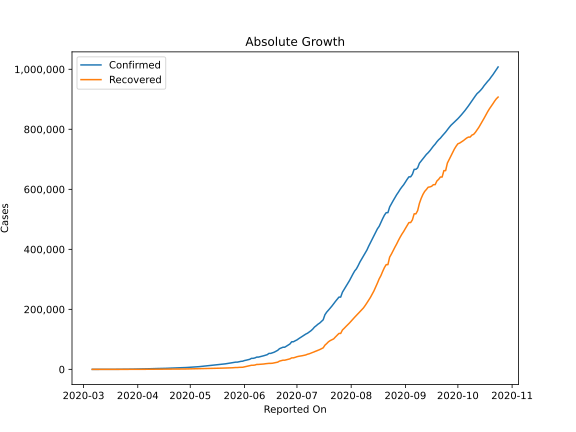
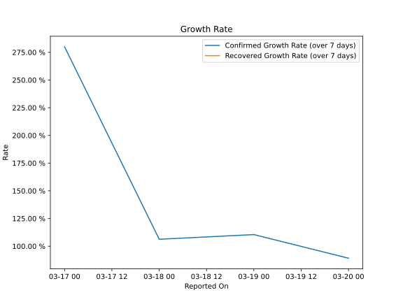

# Country Figures: Growth Rate for Colombia 

The growth rates below are calculated based on
* an exponential growth assumption
* for time difference of past seven (7) days.
The growth rate is to be understood as on "growth per day".

The first growth rate indicates the increase of confirmed (infected) cases.

The second growth rate indicates the increase of recovered (healed) cases.

| Reported On | Confirmed | Growth Rate (Confirmed) | Recovered | Growth Rate (Recovered) |
|-------------|-----------|-------------------------|-----------|-------------------------|
| 2020-05-06 | 8959 |  5.24 %  | 2148 |  6.003 %  | 
| 2020-05-05 | 8613 |  5.29 %  | 2013 |  6.603 %  | 
| 2020-05-04 | 7973 |  5.05 %  | 1807 |  5.729 %  | 
| 2020-05-03 | 7668 |  5.07 %  | 1722 |  5.980 %  | 
| 2020-05-02 | 7285 |  4.98 %  | 1666 |  6.365 %  | 
| 2020-05-01 | 7006 |  5.16 %  | 1551 |  6.227 %  | 
| 2020-04-30 | 6507 |  5.08 %  | 1439 |  6.282 %  | 
| 2020-04-29 | 6207 |  5.06 %  | 1411 |  6.908 %  | 
| 2020-04-28 | 5949 |  5.15 %  | 1268 |  6.509 %  | 
| 2020-04-27 | 5597 |  4.88 %  | 1210 |  5.840 %  | 
| 2020-04-26 | 5379 |  4.99 %  | 1133 |  6.656 %  | 
| 2020-04-25 | 5142 |  5.75 %  | 1067 |  7.437 %  | 
| 2020-04-24 | 4881 |  5.00 %  | 1003 |  6.553 %  | 
| 2020-04-23 | 4561 |  4.92 %  | 927 |  7.458 %  | 
| 2020-04-22 | 4356 |  4.84 %  | 870 |  9.354 %  | 
| 2020-04-21 | 4149 |  4.73 %  | 804 |  11.719 %  | 
| 2020-04-20 | 3977 |  4.75 %  | 804 |  13.206 %  | 
| 2020-04-19 | 3792 |  4.46 %  | 711 |  13.832 %  | 
| 2020-04-18 | 3439 |  3.41 %  | 634 |  15.515 %  | 
| 2020-04-17 | 3439 |  4.71 %  | 634 |  16.698 %  | 
| 2020-04-16 | 3233 |  5.35 %  | 550 |  16.441 %  | 
| 2020-04-15 | 3105 |  5.90 %  | 452 |  18.593 %  | 
| 2020-04-14 | 2979 |  7.36 %  | 354 |  18.059 %  | 
| 2020-04-13 | 2852 |  8.45 %  | 319 |  18.398 %  | 
| 2020-04-12 | 2776 |  8.94 %  | 270 |  16.016 %  | 
| 2020-04-11 | 2709 |  9.37 %  | 214 |  13.190 %  | 
| 2020-04-10 | 2473 |  9.55 %  | 197 |  18.227 %  | 
| 2020-04-09 | 2223 |  9.28 %  | 174 |  16.453 %  | 
| 2020-04-08 | 2054 |  9.38 %  | 123 |  16.409 %  | 
| 2020-04-07 | 1780 |  9.65 %  | 100 |  16.731 %  | 
| 2020-04-06 | 1579 |  9.75 %  | 88 |  25.276 %  | 
| 2020-04-05 | 1485 |  10.70 %  | 88 |  31.068 %  | 
| 2020-04-04 | 1406 |  11.98 %  | 85 |  30.572 %  | 
| 2020-04-03 | 1267 |  12.21 %  | 55 |  24.354 %  | 
| 2020-04-02 | 1161 |  12.29 %  | 55 |  27.541 %  | 
| 2020-04-01 | 1065 |  11.69 %  | 39 |  22.630 %  | 
| 2020-03-31 | 906 |  12.49 %  | 31 |  23.460 %  | 
| 2020-03-30 | 798 |  15.12 %  | 15 |  22.992 %  | 
| 2020-03-29 | 702 |  15.88 %  | 10 |  17.200 %  | 
| 2020-03-28 | 608 |  16.17 %  | 10 |  32.894 %  | 
| 2020-03-27 | 539 |  20.54 %  | 10 |  32.894 %  | 
| 2020-03-26 | 491 |  22.45 %  | 8 |  29.706 %  | 
| 2020-03-25 | 470 |  23.14 %  | 8 |  29.706 %  | 
| 2020-03-24 | 378 |  25.15 %  | 6 |  25.597 %  | 
| 2020-03-23 | 277 |  23.36 %  | 3 |  None  | 
| 2020-03-22 | 231 |  27.37 %  | 3 |  None  | 
| 2020-03-21 | 196 |  31.24 %  | 1 |  None  | 
| 2020-03-20 | 128 |  32.67 %  | 1 |  None  | 
| 2020-03-19 | 102 |  34.68 %  | 1 |  None  | 
| 2020-03-18 | 93 |  33.36 %  | 1 |  None  | 
| 2020-03-17 | 65 |  43.94 %  | 1 |  None  | 
| 2020-03-16 | 54 |  56.99 %  | 0 |  None  | 
| 2020-03-15 | 34 |  50.38 %  | 0 |  None  | 
| 2020-03-14 | 22 |  44.16 %  | 0 |  None  | 
| 2020-03-13 | 13 |  36.64 %  | 0 |  None  | 
| 2020-03-12 | 9 |  None  | 0 |  None  | 
| 2020-03-11 | 9 |  None  | 0 |  None  | 
| 2020-03-10 | 3 |  None  | 0 |  None  | 
| 2020-03-09 | 1 |  None  | 0 |  None  | 
| 2020-03-08 | 1 |  None  | 0 |  None  | 
| 2020-03-07 | 1 |  None  | 0 |  None  | 
| 2020-03-06 | 1 |  None  | 0 |  None  | 

