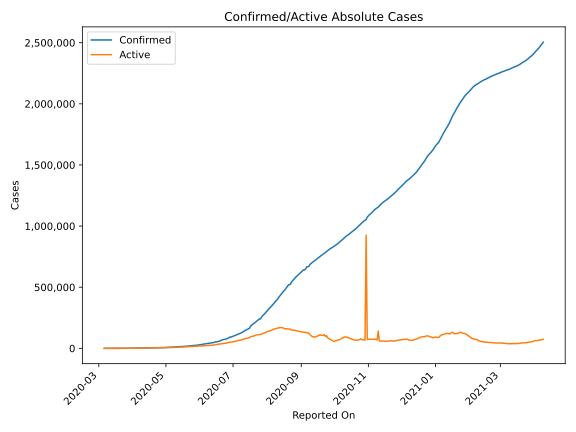
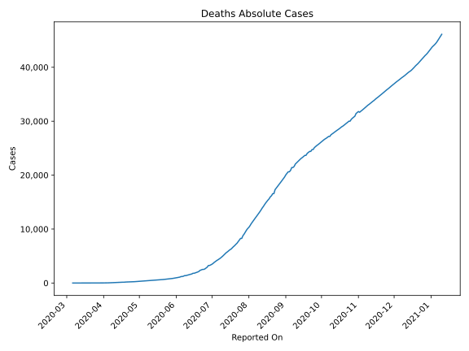
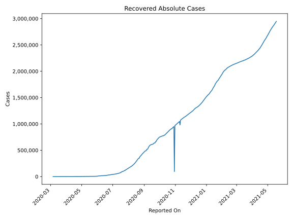
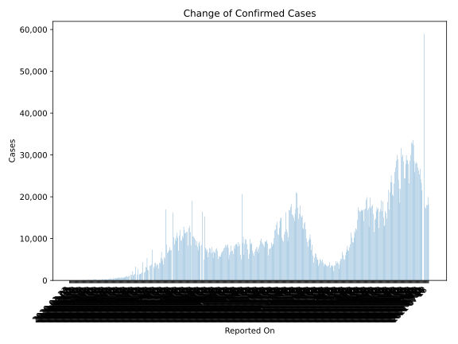
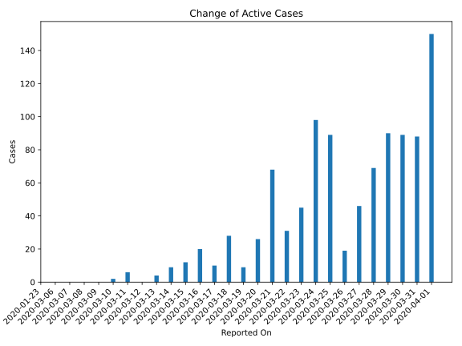
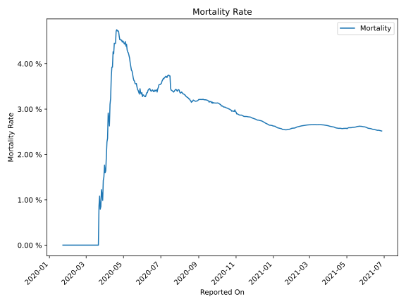

# Country Figures: Time Series for Colombia 

| Reported On | Confirmed | Deaths | Recovered | Active | Mortality | &Delta; Confirmed | &Delta; Deaths | &Delta; Active | % Active of Population |
|-------------|-----------|--------|-----------|--------|-----------|-------------------|----------------|----------------|------------------------|
| 2020-03-22 | 231 | 2 | 3 | 226 |  0.87 %  | 35 | 2 | 31 |  0.000 %  | 
| 2020-03-21 | 196 | 0 | 1 | 195 |  None  | 68 | 0 | 68 |  0.000 %  | 
| 2020-03-20 | 128 | 0 | 1 | 127 |  None  | 26 | 0 | 26 |  0.000 %  | 
| 2020-03-19 | 102 | 0 | 1 | 101 |  None  | 9 | 0 | 9 |  0.000 %  | 
| 2020-03-18 | 93 | 0 | 1 | 92 |  None  | 28 | 0 | 28 |  0.000 %  | 
| 2020-03-17 | 65 | 0 | 1 | 64 |  None  | 11 | 0 | 10 |  0.000 %  | 
| 2020-03-16 | 54 | 0 | 0 | 54 |  None  | 20 | 0 | 20 |  0.000 %  | 
| 2020-03-15 | 34 | 0 | 0 | 34 |  None  | 12 | 0 | 12 |  0.000 %  | 
| 2020-03-14 | 22 | 0 | 0 | 22 |  None  | 9 | 0 | 9 |  0.000 %  | 
| 2020-03-13 | 13 | 0 | 0 | 13 |  None  | 4 | 0 | 4 |  0.000 %  | 
| 2020-03-12 | 9 | 0 | 0 | 9 |  None  | 0 | 0 | 0 |  0.000 %  | 
| 2020-03-11 | 9 | 0 | 0 | 9 |  None  | 6 | 0 | 6 |  0.000 %  | 
| 2020-03-10 | 3 | 0 | 0 | 3 |  None  | 2 | 0 | 2 |  0.000 %  | 
| 2020-03-09 | 1 | 0 | 0 | 1 |  None  | 0 | 0 | 0 |  0.000 %  | 
| 2020-03-08 | 1 | 0 | 0 | 1 |  None  | 0 | 0 | 0 |  0.000 %  | 
| 2020-03-07 | 1 | 0 | 0 | 1 |  None  | 0 | 0 | 0 |  0.000 %  | 
| 2020-03-06 | 1 | 0 | 0 | 1 |  None  | None | None | None |  0.000 %  | 
| 2020-01-23 | None | None | None | None |  None  | None | None | None |  n/a  | 

