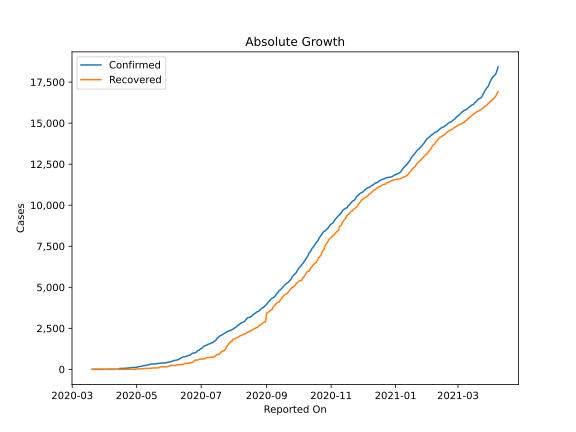
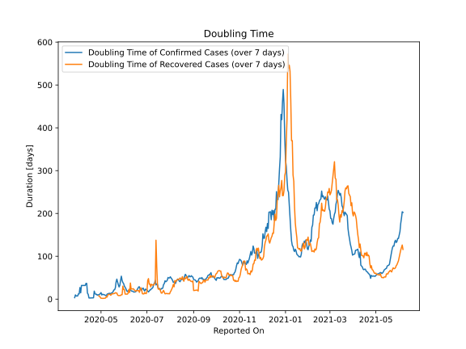

# Country Figures: Doubling Time of Infections for CaboVerde 

The doubling time below are calculated based on
* an exponential growth assumption
* for time difference of past seven (7) days.
The doubling time's unit is "days".

The first doubling time indicates the increase of confirmed (infected)
cases. There, the *higher* the number is, the better is to take control
of the disease.

The second doubling time indicates the increase of recovered (healed)
cases. There, the *lower* the number is, the better it is to take
control of the disease.

| Reported On | Confirmed | Doubling Time (Confirmed) | Recovered | Doubling Time (Recovered) |
|-------------|-----------|---------------------------|-----------|---------------------------|
| 2020-05-05 | 186 |  10.3 days  | 37 |  2.0 days  | 
| 2020-05-04 | 175 |  10.6 days  | 37 |  1.7 days  | 
| 2020-05-03 | 165 |  11.3 days  | 33 |  1.7 days  | 
| 2020-05-02 | 152 |  9.6 days  | 18 |  2.0 days  | 
| 2020-05-01 | 122 |  15.2 days  | 18 |  2.0 days  | 
| 2020-04-30 | 121 |  12.8 days  | 4 |  3.8 days  | 
| 2020-04-29 | 114 |  11.2 days  | 2 |  7.3 days  | 
| 2020-04-28 | 114 |  9.7 days  | 2 |  7.3 days  | 
| 2020-04-27 | 109 |  10.3 days  | 1 |  None  | 
| 2020-04-26 | 106 |  9.1 days  | 1 |  None  | 
| 2020-04-25 | 90 |  11.4 days  | 1 |  None  | 
| 2020-04-24 | 88 |  11.1 days  | 1 |  None  | 
| 2020-04-23 | 82 |  13.1 days  | 1 |  None  | 
| 2020-04-22 | 73 |  18.6 days  | 1 |  None  | 
| 2020-04-21 | 68 |  3.0 days  | 1 |  None  | 
| 2020-04-20 | 67 |  2.9 days  | 1 |  None  | 
| 2020-04-19 | 61 |  2.7 days  | 1 |  None  | 
| 2020-04-18 | 58 |  2.8 days  | 1 |  None  | 
| 2020-04-17 | 56 |  2.7 days  | 1 |  None  | 
| 2020-04-16 | 56 |  2.7 days  | 1 |  None  | 
| 2020-04-15 | 56 |  2.7 days  | 1 |  None  | 
| 2020-04-14 | 11 |  11.1 days  | 1 |  None  | 
| 2020-04-13 | 10 |  13.9 days  | 1 |  None  | 
| 2020-04-12 | 8 |  36.7 days  | 1 |  None  | 
| 2020-04-11 | 8 |  36.7 days  | 1 |  None  | 
| 2020-04-10 | 7 |  31.8 days  | 1 |  None  | 
| 2020-04-09 | 7 |  31.8 days  | 1 |  None  | 
| 2020-04-08 | 7 |  31.8 days  | 1 |  None  | 
| 2020-04-07 | 7 |  31.8 days  | 1 |  None  | 
| 2020-04-06 | 7 |  31.8 days  | 1 |  None  | 
| 2020-04-05 | 7 |  31.8 days  | 0 |  None  | 
| 2020-04-04 | 7 |  14.8 days  | 0 |  None  | 
| 2020-04-03 | 6 |  27.0 days  | 0 |  None  | 
| 2020-04-02 | 6 |  12.3 days  | 0 |  None  | 
| 2020-04-01 | 6 |  12.3 days  | 0 |  None  | 
| 2020-03-31 | 6 |  7.3 days  | 0 |  None  | 
| 2020-03-30 | 6 |  7.3 days  | 0 |  None  | 
| 2020-03-29 | 6 |  7.3 days  | 0 |  None  | 
| 2020-03-28 | 5 |  9.8 days  | 0 |  None  | 
| 2020-03-27 | 5 |  3.3 days  | 0 |  None  | 
| 2020-03-26 | 4 |  None  | 0 |  None  | 
| 2020-03-25 | 4 |  None  | 0 |  None  | 
| 2020-03-24 | 3 |  None  | 0 |  None  | 
| 2020-03-23 | 3 |  None  | 0 |  None  | 
| 2020-03-22 | 3 |  None  | 0 |  None  | 
| 2020-03-21 | 3 |  None  | 0 |  None  | 
| 2020-03-20 | 1 |  None  | 0 |  None  | 

