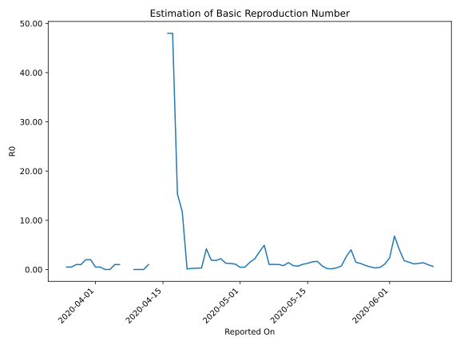

# Country Figures: Time Series for Basic Reproduction Number of CaboVerde 

| Reported On | &Delta; Confirmed | Total &Delta; Confirmed First Interval | Total &Delta; Confirmed Second Interval | Estimated Basic Reproduction Number R0 | 
|-------------|-------------------|----------------------------------------|-----------------------------------------|---------------------------------------------------|
| 2020-05-08 | 12 |  53  |  51  |  1.04  | 
| 2020-05-07 | 27 |  39  |  38  |  1.03  | 
| 2020-05-06 | 5 |  64  |  13  |  4.92  | 
| 2020-05-05 | 11 |  54  |  15  |  3.60  | 
| 2020-05-04 | 10 |  51  |  24  |  2.12  | 
| 2020-05-03 | 13 |  38  |  26  |  1.46  | 
| 2020-05-02 | 30 |  13  |  27  |  0.48  | 
| 2020-05-01 | 1 |  15  |  33  |  0.45  | 
| 2020-04-30 | 7 |  24  |  22  |  1.09  | 
| 2020-04-29 | 0 |  26  |  21  |  1.24  | 
| 2020-04-28 | 5 |  27  |  21  |  1.29  | 
| 2020-04-27 | 3 |  33  |  15  |  2.20  | 
| 2020-04-26 | 16 |  22  |  12  |  1.83  | 
| 2020-04-25 | 2 |  21  |  11  |  1.91  | 
| 2020-04-24 | 6 |  21  |  5  |  4.20  | 
| 2020-04-23 | 9 |  15  |  47  |  0.32  | 
| 2020-04-22 | 5 |  12  |  46  |  0.26  | 
| 2020-04-21 | 1 |  11  |  48  |  0.23  | 
| 2020-04-20 | 6 |  5  |  48  |  0.10  | 
| 2020-04-19 | 3 |  47  |  4  |  11.75  | 
| 2020-04-18 | 2 |  46  |  3  |  15.33  | 
| 2020-04-17 | 0 |  48  |  1  |  48.00  | 
| 2020-04-16 | 0 |  48  |  1  |  48.00  | 
| 2020-04-15 | 45 |  4  |  None  |  None  | 
| 2020-04-14 | 1 |  3  |  None  |  None  | 
| 2020-04-13 | 2 |  1  |  None  |  None  | 
| 2020-04-12 | 0 |  1  |  1  |  1.00  | 
| 2020-04-11 | 1 |  None  |  1  |  None  | 
| 2020-04-10 | 0 |  None  |  1  |  None  | 
| 2020-04-09 | 0 |  None  |  1  |  None  | 
| 2020-04-08 | 0 |  1  |  None  |  None  | 
| 2020-04-07 | 0 |  1  |  None  |  None  | 
| 2020-04-06 | 0 |  1  |  1  |  1.00  | 
| 2020-04-05 | 0 |  1  |  1  |  1.00  | 
| 2020-04-04 | 1 |  None  |  2  |  None  | 
| 2020-04-03 | 0 |  None  |  2  |  None  | 
| 2020-04-02 | 0 |  1  |  2  |  0.50  | 
| 2020-04-01 | 0 |  1  |  2  |  0.50  | 
| 2020-03-31 | 0 |  2  |  1  |  2.00  | 
| 2020-03-30 | 0 |  2  |  1  |  2.00  | 
| 2020-03-29 | 1 |  2  |  2  |  1.00  | 
| 2020-03-28 | 0 |  2  |  2  |  1.00  | 
| 2020-03-27 | 1 |  1  |  2  |  0.50  | 
| 2020-03-26 | 0 |  1  |  2  |  0.50  | 
| 2020-03-25 | 1 |  2  |  None  |  None  | 
| 2020-03-24 | 0 |  2  |  None  |  None  | 
| 2020-03-23 | 0 |  2  |  None  |  None  | 
| 2020-03-22 | 0 |  2  |  None  |  None  | 
| 2020-03-21 | 2 |  None  |  None  |  None  | 
| 2020-03-20 | None |  None  |  None  |  None  | 

