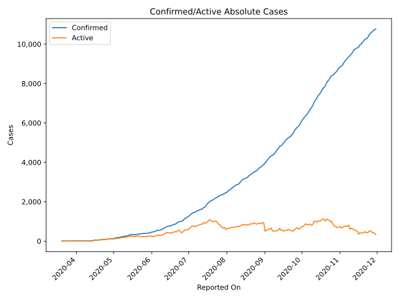
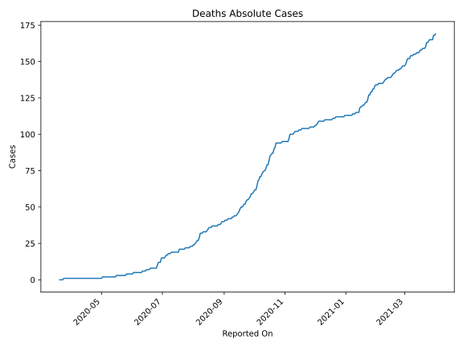
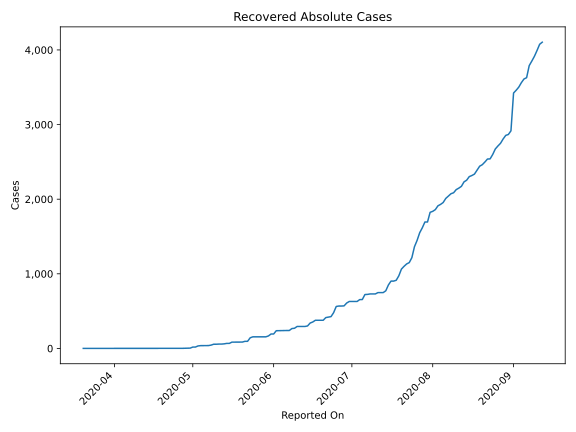
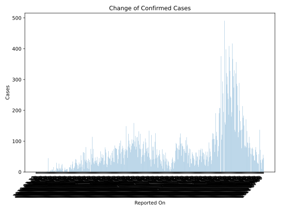
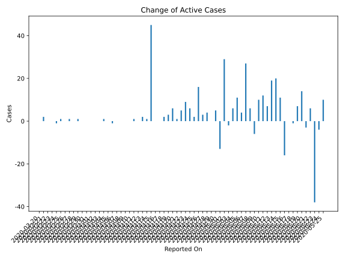
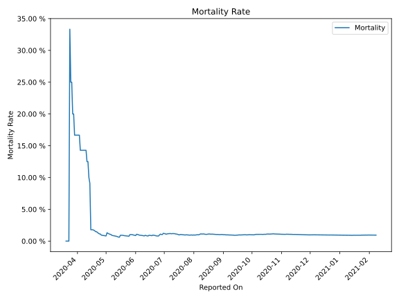

# Country Figures: Time Series for CaboVerde 

| Reported On | Confirmed | Deaths | Recovered | Active | Mortality | &Delta; Confirmed | &Delta; Deaths | &Delta; Recovered | &Delta; Active | % Active of Population |
|-------------|-----------|--------|-----------|--------|-----------|-------------------|----------------|-------------------|----------------|------------------------|
| 2020-04-28 | 114 | 1 | 2 | 111 |  0.88 %  | 5 | 0 | 1 | 4 |  0.020 %  | 
| 2020-04-27 | 109 | 1 | 1 | 107 |  0.92 %  | 3 | 0 | 0 | 3 |  0.020 %  | 
| 2020-04-26 | 106 | 1 | 1 | 104 |  0.94 %  | 16 | 0 | 0 | 16 |  0.019 %  | 
| 2020-04-25 | 90 | 1 | 1 | 88 |  1.11 %  | 2 | 0 | 0 | 2 |  0.016 %  | 
| 2020-04-24 | 88 | 1 | 1 | 86 |  1.14 %  | 6 | 0 | 0 | 6 |  0.016 %  | 
| 2020-04-23 | 82 | 1 | 1 | 80 |  1.22 %  | 9 | 0 | 0 | 9 |  0.015 %  | 
| 2020-04-22 | 73 | 1 | 1 | 71 |  1.37 %  | 5 | 0 | 0 | 5 |  0.013 %  | 
| 2020-04-21 | 68 | 1 | 1 | 66 |  1.47 %  | 1 | 0 | 0 | 1 |  0.012 %  | 
| 2020-04-20 | 67 | 1 | 1 | 65 |  1.49 %  | 6 | 0 | 0 | 6 |  0.012 %  | 
| 2020-04-19 | 61 | 1 | 1 | 59 |  1.64 %  | 3 | 0 | 0 | 3 |  0.011 %  | 
| 2020-04-18 | 58 | 1 | 1 | 56 |  1.72 %  | 2 | 0 | 0 | 2 |  0.010 %  | 
| 2020-04-17 | 56 | 1 | 1 | 54 |  1.79 %  | 0 | 0 | 0 | 0 |  0.010 %  | 
| 2020-04-16 | 56 | 1 | 1 | 54 |  1.79 %  | 0 | 0 | 0 | 0 |  0.010 %  | 
| 2020-04-15 | 56 | 1 | 1 | 54 |  1.79 %  | 45 | 0 | 0 | 45 |  0.010 %  | 
| 2020-04-14 | 11 | 1 | 1 | 9 |  9.09 %  | 1 | 0 | 0 | 1 |  0.002 %  | 
| 2020-04-13 | 10 | 1 | 1 | 8 |  10.00 %  | 2 | 0 | 0 | 2 |  0.001 %  | 
| 2020-04-12 | 8 | 1 | 1 | 6 |  12.50 %  | 0 | 0 | 0 | 0 |  0.001 %  | 
| 2020-04-11 | 8 | 1 | 1 | 6 |  12.50 %  | 1 | 0 | 0 | 1 |  0.001 %  | 
| 2020-04-10 | 7 | 1 | 1 | 5 |  14.29 %  | 0 | 0 | 0 | 0 |  0.001 %  | 
| 2020-04-09 | 7 | 1 | 1 | 5 |  14.29 %  | 0 | 0 | 0 | 0 |  0.001 %  | 
| 2020-04-08 | 7 | 1 | 1 | 5 |  14.29 %  | 0 | 0 | 0 | 0 |  0.001 %  | 
| 2020-04-07 | 7 | 1 | 1 | 5 |  14.29 %  | 0 | 0 | 0 | 0 |  0.001 %  | 
| 2020-04-06 | 7 | 1 | 1 | 5 |  14.29 %  | 0 | 0 | 1 | -1 |  0.001 %  | 
| 2020-04-05 | 7 | 1 | 0 | 6 |  14.29 %  | 0 | 0 | 0 | 0 |  0.001 %  | 
| 2020-04-04 | 7 | 1 | 0 | 6 |  14.29 %  | 1 | 0 | 0 | 1 |  0.001 %  | 
| 2020-04-03 | 6 | 1 | 0 | 5 |  16.67 %  | 0 | 0 | 0 | 0 |  0.001 %  | 
| 2020-04-02 | 6 | 1 | 0 | 5 |  16.67 %  | 0 | 0 | 0 | 0 |  0.001 %  | 
| 2020-04-01 | 6 | 1 | 0 | 5 |  16.67 %  | 0 | 0 | 0 | 0 |  0.001 %  | 
| 2020-03-31 | 6 | 1 | 0 | 5 |  16.67 %  | 0 | 0 | 0 | 0 |  0.001 %  | 
| 2020-03-30 | 6 | 1 | 0 | 5 |  16.67 %  | 0 | 0 | 0 | 0 |  0.001 %  | 
| 2020-03-29 | 6 | 1 | 0 | 5 |  16.67 %  | 1 | 0 | 0 | 1 |  0.001 %  | 
| 2020-03-28 | 5 | 1 | 0 | 4 |  20.00 %  | 0 | 0 | 0 | 0 |  0.001 %  | 
| 2020-03-27 | 5 | 1 | 0 | 4 |  20.00 %  | 1 | 0 | 0 | 1 |  0.001 %  | 
| 2020-03-26 | 4 | 1 | 0 | 3 |  25.00 %  | 0 | 0 | 0 | 0 |  0.001 %  | 
| 2020-03-25 | 4 | 1 | 0 | 3 |  25.00 %  | 1 | 0 | 0 | 1 |  0.001 %  | 
| 2020-03-24 | 3 | 1 | 0 | 2 |  33.33 %  | 0 | 1 | 0 | -1 |  0.000 %  | 
| 2020-03-23 | 3 | 0 | 0 | 3 |  None  | 0 | 0 | 0 | 0 |  0.001 %  | 
| 2020-03-22 | 3 | 0 | 0 | 3 |  None  | 0 | 0 | 0 | 0 |  0.001 %  | 
| 2020-03-21 | 3 | 0 | 0 | 3 |  None  | 2 | 0 | 0 | 2 |  0.001 %  | 
| 2020-03-20 | 1 | 0 | 0 | 1 |  None  | None | None | None | None |  0.000 %  | 

