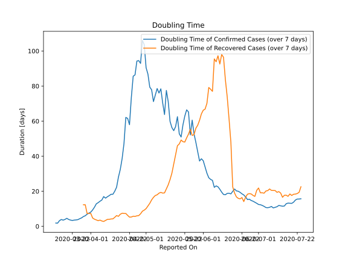

# Country Figures: New Infections in Previous 7 Days per 100,000 Population for CostaRica 

<!--  --> 

| Reported On | &Delta; Confirmed (on the day) | &Delta; Confirmed (last 7 days) | New Cases in Previous 7 Days per 100,000 Population |
|-------------|--------------------------------|---------------------------------|-----------------------------------------------------|
| 2020-05-09 |  7  |  47  |  0.940  |
| 2020-05-08 |  8  |  48  |  0.960  |
| 2020-05-07 |  4  |  46  |  0.920  |
| 2020-05-06 |  6  |  48  |  0.960  |
| 2020-05-05 |  13  |  50  |  1.000  |
| 2020-05-04 |  3  |  45  |  0.900  |
| 2020-05-03 |  6  |  44  |  0.880  |
| 2020-05-02 |  8  |  40  |  0.800  |
| 2020-05-01 |  6  |  38  |  0.760  |
| 2020-04-30 |  6  |  33  |  0.660  |
| 2020-04-29 |  8  |  32  |  0.640  |
| 2020-04-28 |  8  |  36  |  0.720  |
| 2020-04-27 |  2  |  35  |  0.700  |
| 2020-04-26 |  2  |  35  |  0.700  |
| 2020-04-25 |  6  |  38  |  0.760  |
| 2020-04-24 |  1  |  38  |  0.760  |
| 2020-04-23 |  5  |  44  |  0.880  |
| 2020-04-22 |  12  |  55  |  1.100  |
| 2020-04-21 |  7  |  51  |  1.020  |
| 2020-04-20 |  2  |  50  |  1.000  |
| 2020-04-19 |  5  |  65  |  1.300  |
| 2020-04-18 |  6  |  78  |  1.560  |
| 2020-04-17 |  7  |  91  |  1.820  |
| 2020-04-16 |  16  |  103  |  2.060  |
| 2020-04-15 |  8  |  124  |  2.480  |
| 2020-04-14 |  6  |  135  |  2.700  |
| 2020-04-13 |  17  |  145  |  2.900  |
| 2020-04-12 |  18  |  141  |  2.820  |
| 2020-04-11 |  19  |  142  |  2.840  |
| 2020-04-10 |  19  |  142  |  2.840  |
| 2020-04-09 |  37  |  143  |  2.860  |
| 2020-04-08 |  19  |  127  |  2.540  |
| 2020-04-07 |  16  |  136  |  2.720  |
| 2020-04-06 |  13  |  137  |  2.740  |
| 2020-04-05 |  19  |  140  |  2.800  |
| 2020-04-04 |  19  |  140  |  2.800  |
| 2020-04-03 |  20  |  153  |  3.060  |
| 2020-04-02 |  21  |  165  |  3.300  |
| 2020-04-01 |  28  |  174  |  3.480  |
| 2020-03-31 |  17  |  170  |  3.400  |
| 2020-03-30 |  16  |  172  |  3.440  |
| 2020-03-29 |  19  |  180  |  3.600  |
| 2020-03-28 |  32  |  178  |  3.560  |
| 2020-03-27 |  32  |  174  |  3.480  |
| 2020-03-26 |  30  |  162  |  3.240  |
| 2020-03-25 |  24  |  151  |  3.020  |
| 2020-03-24 |  19  |  136  |  2.720  |
| 2020-03-23 |  24  |  123  |  2.460  |
| 2020-03-22 |  17  |  107  |  2.140  |
| 2020-03-21 |  28  |  91  |  1.820  |
| 2020-03-20 |  20  |  66  |  1.320  |
| 2020-03-19 |  19  |  47  |  0.940  |
| 2020-03-18 |  9  |  37  |  0.740  |
| 2020-03-17 |  6  |  32  |  0.640  |
| 2020-03-16 |  8  |  26  |  0.520  |
| 2020-03-15 |  1  |  22  |  0.440  |
| 2020-03-14 |  3  |  25  |  0.500  |
| 2020-03-13 |  1  |  22  |  0.440  |
| 2020-03-12 |  9  |  21  |  0.420  |
| 2020-03-11 |  4  |  12  |  0.240  |
| 2020-03-10 |  None  |  8  |  0.160  |
| 2020-03-09 |  4  |  8  |  0.160  |
| 2020-03-08 |  4  |  4  |  0.080  |
| 2020-03-07 |  None  |  None  |  None  |
| 2020-03-06 |  None  |  None  |  None  |

