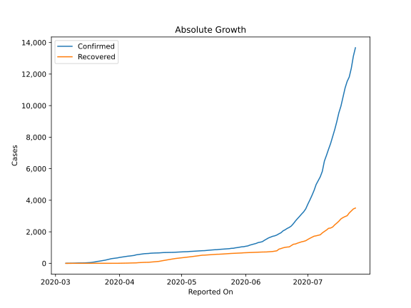

# Country Figures: Doubling Time of Infections for CostaRica 

The doubling time below are calculated based on
* an exponential growth assumption
* for time difference of past seven (7) days.
The doubling time's unit is "days".

The first doubling time indicates the increase of confirmed (infected)
cases. There, the *higher* the number is, the better is to take control
of the disease.

The second doubling time indicates the increase of recovered (healed)
cases. There, the *lower* the number is, the better it is to take
control of the disease.

| Reported On | Confirmed | Doubling Time (Confirmed) | Recovered | Doubling Time (Recovered) |
|-------------|-----------|---------------------------|-----------|---------------------------|
| 2020-04-25 | 693 |  86.4 days  | 242 |  5.6 days  | 
| 2020-04-24 | 687 |  85.6 days  | 216 |  5.7 days  | 
| 2020-04-23 | 686 |  73.5 days  | 196 |  5.3 days  | 
| 2020-04-22 | 681 |  58.0 days  | 180 |  5.2 days  | 
| 2020-04-21 | 669 |  61.5 days  | 150 |  6.3 days  | 
| 2020-04-20 | 662 |  62.1 days  | 124 |  7.3 days  | 
| 2020-04-19 | 660 |  47.1 days  | 112 |  7.3 days  | 
| 2020-04-18 | 655 |  38.6 days  | 97 |  7.4 days  | 
| 2020-04-17 | 649 |  32.5 days  | 88 |  6.9 days  | 
| 2020-04-16 | 642 |  28.1 days  | 74 |  5.7 days  | 
| 2020-04-15 | 626 |  22.3 days  | 67 |  6.1 days  | 
| 2020-04-14 | 618 |  20.0 days  | 66 |  5.1 days  | 
| 2020-04-13 | 612 |  18.3 days  | 62 |  4.3 days  | 
| 2020-04-12 | 595 |  18.3 days  | 56 |  4.2 days  | 
| 2020-04-11 | 577 |  17.5 days  | 49 |  4.0 days  | 
| 2020-04-10 | 558 |  16.9 days  | 42 |  4.0 days  | 
| 2020-04-09 | 539 |  16.1 days  | 30 |  3.3 days  | 
| 2020-04-08 | 502 |  17.0 days  | 29 |  2.8 days  | 
| 2020-04-07 | 483 |  15.0 days  | 24 |  3.0 days  | 
| 2020-04-06 | 467 |  14.3 days  | 18 |  3.6 days  | 
| 2020-04-05 | 454 |  13.5 days  | 16 |  3.2 days  | 
| 2020-04-04 | 435 |  12.8 days  | 13 |  3.6 days  | 
| 2020-04-03 | 416 |  10.9 days  | 11 |  4.1 days  | 
| 2020-04-02 | 396 |  9.3 days  | 6 |  4.8 days  | 
| 2020-04-01 | 375 |  8.1 days  | 4 |  7.3 days  | 
| 2020-03-31 | 347 |  7.5 days  | 4 |  7.3 days  | 
| 2020-03-30 | 330 |  6.9 days  | 4 |  7.3 days  | 
| 2020-03-29 | 314 |  6.0 days  | 3 |  12.3 days  | 
| 2020-03-28 | 295 |  5.6 days  | 3 |  12.3 days  | 
| 2020-03-27 | 263 |  4.8 days  | 3 |  None  | 
| 2020-03-26 | 231 |  4.4 days  | 2 |  None  | 
| 2020-03-25 | 201 |  3.8 days  | 2 |  None  | 
| 2020-03-24 | 177 |  3.7 days  | 2 |  None  | 
| 2020-03-23 | 158 |  3.6 days  | 2 |  None  | 
| 2020-03-22 | 134 |  3.4 days  | 2 |  None  | 
| 2020-03-21 | 117 |  3.6 days  | 2 |  None  | 
| 2020-03-20 | 89 |  3.9 days  | 0 |  None  | 
| 2020-03-19 | 69 |  4.6 days  | 0 |  None  | 
| 2020-03-18 | 50 |  3.9 days  | 0 |  None  | 
| 2020-03-17 | 41 |  3.5 days  | 0 |  None  | 
| 2020-03-16 | 35 |  3.9 days  | 0 |  None  | 
| 2020-03-15 | 27 |  3.2 days  | 0 |  None  | 
| 2020-03-14 | 26 |  1.8 days  | 0 |  None  | 
| 2020-03-13 | 23 |  1.9 days  | 0 |  None  | 
| 2020-03-12 | 22 |  None  | 0 |  None  | 
| 2020-03-11 | 13 |  None  | 0 |  None  | 
| 2020-03-10 | 9 |  None  | 0 |  None  | 
| 2020-03-09 | 9 |  None  | 0 |  None  | 
| 2020-03-08 | 5 |  None  | 0 |  None  | 
| 2020-03-07 | 1 |  None  | 0 |  None  | 
| 2020-03-06 | 1 |  None  | 0 |  None  | 

