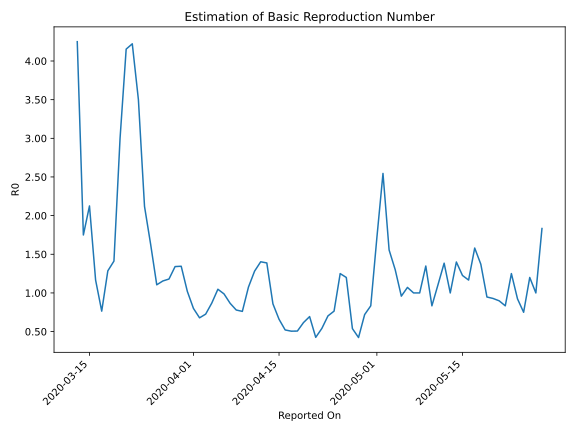

# Country Figures: Time Series for Basic Reproduction Number of CostaRica 

| Reported On | &Delta; Confirmed | Total &Delta; Confirmed First Interval | Total &Delta; Confirmed Second Interval | Estimated Basic Reproduction Number R0 | 
|-------------|-------------------|----------------------------------------|-----------------------------------------|---------------------------------------------------|
| 2020-05-01 | 6 |  24  |  14  |  1.71  | 
| 2020-04-30 | 6 |  20  |  24  |  0.83  | 
| 2020-04-29 | 8 |  18  |  25  |  0.72  | 
| 2020-04-28 | 8 |  11  |  26  |  0.42  | 
| 2020-04-27 | 2 |  14  |  26  |  0.54  | 
| 2020-04-26 | 2 |  24  |  20  |  1.20  | 
| 2020-04-25 | 6 |  25  |  20  |  1.25  | 
| 2020-04-24 | 1 |  26  |  34  |  0.76  | 
| 2020-04-23 | 5 |  26  |  37  |  0.70  | 
| 2020-04-22 | 12 |  20  |  37  |  0.54  | 
| 2020-04-21 | 7 |  20  |  47  |  0.43  | 
| 2020-04-20 | 2 |  34  |  49  |  0.69  | 
| 2020-04-19 | 5 |  37  |  60  |  0.62  | 
| 2020-04-18 | 6 |  37  |  73  |  0.51  | 
| 2020-04-17 | 7 |  47  |  93  |  0.51  | 
| 2020-04-16 | 16 |  49  |  94  |  0.52  | 
| 2020-04-15 | 8 |  60  |  91  |  0.66  | 
| 2020-04-14 | 6 |  73  |  85  |  0.86  | 
| 2020-04-13 | 17 |  93  |  67  |  1.39  | 
| 2020-04-12 | 18 |  94  |  67  |  1.40  | 
| 2020-04-11 | 19 |  91  |  71  |  1.28  | 
| 2020-04-10 | 19 |  85  |  79  |  1.08  | 
| 2020-04-09 | 37 |  67  |  88  |  0.76  | 
| 2020-04-08 | 19 |  67  |  86  |  0.78  | 
| 2020-04-07 | 16 |  71  |  82  |  0.87  | 
| 2020-04-06 | 13 |  79  |  80  |  0.99  | 
| 2020-04-05 | 19 |  88  |  84  |  1.05  | 
| 2020-04-04 | 19 |  86  |  99  |  0.87  | 
| 2020-04-03 | 20 |  82  |  113  |  0.73  | 
| 2020-04-02 | 21 |  80  |  118  |  0.68  | 
| 2020-04-01 | 28 |  84  |  105  |  0.80  | 
| 2020-03-31 | 17 |  99  |  97  |  1.02  | 
| 2020-03-30 | 16 |  113  |  84  |  1.35  | 
| 2020-03-29 | 19 |  118  |  88  |  1.34  | 
| 2020-03-28 | 32 |  105  |  89  |  1.18  | 
| 2020-03-27 | 32 |  97  |  84  |  1.15  | 
| 2020-03-26 | 30 |  84  |  76  |  1.11  | 
| 2020-03-25 | 24 |  88  |  54  |  1.63  | 
| 2020-03-24 | 19 |  89  |  42  |  2.12  | 
| 2020-03-23 | 24 |  84  |  24  |  3.50  | 
| 2020-03-22 | 17 |  76  |  18  |  4.22  | 
| 2020-03-21 | 28 |  54  |  13  |  4.15  | 
| 2020-03-20 | 20 |  42  |  14  |  3.00  | 
| 2020-03-19 | 19 |  24  |  17  |  1.41  | 
| 2020-03-18 | 9 |  18  |  14  |  1.29  | 
| 2020-03-17 | 6 |  13  |  17  |  0.76  | 
| 2020-03-16 | 8 |  14  |  12  |  1.17  | 
| 2020-03-15 | 1 |  17  |  8  |  2.12  | 
| 2020-03-14 | 3 |  14  |  8  |  1.75  | 
| 2020-03-13 | 1 |  17  |  4  |  4.25  | 
| 2020-03-12 | 9 |  12  |  None  |  None  | 
| 2020-03-11 | 4 |  8  |  None  |  None  | 
| 2020-03-10 | 0 |  8  |  None  |  None  | 
| 2020-03-09 | 4 |  4  |  None  |  None  | 
| 2020-03-08 | 4 |  None  |  None  |  None  | 
| 2020-03-07 | 0 |  None  |  None  |  None  | 
| 2020-03-06 | None |  None  |  None  |  None  | 

