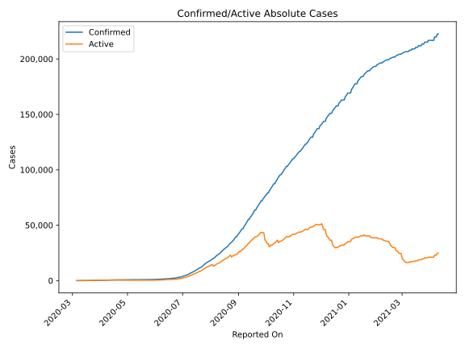
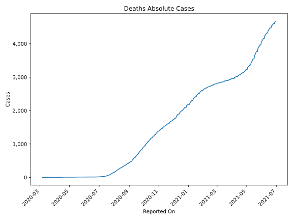
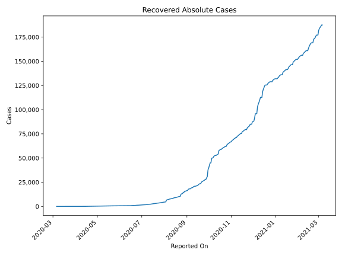
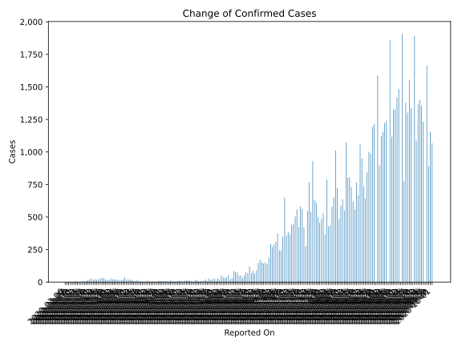
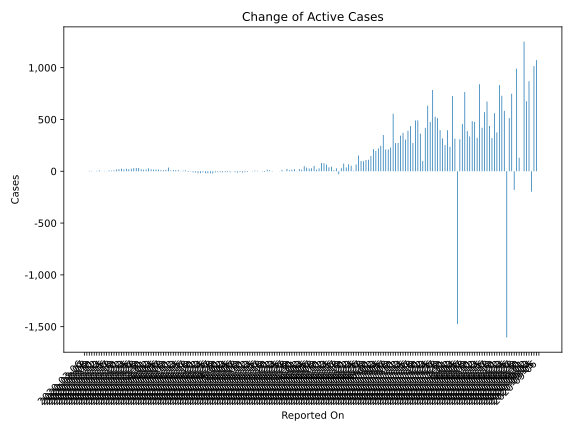
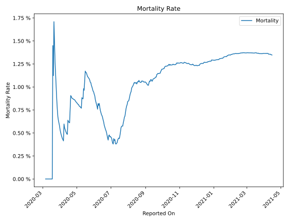

# Country Figures: Time Series for CostaRica 

| Reported On | Confirmed | Deaths | Recovered | Active | Mortality | &Delta; Confirmed | &Delta; Deaths | &Delta; Active | % Active of Population |
|-------------|-----------|--------|-----------|--------|-----------|-------------------|----------------|----------------|------------------------|
| 2020-03-24 | 177 | 2 | 2 | 173 |  1.13 %  | 19 | 0 | 19 |  0.003 %  | 
| 2020-03-23 | 158 | 2 | 2 | 154 |  1.27 %  | 24 | 0 | 24 |  0.003 %  | 
| 2020-03-22 | 134 | 2 | 2 | 130 |  1.49 %  | 17 | 0 | 17 |  0.003 %  | 
| 2020-03-21 | 117 | 2 | 2 | 113 |  1.71 %  | 28 | 1 | 25 |  0.002 %  | 
| 2020-03-20 | 89 | 1 | 0 | 88 |  1.12 %  | 20 | 0 | 20 |  0.002 %  | 
| 2020-03-19 | 69 | 1 | 0 | 68 |  1.45 %  | 19 | 1 | 18 |  0.001 %  | 
| 2020-03-18 | 50 | 0 | 0 | 50 |  None  | 9 | 0 | 9 |  0.001 %  | 
| 2020-03-17 | 41 | 0 | 0 | 41 |  None  | 6 | 0 | 6 |  0.001 %  | 
| 2020-03-16 | 35 | 0 | 0 | 35 |  None  | 8 | 0 | 8 |  0.001 %  | 
| 2020-03-15 | 27 | 0 | 0 | 27 |  None  | 1 | 0 | 1 |  0.001 %  | 
| 2020-03-14 | 26 | 0 | 0 | 26 |  None  | 3 | 0 | 3 |  0.001 %  | 
| 2020-03-13 | 23 | 0 | 0 | 23 |  None  | 1 | 0 | 1 |  0.000 %  | 
| 2020-03-12 | 22 | 0 | 0 | 22 |  None  | 9 | 0 | 9 |  0.000 %  | 
| 2020-03-11 | 13 | 0 | 0 | 13 |  None  | 4 | 0 | 4 |  0.000 %  | 
| 2020-03-10 | 9 | 0 | 0 | 9 |  None  | 0 | 0 | 0 |  0.000 %  | 
| 2020-03-09 | 9 | 0 | 0 | 9 |  None  | 4 | 0 | 4 |  0.000 %  | 
| 2020-03-08 | 5 | 0 | 0 | 5 |  None  | 4 | 0 | 4 |  0.000 %  | 
| 2020-03-07 | 1 | 0 | 0 | 1 |  None  | 0 | 0 | 0 |  0.000 %  | 
| 2020-03-06 | 1 | 0 | 0 | 1 |  None  | None | None | None |  0.000 %  | 

