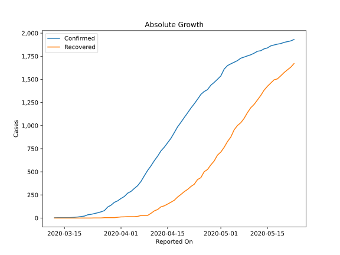
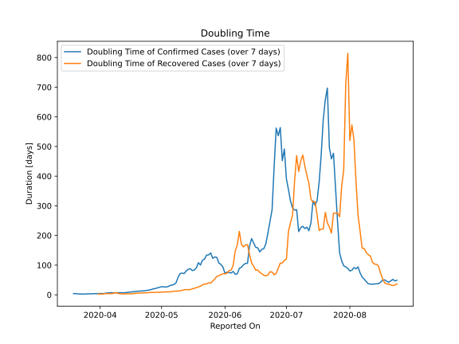

# Country Figures: Doubling Time of Infections for Cuba 

The doubling time below are calculated based on
* an exponential growth assumption
* for time difference of past seven (7) days.
The doubling time's unit is "days".

The first doubling time indicates the increase of confirmed (infected)
cases. There, the *higher* the number is, the better is to take control
of the disease.

The second doubling time indicates the increase of recovered (healed)
cases. There, the *lower* the number is, the better it is to take
control of the disease.

| Reported On | Confirmed | Doubling Time (Confirmed) | Recovered | Doubling Time (Recovered) |
|-------------|-----------|---------------------------|-----------|---------------------------|
| 2020-04-29 | 1467 |  23.4 days  | 617 |  8.5 days  | 
| 2020-04-28 | 1437 |  21.1 days  | 575 |  8.2 days  | 
| 2020-04-27 | 1389 |  20.1 days  | 525 |  8.3 days  | 
| 2020-04-26 | 1369 |  17.7 days  | 501 |  7.5 days  | 
| 2020-04-25 | 1337 |  16.3 days  | 437 |  7.7 days  | 
| 2020-04-24 | 1285 |  15.0 days  | 416 |  6.6 days  | 
| 2020-04-23 | 1235 |  13.8 days  | 365 |  6.7 days  | 
| 2020-04-22 | 1189 |  13.1 days  | 341 |  6.3 days  | 
| 2020-04-21 | 1137 |  12.6 days  | 309 |  6.0 days  | 
| 2020-04-20 | 1087 |  12.4 days  | 285 |  6.0 days  | 
| 2020-04-19 | 1035 |  11.5 days  | 255 |  5.1 days  | 
| 2020-04-18 | 986 |  10.8 days  | 227 |  4.8 days  | 
| 2020-04-17 | 923 |  10.2 days  | 192 |  4.0 days  | 
| 2020-04-16 | 862 |  9.8 days  | 171 |  3.0 days  | 
| 2020-04-15 | 814 |  8.7 days  | 151 |  3.2 days  | 
| 2020-04-14 | 766 |  7.7 days  | 132 |  3.4 days  | 
| 2020-04-13 | 726 |  7.0 days  | 121 |  2.9 days  | 
| 2020-04-12 | 669 |  6.9 days  | 92 |  3.0 days  | 
| 2020-04-11 | 620 |  6.7 days  | 77 |  3.3 days  | 
| 2020-04-10 | 564 |  6.9 days  | 51 |  4.3 days  | 
| 2020-04-09 | 515 |  6.5 days  | 28 |  6.7 days  | 
| 2020-04-08 | 457 |  6.7 days  | 27 |  6.3 days  | 
| 2020-04-07 | 396 |  6.8 days  | 27 |  4.3 days  | 
| 2020-04-06 | 350 |  7.1 days  | 18 |  3.6 days  | 
| 2020-04-05 | 320 |  6.2 days  | 15 |  4.0 days  | 
| 2020-04-04 | 288 |  5.8 days  | 15 |  4.0 days  | 
| 2020-04-03 | 269 |  4.3 days  | 15 |  4.0 days  | 
| 2020-04-02 | 233 |  4.2 days  | 13 |  2.2 days  | 
| 2020-04-01 | 212 |  4.0 days  | 12 |  2.3 days  | 
| 2020-03-31 | 186 |  3.9 days  | 8 |  2.7 days  | 
| 2020-03-30 | 170 |  3.7 days  | 4 |  None  | 
| 2020-03-29 | 139 |  3.9 days  | 4 |  None  | 
| 2020-03-28 | 119 |  3.1 days  | 4 |  None  | 
| 2020-03-27 | 80 |  3.3 days  | 4 |  None  | 
| 2020-03-26 | 67 |  3.0 days  | 1 |  None  | 
| 2020-03-25 | 57 |  2.6 days  | 1 |  None  | 
| 2020-03-24 | 48 |  2.5 days  | 1 |  None  | 
| 2020-03-23 | 40 |  2.4 days  | 0 |  None  | 
| 2020-03-22 | 35 |  2.6 days  | 0 |  None  | 
| 2020-03-21 | 21 |  3.3 days  | 0 |  None  | 
| 2020-03-20 | 16 |  3.8 days  | 0 |  None  | 
| 2020-03-19 | 11 |  4.1 days  | 0 |  None  | 
| 2020-03-18 | 7 |  None  | 0 |  None  | 
| 2020-03-17 | 5 |  None  | 0 |  None  | 
| 2020-03-16 | 4 |  None  | 0 |  None  | 
| 2020-03-15 | 4 |  None  | 0 |  None  | 
| 2020-03-14 | 4 |  None  | 0 |  None  | 
| 2020-03-13 | 4 |  None  | 0 |  None  | 
| 2020-03-12 | 3 |  None  | 0 |  None  | 

