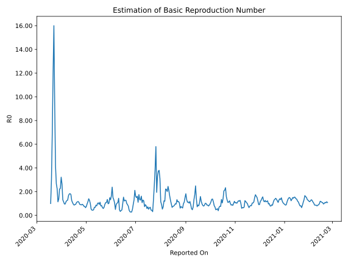

# Country Figures: Time Series for Basic Reproduction Number of Cuba 

| Reported On | &Delta; Confirmed | Total &Delta; Confirmed First Interval | Total &Delta; Confirmed Second Interval | Estimated Basic Reproduction Number R0 | 
|-------------|-------------------|----------------------------------------|-----------------------------------------|---------------------------------------------------|
| 2020-05-03 | 38 |  174  |  152  |  1.14  | 
| 2020-05-02 | 74 |  148  |  154  |  0.96  | 
| 2020-05-01 | 36 |  132  |  180  |  0.73  | 
| 2020-04-30 | 34 |  130  |  200  |  0.65  | 
| 2020-04-29 | 30 |  152  |  198  |  0.77  | 
| 2020-04-28 | 48 |  154  |  200  |  0.77  | 
| 2020-04-27 | 20 |  180  |  203  |  0.89  | 
| 2020-04-26 | 32 |  200  |  214  |  0.93  | 
| 2020-04-25 | 52 |  198  |  225  |  0.88  | 
| 2020-04-24 | 50 |  200  |  221  |  0.90  | 
| 2020-04-23 | 46 |  203  |  220  |  0.92  | 
| 2020-04-22 | 52 |  214  |  197  |  1.09  | 
| 2020-04-21 | 50 |  225  |  193  |  1.17  | 
| 2020-04-20 | 52 |  221  |  194  |  1.14  | 
| 2020-04-19 | 49 |  220  |  202  |  1.09  | 
| 2020-04-18 | 63 |  197  |  211  |  0.93  | 
| 2020-04-17 | 61 |  193  |  212  |  0.91  | 
| 2020-04-16 | 48 |  194  |  224  |  0.87  | 
| 2020-04-15 | 48 |  202  |  214  |  0.94  | 
| 2020-04-14 | 40 |  211  |  195  |  1.08  | 
| 2020-04-13 | 57 |  212  |  169  |  1.25  | 
| 2020-04-12 | 49 |  224  |  127  |  1.76  | 
| 2020-04-11 | 56 |  214  |  117  |  1.83  | 
| 2020-04-10 | 49 |  195  |  108  |  1.81  | 
| 2020-04-09 | 58 |  169  |  102  |  1.66  | 
| 2020-04-08 | 61 |  127  |  99  |  1.28  | 
| 2020-04-07 | 46 |  117  |  94  |  1.24  | 
| 2020-04-06 | 30 |  108  |  93  |  1.16  | 
| 2020-04-05 | 32 |  102  |  106  |  0.96  | 
| 2020-04-04 | 19 |  99  |  103  |  0.96  | 
| 2020-04-03 | 36 |  94  |  82  |  1.15  | 
| 2020-04-02 | 21 |  93  |  71  |  1.31  | 
| 2020-04-01 | 26 |  106  |  40  |  2.65  | 
| 2020-03-31 | 16 |  103  |  32  |  3.22  | 
| 2020-03-30 | 31 |  82  |  36  |  2.28  | 
| 2020-03-29 | 20 |  71  |  32  |  2.22  | 
| 2020-03-28 | 39 |  40  |  29  |  1.38  | 
| 2020-03-27 | 13 |  32  |  28  |  1.14  | 
| 2020-03-26 | 10 |  36  |  16  |  2.25  | 
| 2020-03-25 | 9 |  32  |  12  |  2.67  | 
| 2020-03-24 | 8 |  29  |  7  |  4.14  | 
| 2020-03-23 | 5 |  28  |  3  |  9.33  | 
| 2020-03-22 | 14 |  16  |  1  |  16.00  | 
| 2020-03-21 | 5 |  12  |  1  |  12.00  | 
| 2020-03-20 | 5 |  7  |  1  |  7.00  | 
| 2020-03-19 | 4 |  3  |  1  |  3.00  | 
| 2020-03-18 | 2 |  1  |  1  |  1.00  | 
| 2020-03-17 | 1 |  1  |  None  |  None  | 
| 2020-03-16 | 0 |  1  |  None  |  None  | 
| 2020-03-15 | 0 |  1  |  None  |  None  | 
| 2020-03-14 | 0 |  1  |  None  |  None  | 
| 2020-03-13 | 1 |  None  |  None  |  None  | 
| 2020-03-12 | None |  None  |  None  |  None  | 

