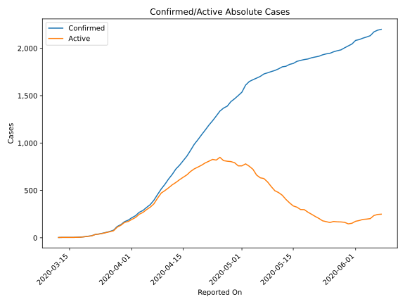
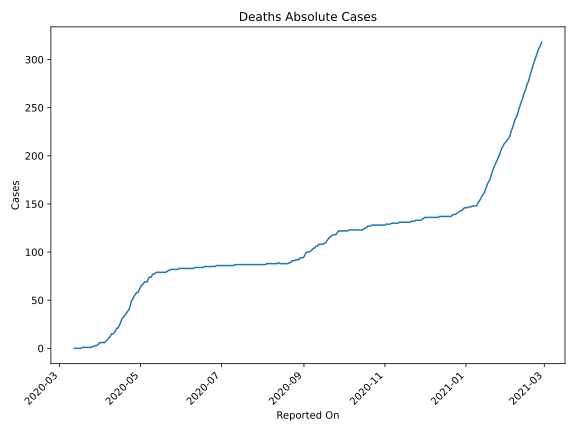
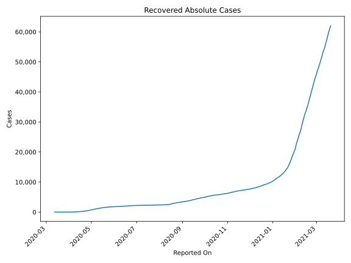
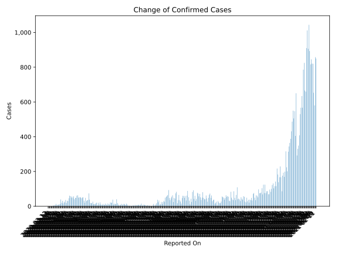
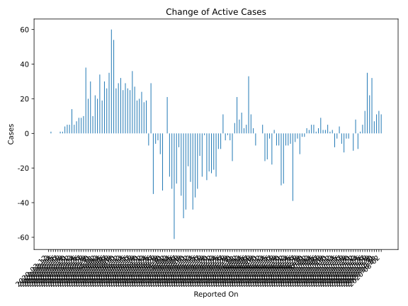
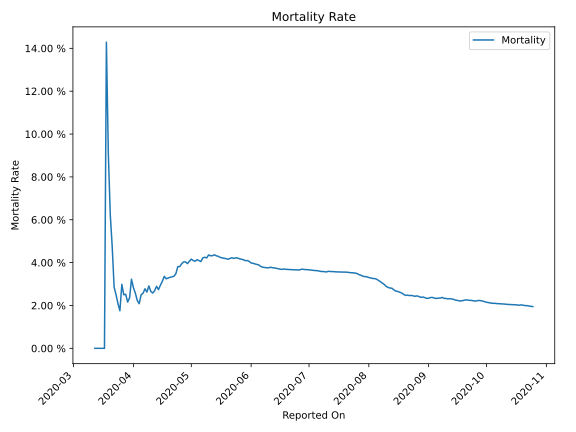

# Country Figures: Time Series for Cuba 

| Reported On | Confirmed | Deaths | Recovered | Active | Mortality | &Delta; Confirmed | &Delta; Deaths | &Delta; Recovered | &Delta; Active | % Active of Population |
|-------------|-----------|--------|-----------|--------|-----------|-------------------|----------------|-------------------|----------------|------------------------|
| 2020-04-20 | 1087 | 36 | 285 | 766 |  3.31 %  | 52 | 2 | 30 | 20 |  0.007 %  | 
| 2020-04-19 | 1035 | 34 | 255 | 746 |  3.29 %  | 49 | 2 | 28 | 19 |  0.007 %  | 
| 2020-04-18 | 986 | 32 | 227 | 727 |  3.25 %  | 63 | 1 | 35 | 27 |  0.006 %  | 
| 2020-04-17 | 923 | 31 | 192 | 700 |  3.36 %  | 61 | 4 | 21 | 36 |  0.006 %  | 
| 2020-04-16 | 862 | 27 | 171 | 664 |  3.13 %  | 48 | 3 | 20 | 25 |  0.006 %  | 
| 2020-04-15 | 814 | 24 | 151 | 639 |  2.95 %  | 48 | 3 | 19 | 26 |  0.006 %  | 
| 2020-04-14 | 766 | 21 | 132 | 613 |  2.74 %  | 40 | 0 | 11 | 29 |  0.005 %  | 
| 2020-04-13 | 726 | 21 | 121 | 584 |  2.89 %  | 57 | 3 | 29 | 25 |  0.005 %  | 
| 2020-04-12 | 669 | 18 | 92 | 559 |  2.69 %  | 49 | 2 | 15 | 32 |  0.005 %  | 
| 2020-04-11 | 620 | 16 | 77 | 527 |  2.58 %  | 56 | 1 | 26 | 29 |  0.005 %  | 
| 2020-04-10 | 564 | 15 | 51 | 498 |  2.66 %  | 49 | 0 | 23 | 26 |  0.004 %  | 
| 2020-04-09 | 515 | 15 | 28 | 472 |  2.91 %  | 58 | 3 | 1 | 54 |  0.004 %  | 
| 2020-04-08 | 457 | 12 | 27 | 418 |  2.63 %  | 61 | 1 | 0 | 60 |  0.004 %  | 
| 2020-04-07 | 396 | 11 | 27 | 358 |  2.78 %  | 46 | 2 | 9 | 35 |  0.003 %  | 
| 2020-04-06 | 350 | 9 | 18 | 323 |  2.57 %  | 30 | 1 | 3 | 26 |  0.003 %  | 
| 2020-04-05 | 320 | 8 | 15 | 297 |  2.50 %  | 32 | 2 | 0 | 30 |  0.003 %  | 
| 2020-04-04 | 288 | 6 | 15 | 267 |  2.08 %  | 19 | 0 | 0 | 19 |  0.002 %  | 
| 2020-04-03 | 269 | 6 | 15 | 248 |  2.23 %  | 36 | 0 | 2 | 34 |  0.002 %  | 
| 2020-04-02 | 233 | 6 | 13 | 214 |  2.58 %  | 21 | 0 | 1 | 20 |  0.002 %  | 
| 2020-04-01 | 212 | 6 | 12 | 194 |  2.83 %  | 26 | 0 | 4 | 22 |  0.002 %  | 
| 2020-03-31 | 186 | 6 | 8 | 172 |  3.23 %  | 16 | 2 | 4 | 10 |  0.002 %  | 
| 2020-03-30 | 170 | 4 | 4 | 162 |  2.35 %  | 31 | 1 | 0 | 30 |  0.001 %  | 
| 2020-03-29 | 139 | 3 | 4 | 132 |  2.16 %  | 20 | 0 | 0 | 20 |  0.001 %  | 
| 2020-03-28 | 119 | 3 | 4 | 112 |  2.52 %  | 39 | 1 | 0 | 38 |  0.001 %  | 
| 2020-03-27 | 80 | 2 | 4 | 74 |  2.50 %  | 13 | 0 | 3 | 10 |  0.001 %  | 
| 2020-03-26 | 67 | 2 | 1 | 64 |  2.99 %  | 10 | 1 | 0 | 9 |  0.001 %  | 
| 2020-03-25 | 57 | 1 | 1 | 55 |  1.75 %  | 9 | 0 | 0 | 9 |  0.000 %  | 
| 2020-03-24 | 48 | 1 | 1 | 46 |  2.08 %  | 8 | 0 | 1 | 7 |  0.000 %  | 
| 2020-03-23 | 40 | 1 | 0 | 39 |  2.50 %  | 5 | 0 | 0 | 5 |  0.000 %  | 
| 2020-03-22 | 35 | 1 | 0 | 34 |  2.86 %  | 14 | 0 | 0 | 14 |  0.000 %  | 
| 2020-03-21 | 21 | 1 | 0 | 20 |  4.76 %  | 5 | 0 | 0 | 5 |  0.000 %  | 
| 2020-03-20 | 16 | 1 | 0 | 15 |  6.25 %  | 5 | 0 | 0 | 5 |  0.000 %  | 
| 2020-03-19 | 11 | 1 | 0 | 10 |  9.09 %  | 4 | 0 | 0 | 4 |  0.000 %  | 
| 2020-03-18 | 7 | 1 | 0 | 6 |  14.29 %  | 2 | 1 | 0 | 1 |  0.000 %  | 
| 2020-03-17 | 5 | 0 | 0 | 5 |  None  | 1 | 0 | 0 | 1 |  0.000 %  | 
| 2020-03-16 | 4 | 0 | 0 | 4 |  None  | 0 | 0 | 0 | 0 |  0.000 %  | 
| 2020-03-15 | 4 | 0 | 0 | 4 |  None  | 0 | 0 | 0 | 0 |  0.000 %  | 
| 2020-03-14 | 4 | 0 | 0 | 4 |  None  | 0 | 0 | 0 | 0 |  0.000 %  | 
| 2020-03-13 | 4 | 0 | 0 | 4 |  None  | 1 | 0 | 0 | 1 |  0.000 %  | 
| 2020-03-12 | 3 | 0 | 0 | 3 |  None  | None | None | None | None |  0.000 %  | 

