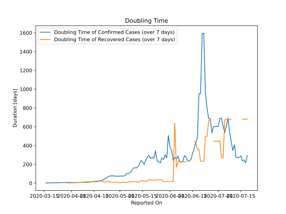

# Country Figures: New Infections in Previous 7 Days per 100,000 Population for Cyprus 

<!--  --> 

| Reported On | &Delta; Confirmed (on the day) | &Delta; Confirmed (last 7 days) | New Cases in Previous 7 Days per 100,000 Population |
|-------------|--------------------------------|---------------------------------|-----------------------------------------------------|
| 2020-05-08 |  2  |  34  |  2.859  |
| 2020-05-07 |  6  |  39  |  3.279  |
| 2020-05-06 |  5  |  40  |  3.363  |
| 2020-05-05 |  4  |  41  |  3.448  |
| 2020-05-04 |  2  |  52  |  4.372  |
| 2020-05-03 |  8  |  55  |  4.625  |
| 2020-05-02 |  7  |  54  |  4.541  |
| 2020-05-01 |  7  |  53  |  4.457  |
| 2020-04-30 |  7  |  55  |  4.625  |
| 2020-04-29 |  6  |  53  |  4.457  |
| 2020-04-28 |  15  |  53  |  4.457  |
| 2020-04-27 |  5  |  50  |  4.204  |
| 2020-04-26 |  7  |  50  |  4.204  |
| 2020-04-25 |  6  |  49  |  4.120  |
| 2020-04-24 |  9  |  54  |  4.541  |
| 2020-04-23 |  5  |  60  |  5.045  |
| 2020-04-22 |  6  |  75  |  6.306  |
| 2020-04-21 |  12  |  89  |  7.484  |
| 2020-04-20 |  5  |  110  |  9.249  |
| 2020-04-19 |  6  |  134  |  11.267  |
| 2020-04-18 |  11  |  145  |  12.192  |
| 2020-04-17 |  15  |  155  |  13.033  |
| 2020-04-16 |  20  |  171  |  14.379  |
| 2020-04-15 |  20  |  189  |  15.892  |
| 2020-04-14 |  33  |  201  |  16.901  |
| 2020-04-13 |  29  |  197  |  16.565  |
| 2020-04-12 |  17  |  187  |  15.724  |
| 2020-04-11 |  21  |  190  |  15.976  |
| 2020-04-10 |  31  |  199  |  16.733  |
| 2020-04-09 |  38  |  208  |  17.490  |
| 2020-04-08 |  32  |  206  |  17.322  |
| 2020-04-07 |  29  |  232  |  19.508  |
| 2020-04-06 |  19  |  235  |  19.760  |
| 2020-04-05 |  20  |  232  |  19.508  |
| 2020-04-04 |  30  |  247  |  20.769  |
| 2020-04-03 |  40  |  234  |  19.676  |
| 2020-04-02 |  36  |  210  |  17.658  |
| 2020-04-01 |  58  |  188  |  15.808  |
| 2020-03-31 |  32  |  138  |  11.604  |
| 2020-03-30 |  16  |  114  |  9.586  |
| 2020-03-29 |  35  |  119  |  10.006  |
| 2020-03-28 |  17  |  95  |  7.988  |
| 2020-03-27 |  16  |  95  |  7.988  |
| 2020-03-26 |  14  |  79  |  6.643  |
| 2020-03-25 |  8  |  83  |  6.979  |
| 2020-03-24 |  8  |  78  |  6.559  |
| 2020-03-23 |  21  |  83  |  6.979  |
| 2020-03-22 |  11  |  69  |  5.802  |
| 2020-03-21 |  17  |  58  |  4.877  |
| 2020-03-20 |  None  |  53  |  4.457  |
| 2020-03-19 |  18  |  61  |  5.129  |
| 2020-03-18 |  3  |  43  |  3.616  |
| 2020-03-17 |  13  |  43  |  3.616  |
| 2020-03-16 |  7  |  31  |  2.607  |
| 2020-03-15 |  None  |  24  |  2.018  |
| 2020-03-14 |  12  |  24  |  2.018  |
| 2020-03-13 |  8  |  12  |  1.009  |
| 2020-03-12 |  None  |  4  |  0.336  |
| 2020-03-11 |  3  |  4  |  0.336  |
| 2020-03-10 |  1  |  1  |  0.084  |
| 2020-03-09 |  None  |  None  |  None  |

