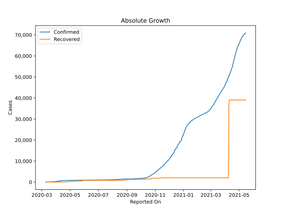

# Country Figures: Doubling Time of Infections for Cyprus 

The doubling time below are calculated based on
* an exponential growth assumption
* for time difference of past seven (7) days.
The doubling time's unit is "days".

The first doubling time indicates the increase of confirmed (infected)
cases. There, the *higher* the number is, the better is to take control
of the disease.

The second doubling time indicates the increase of recovered (healed)
cases. There, the *lower* the number is, the better it is to take
control of the disease.

| Reported On | Confirmed | Doubling Time (Confirmed) | Recovered | Doubling Time (Recovered) |
|-------------|-----------|---------------------------|-----------|---------------------------|
| 2020-05-04 | 874 |  79.4 days  | 296 |  7.3 days  | 
| 2020-05-03 | 872 |  74.8 days  | 296 |  7.3 days  | 
| 2020-05-02 | 864 |  75.5 days  | 296 |  7.3 days  | 
| 2020-05-01 | 857 |  76.4 days  | 296 |  4.7 days  | 
| 2020-04-30 | 850 |  72.9 days  | 296 |  4.7 days  | 
| 2020-04-29 | 843 |  75.1 days  | 148 |  12.1 days  | 
| 2020-04-28 | 837 |  74.5 days  | 148 |  12.1 days  | 
| 2020-04-27 | 822 |  77.7 days  | 148 |  8.4 days  | 
| 2020-04-26 | 817 |  77.2 days  | 148 |  8.4 days  | 
| 2020-04-25 | 810 |  78.1 days  | 148 |  8.1 days  | 
| 2020-04-24 | 804 |  70.1 days  | 98 |  20.5 days  | 
| 2020-04-23 | 795 |  62.2 days  | 98 |  20.5 days  | 
| 2020-04-22 | 790 |  49.0 days  | 98 |  12.2 days  | 
| 2020-04-21 | 784 |  40.6 days  | 98 |  12.2 days  | 
| 2020-04-20 | 772 |  31.9 days  | 81 |  22.4 days  | 
| 2020-04-19 | 767 |  25.6 days  | 81 |  22.4 days  | 
| 2020-04-18 | 761 |  23.3 days  | 79 |  19.1 days  | 
| 2020-04-17 | 750 |  21.3 days  | 77 |  17.5 days  | 
| 2020-04-16 | 735 |  18.7 days  | 77 |  13.3 days  | 
| 2020-04-15 | 715 |  16.1 days  | 65 |  22.1 days  | 
| 2020-04-14 | 695 |  14.6 days  | 65 |  15.3 days  | 
| 2020-04-13 | 662 |  14.1 days  | 65 |  13.5 days  | 
| 2020-04-12 | 633 |  14.2 days  | 65 |  9.0 days  | 
| 2020-04-11 | 616 |  13.5 days  | 61 |  8.2 days  | 
| 2020-04-10 | 595 |  12.3 days  | 58 |  7.0 days  | 
| 2020-04-09 | 564 |  10.9 days  | 53 |  7.9 days  | 
| 2020-04-08 | 526 |  10.1 days  | 52 |  8.2 days  | 
| 2020-04-07 | 494 |  8.0 days  | 47 |  7.1 days  | 
| 2020-04-06 | 465 |  7.2 days  | 45 |  7.1 days  | 
| 2020-04-05 | 446 |  6.9 days  | 37 |  5.7 days  | 
| 2020-04-04 | 426 |  5.9 days  | 33 |  6.5 days  | 
| 2020-04-03 | 396 |  5.8 days  | 28 |  8.1 days  | 
| 2020-04-02 | 356 |  5.8 days  | 28 |  2.8 days  | 
| 2020-04-01 | 320 |  5.8 days  | 28 |  2.5 days  | 
| 2020-03-31 | 262 |  6.8 days  | 23 |  2.7 days  | 
| 2020-03-30 | 230 |  7.4 days  | 22 |  2.8 days  | 
| 2020-03-29 | 214 |  6.3 days  | 15 |  3.3 days  | 
| 2020-03-28 | 179 |  6.8 days  | 15 |  None  | 
| 2020-03-27 | 162 |  5.8 days  | 15 |  None  | 
| 2020-03-26 | 146 |  6.6 days  | 4 |  None  | 
| 2020-03-25 | 132 |  5.2 days  | 3 |  None  | 
| 2020-03-24 | 124 |  5.2 days  | 3 |  None  | 
| 2020-03-23 | 116 |  4.2 days  | 3 |  None  | 
| 2020-03-22 | 95 |  4.1 days  | 3 |  None  | 
| 2020-03-21 | 84 |  4.5 days  | 0 |  None  | 
| 2020-03-20 | 67 |  3.4 days  | 0 |  None  | 
| 2020-03-19 | 67 |  2.3 days  | 0 |  None  | 
| 2020-03-18 | 49 |  2.6 days  | 0 |  None  | 
| 2020-03-17 | 46 |  2.1 days  | 0 |  None  | 
| 2020-03-16 | 33 |  2.1 days  | 0 |  None  | 
| 2020-03-15 | 26 |  None  | 0 |  None  | 
| 2020-03-14 | 26 |  None  | 0 |  None  | 
| 2020-03-13 | 14 |  None  | 0 |  None  | 
| 2020-03-12 | 6 |  None  | 0 |  None  | 
| 2020-03-11 | 6 |  None  | 0 |  None  | 
| 2020-03-10 | 3 |  None  | 0 |  None  | 
| 2020-03-09 | 2 |  None  | 0 |  None  | 

