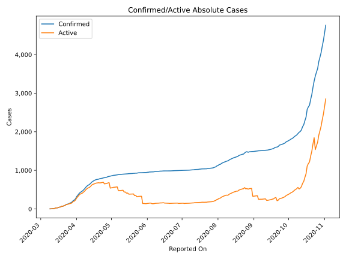
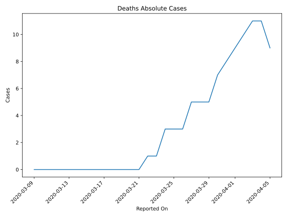
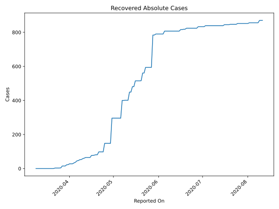
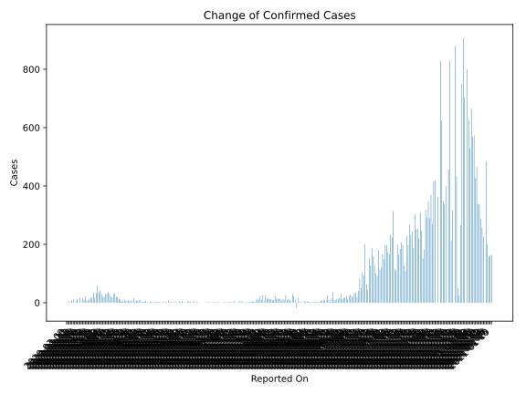
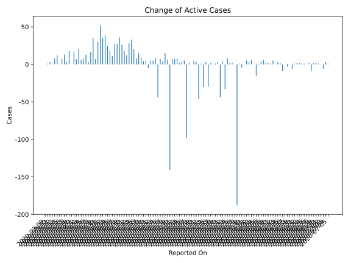
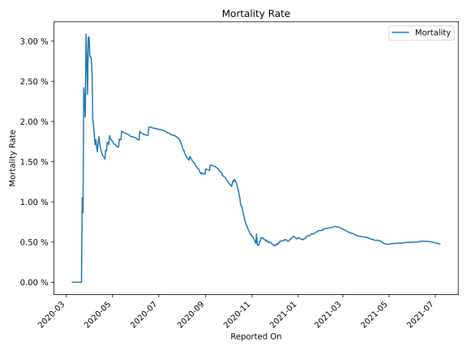

# Country Figures: Time Series for Cyprus 

| Reported On | Confirmed | Deaths | Recovered | Active | Mortality | &Delta; Confirmed | &Delta; Deaths | &Delta; Recovered | &Delta; Active | % Active of Population |
|-------------|-----------|--------|-----------|--------|-----------|-------------------|----------------|-------------------|----------------|------------------------|
| 2020-04-24 | 804 | 14 | 98 | 692 |  1.74 %  | 9 | 1 | 0 | 8 |  0.058 %  | 
| 2020-04-23 | 795 | 13 | 98 | 684 |  1.64 %  | 5 | 0 | 0 | 5 |  0.058 %  | 
| 2020-04-22 | 790 | 13 | 98 | 679 |  1.65 %  | 6 | 1 | 0 | 5 |  0.057 %  | 
| 2020-04-21 | 784 | 12 | 98 | 674 |  1.53 %  | 12 | 0 | 17 | -5 |  0.057 %  | 
| 2020-04-20 | 772 | 12 | 81 | 679 |  1.55 %  | 5 | 0 | 0 | 5 |  0.057 %  | 
| 2020-04-19 | 767 | 12 | 81 | 674 |  1.56 %  | 6 | 0 | 2 | 4 |  0.057 %  | 
| 2020-04-18 | 761 | 12 | 79 | 670 |  1.58 %  | 11 | 0 | 2 | 9 |  0.056 %  | 
| 2020-04-17 | 750 | 12 | 77 | 661 |  1.60 %  | 15 | 0 | 0 | 15 |  0.056 %  | 
| 2020-04-16 | 735 | 12 | 77 | 646 |  1.63 %  | 20 | 0 | 12 | 8 |  0.054 %  | 
| 2020-04-15 | 715 | 12 | 65 | 638 |  1.68 %  | 20 | 0 | 0 | 20 |  0.054 %  | 
| 2020-04-14 | 695 | 12 | 65 | 618 |  1.73 %  | 33 | 0 | 0 | 33 |  0.052 %  | 
| 2020-04-13 | 662 | 12 | 65 | 585 |  1.81 %  | 29 | 1 | 0 | 28 |  0.049 %  | 
| 2020-04-12 | 633 | 11 | 65 | 557 |  1.74 %  | 17 | 1 | 4 | 12 |  0.047 %  | 
| 2020-04-11 | 616 | 10 | 61 | 545 |  1.62 %  | 21 | 0 | 3 | 18 |  0.046 %  | 
| 2020-04-10 | 595 | 10 | 58 | 527 |  1.68 %  | 31 | 0 | 5 | 26 |  0.044 %  | 
| 2020-04-09 | 564 | 10 | 53 | 501 |  1.77 %  | 38 | 1 | 1 | 36 |  0.042 %  | 
| 2020-04-08 | 526 | 9 | 52 | 465 |  1.71 %  | 32 | 0 | 5 | 27 |  0.039 %  | 
| 2020-04-07 | 494 | 9 | 47 | 438 |  1.82 %  | 29 | 0 | 2 | 27 |  0.037 %  | 
| 2020-04-06 | 465 | 9 | 45 | 411 |  1.94 %  | 19 | 0 | 8 | 11 |  0.035 %  | 
| 2020-04-05 | 446 | 9 | 37 | 400 |  2.02 %  | 20 | -2 | 4 | 18 |  0.034 %  | 
| 2020-04-04 | 426 | 11 | 33 | 382 |  2.58 %  | 30 | 0 | 5 | 25 |  0.032 %  | 
| 2020-04-03 | 396 | 11 | 28 | 357 |  2.78 %  | 40 | 1 | 0 | 39 |  0.030 %  | 
| 2020-04-02 | 356 | 10 | 28 | 318 |  2.81 %  | 36 | 1 | 0 | 35 |  0.027 %  | 
| 2020-04-01 | 320 | 9 | 28 | 283 |  2.81 %  | 58 | 1 | 5 | 52 |  0.024 %  | 
| 2020-03-31 | 262 | 8 | 23 | 231 |  3.05 %  | 32 | 1 | 1 | 30 |  0.019 %  | 
| 2020-03-30 | 230 | 7 | 22 | 201 |  3.04 %  | 16 | 2 | 7 | 7 |  0.017 %  | 
| 2020-03-29 | 214 | 5 | 15 | 194 |  2.34 %  | 35 | 0 | 0 | 35 |  0.016 %  | 
| 2020-03-28 | 179 | 5 | 15 | 159 |  2.79 %  | 17 | 0 | 0 | 17 |  0.013 %  | 
| 2020-03-27 | 162 | 5 | 15 | 142 |  3.09 %  | 16 | 2 | 11 | 3 |  0.012 %  | 
| 2020-03-26 | 146 | 3 | 4 | 139 |  2.05 %  | 14 | 0 | 1 | 13 |  0.012 %  | 
| 2020-03-25 | 132 | 3 | 3 | 126 |  2.27 %  | 8 | 0 | 0 | 8 |  0.011 %  | 
| 2020-03-24 | 124 | 3 | 3 | 118 |  2.42 %  | 8 | 2 | 0 | 6 |  0.010 %  | 
| 2020-03-23 | 116 | 1 | 3 | 112 |  0.86 %  | 21 | 0 | 0 | 21 |  0.009 %  | 
| 2020-03-22 | 95 | 1 | 3 | 91 |  1.05 %  | 11 | 1 | 3 | 7 |  0.008 %  | 
| 2020-03-21 | 84 | 0 | 0 | 84 |  None  | 17 | 0 | 0 | 17 |  0.007 %  | 
| 2020-03-20 | 67 | 0 | 0 | 67 |  None  | 0 | 0 | 0 | 0 |  0.006 %  | 
| 2020-03-19 | 67 | 0 | 0 | 67 |  None  | 18 | 0 | 0 | 18 |  0.006 %  | 
| 2020-03-18 | 49 | 0 | 0 | 49 |  None  | 3 | 0 | 0 | 3 |  0.004 %  | 
| 2020-03-17 | 46 | 0 | 0 | 46 |  None  | 13 | 0 | 0 | 13 |  0.004 %  | 
| 2020-03-16 | 33 | 0 | 0 | 33 |  None  | 7 | 0 | 0 | 7 |  0.003 %  | 
| 2020-03-15 | 26 | 0 | 0 | 26 |  None  | 0 | 0 | 0 | 0 |  0.002 %  | 
| 2020-03-14 | 26 | 0 | 0 | 26 |  None  | 12 | 0 | 0 | 12 |  0.002 %  | 
| 2020-03-13 | 14 | 0 | 0 | 14 |  None  | 8 | 0 | 0 | 8 |  0.001 %  | 
| 2020-03-12 | 6 | 0 | 0 | 6 |  None  | 0 | 0 | 0 | 0 |  0.001 %  | 
| 2020-03-11 | 6 | 0 | 0 | 6 |  None  | 3 | 0 | 0 | 3 |  0.001 %  | 
| 2020-03-10 | 3 | 0 | 0 | 3 |  None  | 1 | 0 | 0 | 1 |  0.000 %  | 
| 2020-03-09 | 2 | 0 | 0 | 2 |  None  | None | None | None | None |  0.000 %  | 

