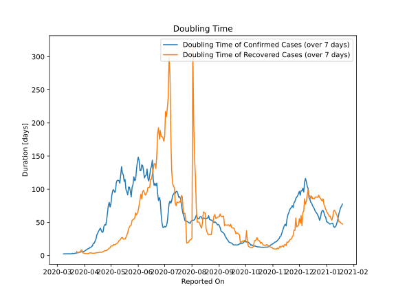

# Country Figures: New Infections in Previous 7 Days per 100,000 Population for Czechia 

<!--  --> 

| Reported On | &Delta; Confirmed (on the day) | &Delta; Confirmed (last 7 days) | New Cases in Previous 7 Days per 100,000 Population |
|-------------|--------------------------------|---------------------------------|-----------------------------------------------------|
| 2020-05-08 |  46  |  340  |  3.200  |
| 2020-05-07 |  57  |  349  |  3.284  |
| 2020-05-06 |  78  |  395  |  3.717  |
| 2020-05-05 |  77  |  392  |  3.689  |
| 2020-05-04 |  38  |  374  |  3.520  |
| 2020-05-03 |  26  |  377  |  3.548  |
| 2020-05-02 |  18  |  403  |  3.793  |
| 2020-05-01 |  55  |  464  |  4.367  |
| 2020-04-30 |  103  |  495  |  4.659  |
| 2020-04-29 |  75  |  447  |  4.207  |
| 2020-04-28 |  59  |  471  |  4.433  |
| 2020-04-27 |  41  |  545  |  5.129  |
| 2020-04-26 |  52  |  658  |  6.193  |
| 2020-04-25 |  79  |  746  |  7.021  |
| 2020-04-24 |  86  |  724  |  6.814  |
| 2020-04-23 |  55  |  754  |  7.096  |
| 2020-04-22 |  99  |  916  |  8.621  |
| 2020-04-21 |  133  |  922  |  8.677  |
| 2020-04-20 |  154  |  841  |  7.915  |
| 2020-04-19 |  140  |  755  |  7.105  |
| 2020-04-18 |  57  |  775  |  7.294  |
| 2020-04-17 |  116  |  817  |  7.689  |
| 2020-04-16 |  217  |  864  |  8.131  |
| 2020-04-15 |  105  |  904  |  8.508  |
| 2020-04-14 |  52  |  1094  |  10.296  |
| 2020-04-13 |  68  |  1237  |  11.642  |
| 2020-04-12 |  160  |  1404  |  13.213  |
| 2020-04-11 |  99  |  1359  |  12.790  |
| 2020-04-10 |  163  |  1641  |  15.444  |
| 2020-04-09 |  257  |  1711  |  16.102  |
| 2020-04-08 |  295  |  1804  |  16.978  |
| 2020-04-07 |  195  |  1709  |  16.084  |
| 2020-04-06 |  235  |  1821  |  17.138  |
| 2020-04-05 |  115  |  1770  |  16.658  |
| 2020-04-04 |  381  |  1841  |  17.326  |
| 2020-04-03 |  233  |  1812  |  17.053  |
| 2020-04-02 |  350  |  1933  |  18.192  |
| 2020-04-01 |  200  |  1854  |  17.448  |
| 2020-03-31 |  307  |  1914  |  18.013  |
| 2020-03-30 |  184  |  1765  |  16.611  |
| 2020-03-29 |  186  |  1697  |  15.971  |
| 2020-03-28 |  352  |  1636  |  15.397  |
| 2020-03-27 |  354  |  1446  |  13.609  |
| 2020-03-26 |  271  |  1231  |  11.585  |
| 2020-03-25 |  260  |  1190  |  11.199  |
| 2020-03-24 |  158  |  998  |  9.392  |
| 2020-03-23 |  116  |  938  |  8.828  |
| 2020-03-22 |  125  |  867  |  8.159  |
| 2020-03-21 |  162  |  806  |  7.585  |
| 2020-03-20 |  139  |  692  |  6.513  |
| 2020-03-19 |  230  |  600  |  5.647  |
| 2020-03-18 |  68  |  373  |  3.510  |
| 2020-03-17 |  98  |  355  |  3.341  |
| 2020-03-16 |  45  |  267  |  2.513  |
| 2020-03-15 |  64  |  222  |  2.089  |
| 2020-03-14 |  48  |  170  |  1.600  |
| 2020-03-13 |  47  |  123  |  1.158  |
| 2020-03-12 |  3  |  82  |  0.772  |
| 2020-03-11 |  50  |  83  |  0.781  |
| 2020-03-10 |  10  |  36  |  0.339  |
| 2020-03-09 |  None  |  28  |  0.264  |
| 2020-03-08 |  12  |  28  |  0.264  |
| 2020-03-07 |  1  |  16  |  0.151  |
| 2020-03-06 |  6  |  15  |  0.141  |
| 2020-03-05 |  4  |  9  |  0.085  |
| 2020-03-04 |  3  |  5  |  0.047  |
| 2020-03-03 |  2  |  2  |  0.019  |
| 2020-03-02 |  None  |  None  |  None  |
| 2020-03-01 |  None  |  None  |  None  |

