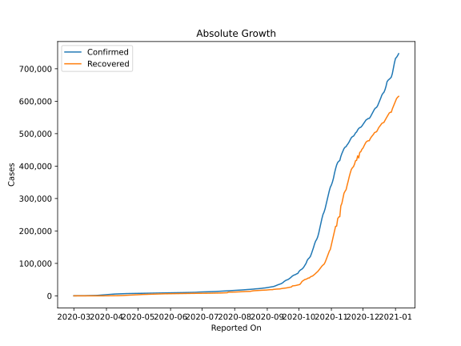

# Country Figures: Doubling Time of Infections for Czechia 

The doubling time below are calculated based on
* an exponential growth assumption
* for time difference of past seven (7) days.
The doubling time's unit is "days".

The first doubling time indicates the increase of confirmed (infected)
cases. There, the *higher* the number is, the better is to take control
of the disease.

The second doubling time indicates the increase of recovered (healed)
cases. There, the *lower* the number is, the better it is to take
control of the disease.

| Reported On | Confirmed | Doubling Time (Confirmed) | Recovered | Doubling Time (Recovered) |
|-------------|-----------|---------------------------|-----------|---------------------------|
| 2020-04-11 | 5831 |  18.6 days  | 411 |  3.3 days  | 
| 2020-04-10 | 5732 |  14.7 days  | 346 |  3.4 days  | 
| 2020-04-09 | 5569 |  13.6 days  | 301 |  3.6 days  | 
| 2020-04-08 | 5312 |  12.0 days  | 233 |  4.0 days  | 
| 2020-04-07 | 5017 |  12.0 days  | 172 |  4.0 days  | 
| 2020-04-06 | 4822 |  10.6 days  | 121 |  3.4 days  | 
| 2020-04-05 | 4587 |  10.3 days  | 96 |  2.6 days  | 
| 2020-04-04 | 4472 |  9.5 days  | 78 |  2.8 days  | 
| 2020-04-03 | 4091 |  8.6 days  | 72 |  2.9 days  | 
| 2020-04-02 | 3858 |  7.3 days  | 67 |  2.9 days  | 
| 2020-04-01 | 3508 |  6.8 days  | 61 |  3.0 days  | 
| 2020-03-31 | 3308 |  6.0 days  | 45 |  3.6 days  | 
| 2020-03-30 | 3001 |  5.8 days  | 25 |  4.1 days  | 
| 2020-03-29 | 2817 |  5.6 days  | 11 |  8.3 days  | 
| 2020-03-28 | 2631 |  5.3 days  | 11 |  8.3 days  | 
| 2020-03-27 | 2279 |  5.2 days  | 11 |  5.1 days  | 
| 2020-03-26 | 1925 |  5.1 days  | 10 |  4.4 days  | 
| 2020-03-25 | 1654 |  4.2 days  | 10 |  4.4 days  | 
| 2020-03-24 | 1394 |  4.2 days  | 10 |  4.4 days  | 
| 2020-03-23 | 1236 |  3.7 days  | 7 |  6.1 days  | 
| 2020-03-22 | 1120 |  3.6 days  | 6 |  None  | 
| 2020-03-21 | 995 |  3.3 days  | 6 |  None  | 
| 2020-03-20 | 833 |  3.1 days  | 4 |  None  | 
| 2020-03-19 | 694 |  2.8 days  | 3 |  None  | 
| 2020-03-18 | 464 |  3.3 days  | 3 |  None  | 
| 2020-03-17 | 396 |  2.5 days  | 3 |  None  | 
| 2020-03-16 | 298 |  2.5 days  | 3 |  None  | 
| 2020-03-15 | 253 |  2.6 days  | 0 |  None  | 
| 2020-03-14 | 189 |  2.4 days  | 0 |  None  | 
| 2020-03-13 | 141 |  2.7 days  | 0 |  None  | 
| 2020-03-12 | 94 |  2.7 days  | 0 |  None  | 
| 2020-03-11 | 91 |  2.3 days  | 0 |  None  | 
| 2020-03-10 | 41 |  2.6 days  | 0 |  None  | 
| 2020-03-09 | 31 |  2.4 days  | 0 |  None  | 
| 2020-03-08 | 31 |  2.4 days  | 0 |  None  | 
| 2020-03-07 | 19 |  None  | 0 |  None  | 
| 2020-03-06 | 18 |  None  | 0 |  None  | 
| 2020-03-05 | 12 |  None  | 0 |  None  | 
| 2020-03-04 | 8 |  None  | 0 |  None  | 
| 2020-03-03 | 5 |  None  | 0 |  None  | 
| 2020-03-02 | 3 |  None  | 0 |  None  | 
| 2020-03-01 | 3 |  None  | 0 |  None  | 

