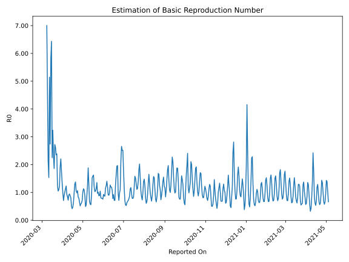

# Country Figures: Time Series for Basic Reproduction Number of Czechia 

| Reported On | &Delta; Confirmed | Total &Delta; Confirmed First Interval | Total &Delta; Confirmed Second Interval | Estimated Basic Reproduction Number R0 | 
|-------------|-------------------|----------------------------------------|-----------------------------------------|---------------------------------------------------|
| 2020-05-09 | 18 |  258  |  137  |  1.88  | 
| 2020-05-08 | 46 |  250  |  202  |  1.24  | 
| 2020-05-07 | 57 |  219  |  251  |  0.87  | 
| 2020-05-06 | 78 |  159  |  292  |  0.54  | 
| 2020-05-05 | 77 |  137  |  278  |  0.49  | 
| 2020-05-04 | 38 |  202  |  227  |  0.89  | 
| 2020-05-03 | 26 |  251  |  231  |  1.09  | 
| 2020-05-02 | 18 |  292  |  258  |  1.13  | 
| 2020-05-01 | 55 |  278  |  272  |  1.02  | 
| 2020-04-30 | 103 |  227  |  319  |  0.71  | 
| 2020-04-29 | 75 |  231  |  373  |  0.62  | 
| 2020-04-28 | 59 |  258  |  441  |  0.59  | 
| 2020-04-27 | 41 |  272  |  526  |  0.52  | 
| 2020-04-26 | 52 |  319  |  484  |  0.66  | 
| 2020-04-25 | 79 |  373  |  467  |  0.80  | 
| 2020-04-24 | 86 |  441  |  530  |  0.83  | 
| 2020-04-23 | 55 |  526  |  495  |  1.06  | 
| 2020-04-22 | 99 |  484  |  490  |  0.99  | 
| 2020-04-21 | 133 |  467  |  442  |  1.06  | 
| 2020-04-20 | 154 |  530  |  385  |  1.38  | 
| 2020-04-19 | 140 |  495  |  379  |  1.31  | 
| 2020-04-18 | 57 |  490  |  490  |  1.00  | 
| 2020-04-17 | 116 |  442  |  679  |  0.65  | 
| 2020-04-16 | 217 |  385  |  814  |  0.47  | 
| 2020-04-15 | 105 |  379  |  910  |  0.42  | 
| 2020-04-14 | 52 |  490  |  982  |  0.50  | 
| 2020-04-13 | 68 |  679  |  840  |  0.81  | 
| 2020-04-12 | 160 |  814  |  926  |  0.88  | 
| 2020-04-11 | 99 |  910  |  964  |  0.94  | 
| 2020-04-10 | 163 |  982  |  1079  |  0.91  | 
| 2020-04-09 | 257 |  840  |  1164  |  0.72  | 
| 2020-04-08 | 295 |  926  |  1090  |  0.85  | 
| 2020-04-07 | 195 |  964  |  1041  |  0.93  | 
| 2020-04-06 | 235 |  1079  |  877  |  1.23  | 
| 2020-04-05 | 115 |  1164  |  1029  |  1.13  | 
| 2020-04-04 | 381 |  1090  |  1076  |  1.01  | 
| 2020-04-03 | 233 |  1041  |  1163  |  0.90  | 
| 2020-04-02 | 350 |  877  |  1237  |  0.71  | 
| 2020-04-01 | 200 |  1029  |  1043  |  0.99  | 
| 2020-03-31 | 307 |  1076  |  805  |  1.34  | 
| 2020-03-30 | 184 |  1163  |  659  |  1.76  | 
| 2020-03-29 | 186 |  1237  |  561  |  2.20  | 
| 2020-03-28 | 352 |  1043  |  542  |  1.92  | 
| 2020-03-27 | 354 |  805  |  656  |  1.23  | 
| 2020-03-26 | 271 |  659  |  599  |  1.10  | 
| 2020-03-25 | 260 |  561  |  535  |  1.05  | 
| 2020-03-24 | 158 |  542  |  441  |  1.23  | 
| 2020-03-23 | 116 |  656  |  275  |  2.39  | 
| 2020-03-22 | 125 |  599  |  255  |  2.35  | 
| 2020-03-21 | 162 |  535  |  204  |  2.62  | 
| 2020-03-20 | 139 |  441  |  162  |  2.72  | 
| 2020-03-19 | 230 |  275  |  148  |  1.86  | 
| 2020-03-18 | 68 |  255  |  110  |  2.32  | 
| 2020-03-17 | 98 |  204  |  63  |  3.24  | 
| 2020-03-16 | 45 |  162  |  72  |  2.25  | 
| 2020-03-15 | 64 |  148  |  23  |  6.43  | 
| 2020-03-14 | 48 |  110  |  19  |  5.79  | 
| 2020-03-13 | 47 |  63  |  23  |  2.74  | 
| 2020-03-12 | 3 |  72  |  14  |  5.14  | 
| 2020-03-11 | 50 |  23  |  15  |  1.53  | 
| 2020-03-10 | 10 |  19  |  9  |  2.11  | 
| 2020-03-09 | 0 |  23  |  5  |  4.60  | 
| 2020-03-08 | 12 |  14  |  2  |  7.00  | 
| 2020-03-07 | 1 |  15  |  None  |  None  | 
| 2020-03-06 | 6 |  9  |  None  |  None  | 
| 2020-03-05 | 4 |  5  |  None  |  None  | 
| 2020-03-04 | 3 |  2  |  None  |  None  | 
| 2020-03-03 | 2 |  None  |  None  |  None  | 
| 2020-03-02 | 0 |  None  |  None  |  None  | 
| 2020-03-01 | None |  None  |  None  |  None  | 

