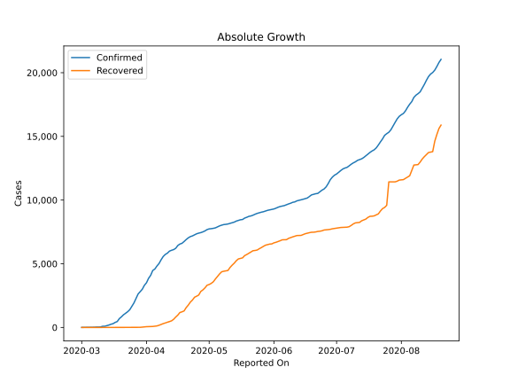
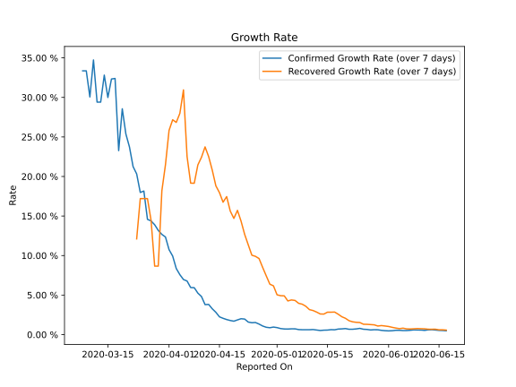

# Country Figures: Growth Rate for Czechia 

The growth rates below are calculated based on
* an exponential growth assumption
* for time difference of past seven (7) days.
The growth rate is to be understood as on "growth per day".

The first growth rate indicates the increase of confirmed (infected) cases.

The second growth rate indicates the increase of recovered (healed) cases.

| Reported On | Confirmed | Growth Rate (Confirmed) | Recovered | Growth Rate (Recovered) |
|-------------|-----------|-------------------------|-----------|-------------------------|
| 2020-05-03 | 7781 |  0.71 %  | 3587 |  4.903 %  | 
| 2020-05-02 | 7755 |  0.76 %  | 3461 |  4.918 %  | 
| 2020-05-01 | 7737 |  0.88 %  | 3372 |  5.031 %  | 
| 2020-04-30 | 7682 |  0.95 %  | 3314 |  6.168 %  | 
| 2020-04-29 | 7579 |  0.87 %  | 3108 |  6.376 %  | 
| 2020-04-28 | 7504 |  0.93 %  | 2948 |  7.426 %  | 
| 2020-04-27 | 7445 |  1.09 %  | 2826 |  8.497 %  | 
| 2020-04-26 | 7404 |  1.33 %  | 2545 |  9.619 %  | 
| 2020-04-25 | 7352 |  1.53 %  | 2453 |  9.896 %  | 
| 2020-04-24 | 7273 |  1.50 %  | 2371 |  10.041 %  | 
| 2020-04-23 | 7187 |  1.58 %  | 2152 |  11.354 %  | 
| 2020-04-22 | 7132 |  1.96 %  | 1989 |  12.676 %  | 
| 2020-04-21 | 7033 |  2.01 %  | 1753 |  14.350 %  | 
| 2020-04-20 | 6900 |  1.86 %  | 1559 |  15.713 %  | 
| 2020-04-19 | 6746 |  1.70 %  | 1298 |  14.696 %  | 
| 2020-04-18 | 6606 |  1.78 %  | 1227 |  15.625 %  | 
| 2020-04-17 | 6549 |  1.90 %  | 1174 |  17.453 %  | 
| 2020-04-16 | 6433 |  2.06 %  | 972 |  16.746 %  | 
| 2020-04-15 | 6216 |  2.25 %  | 819 |  17.958 %  | 
| 2020-04-14 | 6111 |  2.82 %  | 642 |  18.816 %  | 
| 2020-04-13 | 6059 |  3.26 %  | 519 |  20.802 %  | 
| 2020-04-12 | 5991 |  3.81 %  | 464 |  22.508 %  | 
| 2020-04-11 | 5831 |  3.79 %  | 411 |  23.741 %  | 
| 2020-04-10 | 5732 |  4.82 %  | 346 |  22.425 %  | 
| 2020-04-09 | 5569 |  5.24 %  | 301 |  21.463 %  | 
| 2020-04-08 | 5312 |  5.93 %  | 233 |  19.145 %  | 
| 2020-04-07 | 5017 |  5.95 %  | 172 |  19.155 %  | 
| 2020-04-06 | 4822 |  6.77 %  | 121 |  22.527 %  | 
| 2020-04-05 | 4587 |  6.97 %  | 96 |  30.949 %  | 
| 2020-04-04 | 4472 |  7.58 %  | 78 |  27.983 %  | 
| 2020-04-03 | 4091 |  8.36 %  | 72 |  26.840 %  | 
| 2020-04-02 | 3858 |  9.93 %  | 67 |  27.173 %  | 
| 2020-04-01 | 3508 |  10.74 %  | 61 |  25.833 %  | 
| 2020-03-31 | 3308 |  12.35 %  | 45 |  21.487 %  | 
| 2020-03-30 | 3001 |  12.67 %  | 25 |  18.185 %  | 
| 2020-03-29 | 2817 |  13.18 %  | 11 |  8.659 %  | 
| 2020-03-28 | 2631 |  13.89 %  | 11 |  8.659 %  | 
| 2020-03-27 | 2279 |  14.38 %  | 11 |  14.451 %  | 
| 2020-03-26 | 1925 |  14.57 %  | 10 |  17.200 %  | 
| 2020-03-25 | 1654 |  18.16 %  | 10 |  17.200 %  | 
| 2020-03-24 | 1394 |  17.98 %  | 10 |  17.200 %  | 
| 2020-03-23 | 1236 |  20.32 %  | 7 |  12.104 %  | 
| 2020-03-22 | 1120 |  21.25 %  | 6 |  None  | 
| 2020-03-21 | 995 |  23.73 %  | 6 |  None  | 
| 2020-03-20 | 833 |  25.38 %  | 4 |  None  | 
| 2020-03-19 | 694 |  28.56 %  | 3 |  None  | 
| 2020-03-18 | 464 |  23.27 %  | 3 |  None  | 
| 2020-03-17 | 396 |  32.40 %  | 3 |  None  | 
| 2020-03-16 | 298 |  32.33 %  | 3 |  None  | 
| 2020-03-15 | 253 |  29.99 %  | 0 |  None  | 
| 2020-03-14 | 189 |  32.82 %  | 0 |  None  | 
| 2020-03-13 | 141 |  29.41 %  | 0 |  None  | 
| 2020-03-12 | 94 |  29.41 %  | 0 |  None  | 
| 2020-03-11 | 91 |  34.73 %  | 0 |  None  | 
| 2020-03-10 | 41 |  30.06 %  | 0 |  None  | 
| 2020-03-09 | 31 |  33.36 %  | 0 |  None  | 
| 2020-03-08 | 31 |  33.36 %  | 0 |  None  | 
| 2020-03-07 | 19 |  None  | 0 |  None  | 
| 2020-03-06 | 18 |  None  | 0 |  None  | 
| 2020-03-05 | 12 |  None  | 0 |  None  | 
| 2020-03-04 | 8 |  None  | 0 |  None  | 
| 2020-03-03 | 5 |  None  | 0 |  None  | 
| 2020-03-02 | 3 |  None  | 0 |  None  | 
| 2020-03-01 | 3 |  None  | 0 |  None  | 

