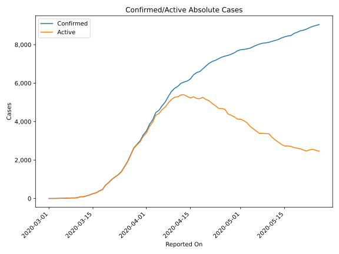
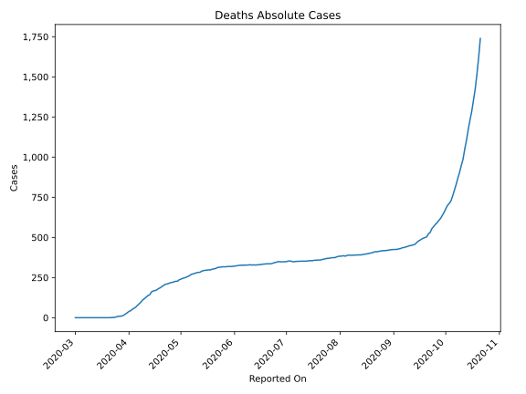
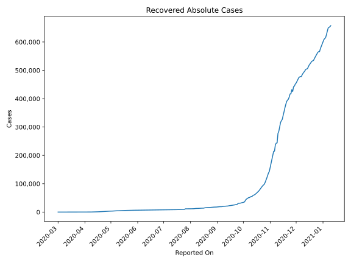
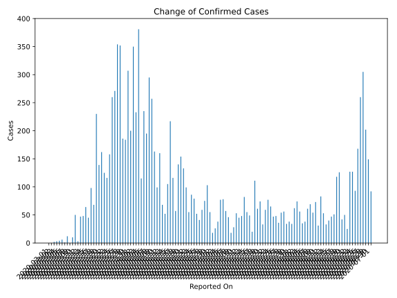
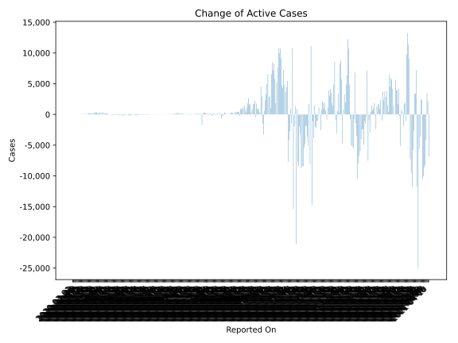
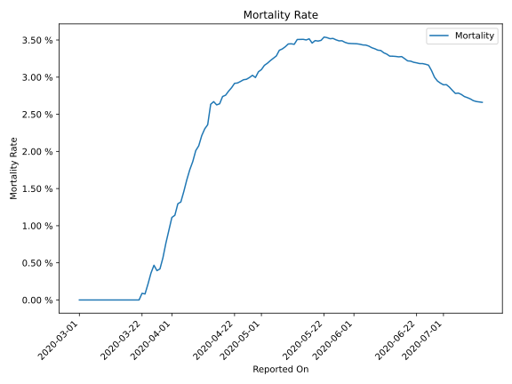

# Country Figures: Time Series for Czechia 

| Reported On | Confirmed | Deaths | Recovered | Active | Mortality | &Delta; Confirmed | &Delta; Deaths | &Delta; Active | % Active of Population |
|-------------|-----------|--------|-----------|--------|-----------|-------------------|----------------|----------------|------------------------|
| 2020-04-01 | 3589 | 39 | 61 | 3489 |  1.09 %  | 281 | 8 | 257 |  0.033 %  | 
| 2020-03-31 | 3308 | 31 | 45 | 3232 |  0.94 %  | 307 | 8 | 279 |  0.030 %  | 
| 2020-03-30 | 3001 | 23 | 25 | 2953 |  0.77 %  | 184 | 7 | 163 |  0.028 %  | 
| 2020-03-29 | 2817 | 16 | 11 | 2790 |  0.57 %  | 186 | 5 | 181 |  0.026 %  | 
| 2020-03-28 | 2631 | 11 | 11 | 2609 |  0.42 %  | 352 | 2 | 350 |  0.025 %  | 
| 2020-03-27 | 2279 | 9 | 11 | 2259 |  0.39 %  | 354 | 0 | 353 |  0.021 %  | 
| 2020-03-26 | 1925 | 9 | 10 | 1906 |  0.47 %  | 271 | 3 | 268 |  0.018 %  | 
| 2020-03-25 | 1654 | 6 | 10 | 1638 |  0.36 %  | 260 | 3 | 257 |  0.015 %  | 
| 2020-03-24 | 1394 | 3 | 10 | 1381 |  0.22 %  | 158 | 2 | 153 |  0.013 %  | 
| 2020-03-23 | 1236 | 1 | 7 | 1228 |  0.08 %  | 116 | 0 | 115 |  0.012 %  | 
| 2020-03-22 | 1120 | 1 | 6 | 1113 |  0.09 %  | 125 | 1 | 124 |  0.010 %  | 
| 2020-03-21 | 995 | 0 | 6 | 989 |  None  | 162 | 0 | 160 |  0.009 %  | 
| 2020-03-20 | 833 | 0 | 4 | 829 |  None  | 139 | 0 | 138 |  0.008 %  | 
| 2020-03-19 | 694 | 0 | 3 | 691 |  None  | 230 | 0 | 230 |  0.007 %  | 
| 2020-03-18 | 464 | 0 | 3 | 461 |  None  | 68 | 0 | 68 |  0.004 %  | 
| 2020-03-17 | 396 | 0 | 3 | 393 |  None  | 98 | 0 | 98 |  0.004 %  | 
| 2020-03-16 | 298 | 0 | 3 | 295 |  None  | 45 | 0 | 42 |  0.003 %  | 
| 2020-03-15 | 253 | 0 | 0 | 253 |  None  | 64 | 0 | 64 |  0.002 %  | 
| 2020-03-14 | 189 | 0 | 0 | 189 |  None  | 48 | 0 | 48 |  0.002 %  | 
| 2020-03-13 | 141 | 0 | 0 | 141 |  None  | 47 | 0 | 47 |  0.001 %  | 
| 2020-03-12 | 94 | 0 | 0 | 94 |  None  | 3 | 0 | 3 |  0.001 %  | 
| 2020-03-11 | 91 | 0 | 0 | 91 |  None  | 50 | 0 | 50 |  0.001 %  | 
| 2020-03-10 | 41 | 0 | 0 | 41 |  None  | 10 | 0 | 10 |  0.000 %  | 
| 2020-03-09 | 31 | 0 | 0 | 31 |  None  | 0 | 0 | 0 |  0.000 %  | 
| 2020-03-08 | 31 | 0 | 0 | 31 |  None  | 12 | 0 | 12 |  0.000 %  | 
| 2020-03-07 | 19 | 0 | 0 | 19 |  None  | 1 | 0 | 1 |  0.000 %  | 
| 2020-03-06 | 18 | 0 | 0 | 18 |  None  | 6 | 0 | 6 |  0.000 %  | 
| 2020-03-05 | 12 | 0 | 0 | 12 |  None  | 4 | 0 | 4 |  0.000 %  | 
| 2020-03-04 | 8 | 0 | 0 | 8 |  None  | 3 | 0 | 3 |  0.000 %  | 
| 2020-03-03 | 5 | 0 | 0 | 5 |  None  | 2 | 0 | 2 |  0.000 %  | 
| 2020-03-02 | 3 | 0 | 0 | 3 |  None  | 0 | 0 | 0 |  0.000 %  | 
| 2020-03-01 | 3 | 0 | 0 | 3 |  None  | None | None | None |  0.000 %  | 

