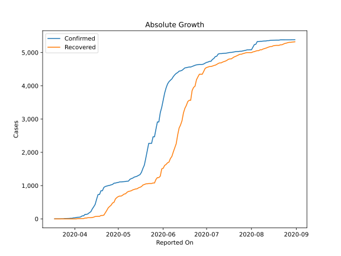

# Country Figures: Doubling Time of Infections for Djibouti 

The doubling time below are calculated based on
* an exponential growth assumption
* for time difference of past seven (7) days.
The doubling time's unit is "days".

The first doubling time indicates the increase of confirmed (infected)
cases. There, the *higher* the number is, the better is to take control
of the disease.

The second doubling time indicates the increase of recovered (healed)
cases. There, the *lower* the number is, the better it is to take
control of the disease.

| Reported On | Confirmed | Doubling Time (Confirmed) | Recovered | Doubling Time (Recovered) |
|-------------|-----------|---------------------------|-----------|---------------------------|
| 2020-05-08 | 1135 |  142.8 days  | 824 |  24.1 days  | 
| 2020-05-07 | 1133 |  122.8 days  | 799 |  22.5 days  | 
| 2020-05-06 | 1124 |  113.9 days  | 755 |  21.3 days  | 
| 2020-05-05 | 1120 |  111.1 days  | 745 |  12.4 days  | 
| 2020-05-04 | 1116 |  64.7 days  | 713 |  12.4 days  | 
| 2020-05-03 | 1112 |  58.5 days  | 686 |  9.8 days  | 
| 2020-05-02 | 1112 |  49.8 days  | 686 |  8.3 days  | 
| 2020-05-01 | 1097 |  52.2 days  | 672 |  7.2 days  | 
| 2020-04-30 | 1089 |  49.2 days  | 642 |  5.5 days  | 
| 2020-04-29 | 1077 |  48.6 days  | 599 |  4.4 days  | 
| 2020-04-28 | 1072 |  38.8 days  | 498 |  3.6 days  | 
| 2020-04-27 | 1035 |  24.4 days  | 477 |  3.5 days  | 
| 2020-04-26 | 1023 |  25.9 days  | 411 |  3.8 days  | 
| 2020-04-25 | 1008 |  15.5 days  | 373 |  3.4 days  | 
| 2020-04-24 | 999 |  15.9 days  | 330 |  3.6 days  | 
| 2020-04-23 | 986 |  9.8 days  | 252 |  4.3 days  | 
| 2020-04-22 | 974 |  6.4 days  | 183 |  5.5 days  | 
| 2020-04-21 | 945 |  5.4 days  | 112 |  6.8 days  | 
| 2020-04-20 | 846 |  5.0 days  | 102 |  5.7 days  | 
| 2020-04-19 | 846 |  3.9 days  | 102 |  5.0 days  | 
| 2020-04-18 | 732 |  3.9 days  | 76 |  6.8 days  | 
| 2020-04-17 | 732 |  3.4 days  | 76 |  6.8 days  | 
| 2020-04-16 | 591 |  3.6 days  | 73 |  4.9 days  | 
| 2020-04-15 | 435 |  4.5 days  | 71 |  5.0 days  | 
| 2020-04-14 | 363 |  3.8 days  | 53 |  3.1 days  | 
| 2020-04-13 | 298 |  4.4 days  | 41 |  3.5 days  | 
| 2020-04-12 | 214 |  4.1 days  | 36 |  3.8 days  | 
| 2020-04-11 | 187 |  4.0 days  | 36 |  3.6 days  | 
| 2020-04-10 | 150 |  4.7 days  | 36 |  3.6 days  | 
| 2020-04-09 | 135 |  4.3 days  | 25 |  None  | 
| 2020-04-08 | 135 |  3.8 days  | 25 |  None  | 
| 2020-04-07 | 90 |  4.8 days  | 9 |  None  | 
| 2020-04-06 | 90 |  3.3 days  | 9 |  None  | 
| 2020-04-05 | 59 |  4.4 days  | 9 |  None  | 
| 2020-04-04 | 50 |  4.1 days  | 8 |  None  | 
| 2020-04-03 | 49 |  3.8 days  | 8 |  None  | 
| 2020-04-02 | 40 |  4.1 days  | 0 |  None  | 
| 2020-04-01 | 33 |  4.8 days  | 0 |  None  | 
| 2020-03-31 | 30 |  2.4 days  | 0 |  None  | 
| 2020-03-30 | 18 |  3.0 days  | 0 |  None  | 
| 2020-03-29 | 18 |  2.0 days  | 0 |  None  | 
| 2020-03-28 | 14 |  2.2 days  | 0 |  None  | 
| 2020-03-27 | 12 |  2.3 days  | 0 |  None  | 
| 2020-03-26 | 11 |  2.4 days  | 0 |  None  | 
| 2020-03-25 | 11 |  2.4 days  | 0 |  None  | 
| 2020-03-24 | 3 |  None  | 0 |  None  | 
| 2020-03-23 | 3 |  None  | 0 |  None  | 
| 2020-03-22 | 1 |  None  | 0 |  None  | 
| 2020-03-21 | 1 |  None  | 0 |  None  | 
| 2020-03-20 | 1 |  None  | 0 |  None  | 
| 2020-03-19 | 1 |  None  | 0 |  None  | 
| 2020-03-18 | 1 |  None  | 0 |  None  | 

