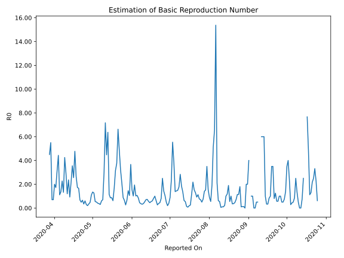

# Country Figures: Time Series for Basic Reproduction Number of Djibouti 

| Reported On | &Delta; Confirmed | Total &Delta; Confirmed First Interval | Total &Delta; Confirmed Second Interval | Estimated Basic Reproduction Number R0 | 
|-------------|-------------------|----------------------------------------|-----------------------------------------|---------------------------------------------------|
| 2020-05-07 | 9 |  12  |  40  |  0.30  | 
| 2020-05-06 | 4 |  23  |  62  |  0.37  | 
| 2020-05-05 | 4 |  27  |  66  |  0.41  | 
| 2020-05-04 | 4 |  35  |  69  |  0.51  | 
| 2020-05-03 | 0 |  40  |  73  |  0.55  | 
| 2020-05-02 | 15 |  62  |  49  |  1.27  | 
| 2020-05-01 | 8 |  66  |  49  |  1.35  | 
| 2020-04-30 | 12 |  69  |  63  |  1.10  | 
| 2020-04-29 | 5 |  73  |  153  |  0.48  | 
| 2020-04-28 | 37 |  49  |  140  |  0.35  | 
| 2020-04-27 | 12 |  49  |  242  |  0.20  | 
| 2020-04-26 | 15 |  63  |  213  |  0.30  | 
| 2020-04-25 | 9 |  153  |  255  |  0.60  | 
| 2020-04-24 | 13 |  140  |  411  |  0.34  | 
| 2020-04-23 | 12 |  242  |  369  |  0.66  | 
| 2020-04-22 | 29 |  213  |  434  |  0.49  | 
| 2020-04-21 | 99 |  255  |  377  |  0.68  | 
| 2020-04-20 | 0 |  411  |  248  |  1.66  | 
| 2020-04-19 | 114 |  369  |  213  |  1.73  | 
| 2020-04-18 | 0 |  434  |  163  |  2.66  | 
| 2020-04-17 | 141 |  377  |  79  |  4.77  | 
| 2020-04-16 | 156 |  248  |  97  |  2.56  | 
| 2020-04-15 | 72 |  213  |  60  |  3.55  | 
| 2020-04-14 | 65 |  163  |  76  |  2.14  | 
| 2020-04-13 | 84 |  79  |  85  |  0.93  | 
| 2020-04-12 | 27 |  97  |  41  |  2.37  | 
| 2020-04-11 | 37 |  60  |  50  |  1.20  | 
| 2020-04-10 | 15 |  76  |  26  |  2.92  | 
| 2020-04-09 | 0 |  85  |  20  |  4.25  | 
| 2020-04-08 | 45 |  41  |  31  |  1.32  | 
| 2020-04-07 | 0 |  50  |  22  |  2.27  | 
| 2020-04-06 | 31 |  26  |  19  |  1.37  | 
| 2020-04-05 | 9 |  20  |  18  |  1.11  | 
| 2020-04-04 | 1 |  31  |  7  |  4.43  | 
| 2020-04-03 | 9 |  22  |  7  |  3.14  | 
| 2020-04-02 | 7 |  19  |  11  |  1.73  | 
| 2020-04-01 | 3 |  18  |  9  |  2.00  | 
| 2020-03-31 | 12 |  7  |  10  |  0.70  | 
| 2020-03-30 | 0 |  7  |  10  |  0.70  | 
| 2020-03-29 | 4 |  11  |  2  |  5.50  | 
| 2020-03-28 | 2 |  9  |  2  |  4.50  | 
| 2020-03-27 | 1 |  10  |  None  |  None  | 
| 2020-03-26 | 0 |  10  |  None  |  None  | 
| 2020-03-25 | 8 |  2  |  None  |  None  | 
| 2020-03-24 | 0 |  2  |  None  |  None  | 
| 2020-03-23 | 2 |  None  |  None  |  None  | 
| 2020-03-22 | 0 |  None  |  None  |  None  | 
| 2020-03-21 | 0 |  None  |  None  |  None  | 
| 2020-03-20 | 0 |  None  |  None  |  None  | 
| 2020-03-19 | 0 |  None  |  None  |  None  | 
| 2020-03-18 | None |  None  |  None  |  None  | 

