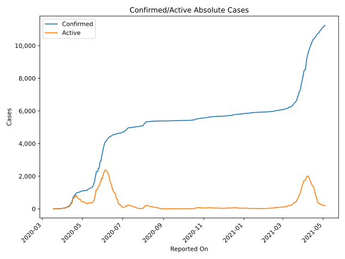
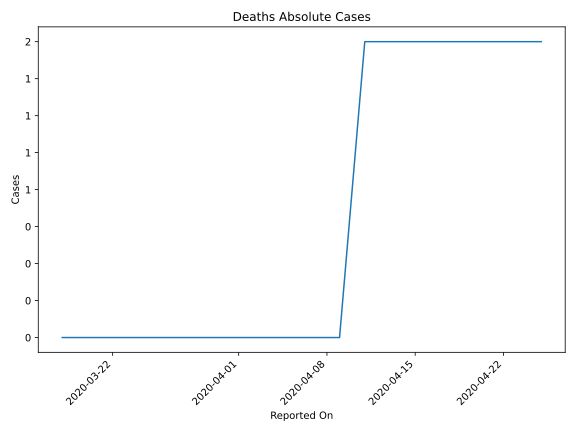
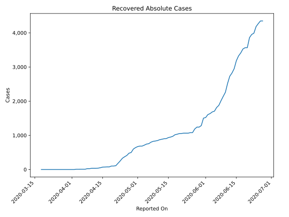
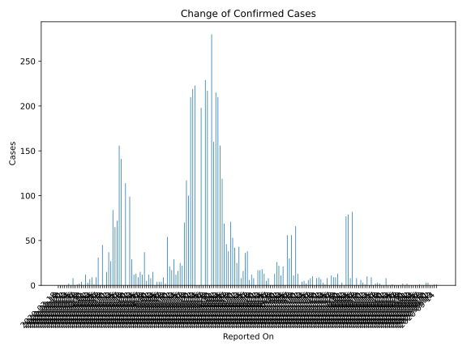
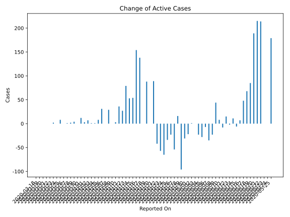
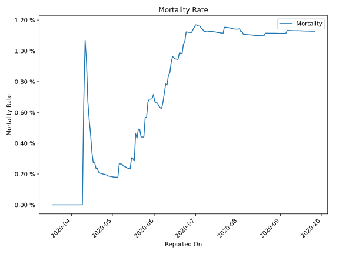

# Country Figures: Time Series for Djibouti 

| Reported On | Confirmed | Deaths | Recovered | Active | Mortality | &Delta; Confirmed | &Delta; Deaths | &Delta; Recovered | &Delta; Active | % Active of Population |
|-------------|-----------|--------|-----------|--------|-----------|-------------------|----------------|-------------------|----------------|------------------------|
| 2020-04-26 | 1023 | 2 | 411 | 610 |  0.20 %  | 15 | 0 | 38 | -23 |  0.064 %  | 
| 2020-04-25 | 1008 | 2 | 373 | 633 |  0.20 %  | 9 | 0 | 43 | -34 |  0.066 %  | 
| 2020-04-24 | 999 | 2 | 330 | 667 |  0.20 %  | 13 | 0 | 78 | -65 |  0.070 %  | 
| 2020-04-23 | 986 | 2 | 252 | 732 |  0.20 %  | 12 | 0 | 69 | -57 |  0.076 %  | 
| 2020-04-22 | 974 | 2 | 183 | 789 |  0.21 %  | 29 | 0 | 71 | -42 |  0.082 %  | 
| 2020-04-21 | 945 | 2 | 112 | 831 |  0.21 %  | 99 | 0 | 10 | 89 |  0.087 %  | 
| 2020-04-20 | 846 | 2 | 102 | 742 |  0.24 %  | 0 | 0 | 0 | 0 |  0.077 %  | 
| 2020-04-19 | 846 | 2 | 102 | 742 |  0.24 %  | 114 | 0 | 26 | 88 |  0.077 %  | 
| 2020-04-18 | 732 | 2 | 76 | 654 |  0.27 %  | 0 | 0 | 0 | 0 |  0.068 %  | 
| 2020-04-17 | 732 | 2 | 76 | 654 |  0.27 %  | 141 | 0 | 3 | 138 |  0.068 %  | 
| 2020-04-16 | 591 | 2 | 73 | 516 |  0.34 %  | 156 | 0 | 2 | 154 |  0.054 %  | 
| 2020-04-15 | 435 | 2 | 71 | 362 |  0.46 %  | 72 | 0 | 18 | 54 |  0.038 %  | 
| 2020-04-14 | 363 | 2 | 53 | 308 |  0.55 %  | 65 | 0 | 12 | 53 |  0.032 %  | 
| 2020-04-13 | 298 | 2 | 41 | 255 |  0.67 %  | 84 | 0 | 5 | 79 |  0.027 %  | 
| 2020-04-12 | 214 | 2 | 36 | 176 |  0.93 %  | 27 | 0 | 0 | 27 |  0.018 %  | 
| 2020-04-11 | 187 | 2 | 36 | 149 |  1.07 %  | 37 | 1 | 0 | 36 |  0.016 %  | 
| 2020-04-10 | 150 | 1 | 36 | 113 |  0.67 %  | 15 | 1 | 11 | 3 |  0.012 %  | 
| 2020-04-09 | 135 | 0 | 25 | 110 |  None  | 0 | 0 | 0 | 0 |  0.011 %  | 
| 2020-04-08 | 135 | 0 | 25 | 110 |  None  | 45 | 0 | 16 | 29 |  0.011 %  | 
| 2020-04-07 | 90 | 0 | 9 | 81 |  None  | 0 | 0 | 0 | 0 |  0.008 %  | 
| 2020-04-06 | 90 | 0 | 9 | 81 |  None  | 31 | 0 | 0 | 31 |  0.008 %  | 
| 2020-04-05 | 59 | 0 | 9 | 50 |  None  | 9 | 0 | 1 | 8 |  0.005 %  | 
| 2020-04-04 | 50 | 0 | 8 | 42 |  None  | 1 | 0 | 0 | 1 |  0.004 %  | 
| 2020-04-03 | 49 | 0 | 8 | 41 |  None  | 9 | 0 | 8 | 1 |  0.004 %  | 
| 2020-04-02 | 40 | 0 | 0 | 40 |  None  | 7 | 0 | 0 | 7 |  0.004 %  | 
| 2020-04-01 | 33 | 0 | 0 | 33 |  None  | 3 | 0 | 0 | 3 |  0.003 %  | 
| 2020-03-31 | 30 | 0 | 0 | 30 |  None  | 12 | 0 | 0 | 12 |  0.003 %  | 
| 2020-03-30 | 18 | 0 | 0 | 18 |  None  | 0 | 0 | 0 | 0 |  0.002 %  | 
| 2020-03-29 | 18 | 0 | 0 | 18 |  None  | 4 | 0 | 0 | 4 |  0.002 %  | 
| 2020-03-28 | 14 | 0 | 0 | 14 |  None  | 2 | 0 | 0 | 2 |  0.001 %  | 
| 2020-03-27 | 12 | 0 | 0 | 12 |  None  | 1 | 0 | 0 | 1 |  0.001 %  | 
| 2020-03-26 | 11 | 0 | 0 | 11 |  None  | 0 | 0 | 0 | 0 |  0.001 %  | 
| 2020-03-25 | 11 | 0 | 0 | 11 |  None  | 8 | 0 | 0 | 8 |  0.001 %  | 
| 2020-03-24 | 3 | 0 | 0 | 3 |  None  | 0 | 0 | 0 | 0 |  0.000 %  | 
| 2020-03-23 | 3 | 0 | 0 | 3 |  None  | 2 | 0 | 0 | 2 |  0.000 %  | 
| 2020-03-22 | 1 | 0 | 0 | 1 |  None  | 0 | 0 | 0 | 0 |  0.000 %  | 
| 2020-03-21 | 1 | 0 | 0 | 1 |  None  | 0 | 0 | 0 | 0 |  0.000 %  | 
| 2020-03-20 | 1 | 0 | 0 | 1 |  None  | 0 | 0 | 0 | 0 |  0.000 %  | 
| 2020-03-19 | 1 | 0 | 0 | 1 |  None  | 0 | 0 | 0 | 0 |  0.000 %  | 
| 2020-03-18 | 1 | 0 | 0 | 1 |  None  | None | None | None | None |  0.000 %  | 

