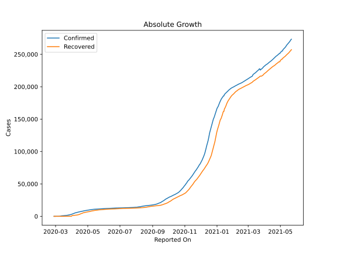
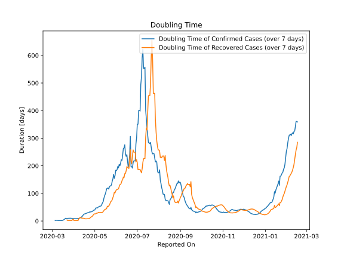

# Country Figures: Doubling Time of Infections for Denmark 

The doubling time below are calculated based on
* an exponential growth assumption
* for time difference of past seven (7) days.
The doubling time's unit is "days".

The first doubling time indicates the increase of confirmed (infected)
cases. There, the *higher* the number is, the better is to take control
of the disease.

The second doubling time indicates the increase of recovered (healed)
cases. There, the *lower* the number is, the better it is to take
control of the disease.

| Reported On | Confirmed | Doubling Time (Confirmed) | Recovered | Doubling Time (Recovered) |
|-------------|-----------|---------------------------|-----------|---------------------------|
| 2020-04-05 | 4561 |  8.8 days  | 1429 |  2.0 days  | 
| 2020-04-04 | 4269 |  8.6 days  | 1379 |  1.8 days  | 
| 2020-04-03 | 3946 |  8.6 days  | 1287 |  1.9 days  | 
| 2020-04-02 | 3573 |  8.9 days  | 1172 |  1.9 days  | 
| 2020-04-01 | 3290 |  8.9 days  | 971 |  1.9 days  | 
| 2020-03-31 | 3039 |  8.8 days  | 77 |  6.7 days  | 
| 2020-03-30 | 2755 |  9.0 days  | 73 |  4.7 days  | 
| 2020-03-29 | 2564 |  9.6 days  | 73 |  2.0 days  | 
| 2020-03-28 | 2366 |  9.8 days  | 57 |  1.5 days  | 
| 2020-03-27 | 2200 |  10.1 days  | 57 |  1.5 days  | 
| 2020-03-26 | 2023 |  10.0 days  | 50 |  1.6 days  | 
| 2020-03-25 | 1862 |  9.8 days  | 41 |  1.6 days  | 
| 2020-03-24 | 1718 |  9.7 days  | 36 |  1.7 days  | 
| 2020-03-23 | 1572 |  9.6 days  | 24 |  1.9 days  | 
| 2020-03-22 | 1514 |  9.2 days  | 4 |  3.8 days  | 
| 2020-03-21 | 1420 |  9.5 days  | 1 |  None  | 
| 2020-03-20 | 1337 |  9.9 days  | 1 |  None  | 
| 2020-03-19 | 1225 |  7.4 days  | 1 |  None  | 
| 2020-03-18 | 1115 |  5.6 days  | 1 |  None  | 
| 2020-03-17 | 1024 |  3.9 days  | 1 |  None  | 
| 2020-03-16 | 932 |  2.4 days  | 1 |  None  | 
| 2020-03-15 | 875 |  1.8 days  | 1 |  None  | 
| 2020-03-14 | 836 |  1.7 days  | 1 |  None  | 
| 2020-03-13 | 804 |  1.7 days  | 1 |  None  | 
| 2020-03-12 | 617 |  1.5 days  | 1 |  None  | 
| 2020-03-11 | 444 |  1.6 days  | 1 |  None  | 
| 2020-03-10 | 262 |  1.6 days  | 1 |  None  | 
| 2020-03-09 | 90 |  1.9 days  | 1 |  None  | 
| 2020-03-08 | 35 |  2.6 days  | 1 |  None  | 
| 2020-03-07 | 23 |  2.7 days  | 1 |  None  | 
| 2020-03-06 | 23 |  1.9 days  | 1 |  None  | 
| 2020-03-05 | 10 |  2.4 days  | 0 |  None  | 
| 2020-03-04 | 10 |  None  | 0 |  None  | 
| 2020-03-03 | 6 |  None  | 0 |  None  | 
| 2020-03-02 | 4 |  None  | 0 |  None  | 
| 2020-03-01 | 4 |  None  | 0 |  None  | 
| 2020-02-29 | 3 |  None  | 0 |  None  | 
| 2020-02-28 | 1 |  None  | 0 |  None  | 
| 2020-02-27 | 1 |  None  | 0 |  None  | 

