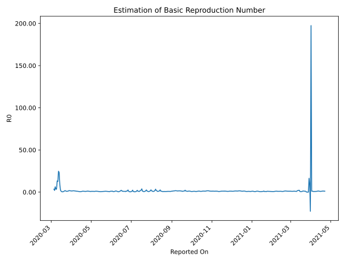

# Country Figures: Time Series for Basic Reproduction Number of Denmark 

| Reported On | &Delta; Confirmed | Total &Delta; Confirmed First Interval | Total &Delta; Confirmed Second Interval | Estimated Basic Reproduction Number R0 | 
|-------------|-------------------|----------------------------------------|-----------------------------------------|---------------------------------------------------|
| 2020-05-09 | 101 |  548  |  512  |  1.07  | 
| 2020-05-08 | 135 |  560  |  515  |  1.09  | 
| 2020-05-07 | 145 |  531  |  556  |  0.96  | 
| 2020-05-06 | 117 |  510  |  613  |  0.83  | 
| 2020-05-05 | 151 |  512  |  583  |  0.88  | 
| 2020-05-04 | 147 |  515  |  563  |  0.91  | 
| 2020-05-03 | 116 |  556  |  641  |  0.87  | 
| 2020-05-02 | 96 |  613  |  625  |  0.98  | 
| 2020-05-01 | 153 |  583  |  665  |  0.88  | 
| 2020-04-30 | 150 |  563  |  752  |  0.75  | 
| 2020-04-29 | 157 |  641  |  697  |  0.92  | 
| 2020-04-28 | 153 |  625  |  691  |  0.90  | 
| 2020-04-27 | 123 |  665  |  671  |  0.99  | 
| 2020-04-26 | 130 |  752  |  623  |  1.21  | 
| 2020-04-25 | 235 |  697  |  637  |  1.09  | 
| 2020-04-24 | 137 |  691  |  704  |  0.98  | 
| 2020-04-23 | 163 |  671  |  731  |  0.92  | 
| 2020-04-22 | 217 |  623  |  755  |  0.83  | 
| 2020-04-21 | 180 |  637  |  705  |  0.90  | 
| 2020-04-20 | 131 |  704  |  685  |  1.03  | 
| 2020-04-19 | 143 |  731  |  692  |  1.06  | 
| 2020-04-18 | 169 |  755  |  683  |  1.11  | 
| 2020-04-17 | 194 |  705  |  772  |  0.91  | 
| 2020-04-16 | 198 |  685  |  925  |  0.74  | 
| 2020-04-15 | 170 |  692  |  1139  |  0.61  | 
| 2020-04-14 | 193 |  683  |  1269  |  0.54  | 
| 2020-04-13 | 144 |  772  |  1328  |  0.58  | 
| 2020-04-12 | 178 |  925  |  1320  |  0.70  | 
| 2020-04-11 | 177 |  1139  |  1302  |  0.87  | 
| 2020-04-10 | 184 |  1269  |  1271  |  1.00  | 
| 2020-04-09 | 233 |  1328  |  1230  |  1.08  | 
| 2020-04-08 | 331 |  1320  |  1191  |  1.11  | 
| 2020-04-07 | 391 |  1302  |  1009  |  1.29  | 
| 2020-04-06 | 314 |  1271  |  924  |  1.38  | 
| 2020-04-05 | 292 |  1230  |  839  |  1.47  | 
| 2020-04-04 | 323 |  1191  |  732  |  1.63  | 
| 2020-04-03 | 373 |  1009  |  702  |  1.44  | 
| 2020-04-02 | 283 |  924  |  648  |  1.43  | 
| 2020-04-01 | 251 |  839  |  628  |  1.34  | 
| 2020-03-31 | 284 |  732  |  509  |  1.44  | 
| 2020-03-30 | 191 |  702  |  442  |  1.59  | 
| 2020-03-29 | 198 |  648  |  381  |  1.70  | 
| 2020-03-28 | 166 |  628  |  347  |  1.81  | 
| 2020-03-27 | 177 |  509  |  399  |  1.28  | 
| 2020-03-26 | 161 |  442  |  396  |  1.12  | 
| 2020-03-25 | 144 |  381  |  405  |  0.94  | 
| 2020-03-24 | 146 |  347  |  350  |  0.99  | 
| 2020-03-23 | 58 |  399  |  279  |  1.43  | 
| 2020-03-22 | 94 |  396  |  220  |  1.80  | 
| 2020-03-21 | 83 |  405  |  315  |  1.29  | 
| 2020-03-20 | 112 |  350  |  431  |  0.81  | 
| 2020-03-19 | 110 |  279  |  574  |  0.49  | 
| 2020-03-18 | 91 |  220  |  714  |  0.31  | 
| 2020-03-17 | 92 |  315  |  582  |  0.54  | 
| 2020-03-16 | 57 |  431  |  421  |  1.02  | 
| 2020-03-15 | 39 |  574  |  239  |  2.40  | 
| 2020-03-14 | 32 |  714  |  80  |  8.93  | 
| 2020-03-13 | 187 |  582  |  25  |  23.28  | 
| 2020-03-12 | 173 |  421  |  17  |  24.76  | 
| 2020-03-11 | 182 |  239  |  19  |  12.58  | 
| 2020-03-10 | 172 |  80  |  6  |  13.33  | 
| 2020-03-09 | 55 |  25  |  7  |  3.57  | 
| 2020-03-08 | 12 |  17  |  5  |  3.40  | 
| 2020-03-07 | 0 |  19  |  3  |  6.33  | 
| 2020-03-06 | 13 |  6  |  3  |  2.00  | 
| 2020-03-05 | 0 |  7  |  2  |  3.50  | 
| 2020-03-04 | 4 |  5  |  None  |  None  | 
| 2020-03-03 | 2 |  3  |  None  |  None  | 
| 2020-03-02 | 0 |  3  |  None  |  None  | 
| 2020-03-01 | 1 |  2  |  None  |  None  | 
| 2020-02-29 | 2 |  None  |  None  |  None  | 
| 2020-02-28 | 0 |  None  |  None  |  None  | 
| 2020-02-27 | None |  None  |  None  |  None  | 

