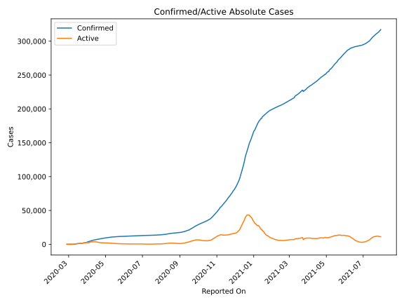
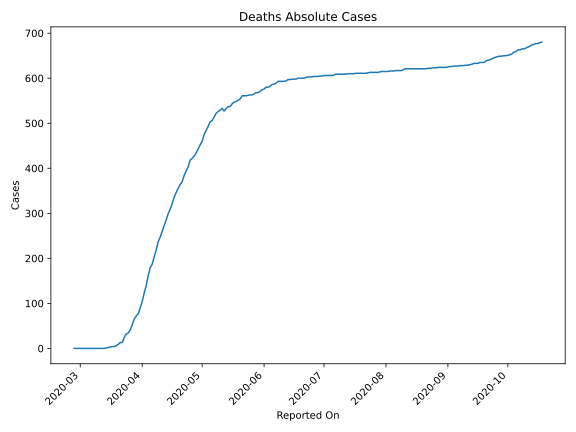
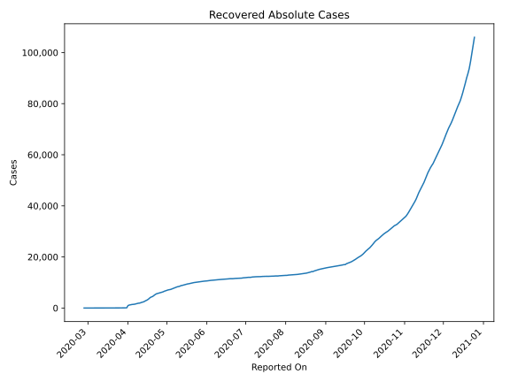
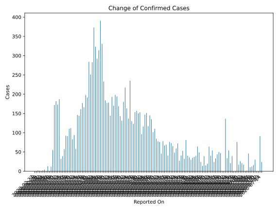
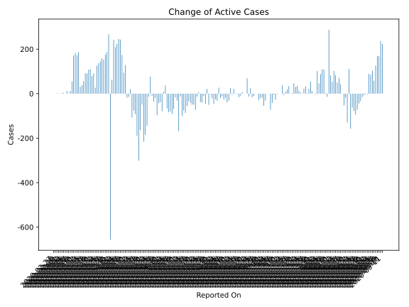
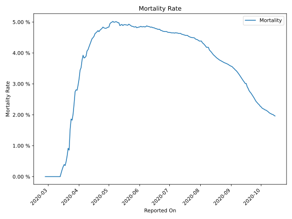

# Country Figures: Time Series for Denmark 

| Reported On | Confirmed | Deaths | Recovered | Active | Mortality | &Delta; Confirmed | &Delta; Deaths | &Delta; Recovered | &Delta; Active | % Active of Population |
|-------------|-----------|--------|-----------|--------|-----------|-------------------|----------------|-------------------|----------------|------------------------|
| 2020-04-11 | 6191 | 260 | 2111 | 3820 |  4.20 %  | 177 | 13 | 182 | -18 |  0.066 %  | 
| 2020-04-10 | 6014 | 247 | 1929 | 3838 |  4.11 %  | 184 | 10 | 46 | 128 |  0.066 %  | 
| 2020-04-09 | 5830 | 237 | 1883 | 3710 |  4.07 %  | 233 | 19 | 120 | 94 |  0.064 %  | 
| 2020-04-08 | 5597 | 218 | 1763 | 3616 |  3.89 %  | 331 | 15 | 142 | 174 |  0.062 %  | 
| 2020-04-07 | 5266 | 203 | 1621 | 3442 |  3.85 %  | 391 | 16 | 132 | 243 |  0.059 %  | 
| 2020-04-06 | 4875 | 187 | 1489 | 3199 |  3.84 %  | 314 | 8 | 60 | 246 |  0.055 %  | 
| 2020-04-05 | 4561 | 179 | 1429 | 2953 |  3.92 %  | 292 | 18 | 50 | 224 |  0.051 %  | 
| 2020-04-04 | 4269 | 161 | 1379 | 2729 |  3.77 %  | 323 | 22 | 92 | 209 |  0.047 %  | 
| 2020-04-03 | 3946 | 139 | 1287 | 2520 |  3.52 %  | 373 | 16 | 115 | 242 |  0.043 %  | 
| 2020-04-02 | 3573 | 123 | 1172 | 2278 |  3.44 %  | 283 | 19 | 201 | 63 |  0.039 %  | 
| 2020-04-01 | 3290 | 104 | 971 | 2215 |  3.16 %  | 251 | 14 | 894 | -657 |  0.038 %  | 
| 2020-03-31 | 3039 | 90 | 77 | 2872 |  2.96 %  | 284 | 13 | 4 | 267 |  0.050 %  | 
| 2020-03-30 | 2755 | 77 | 73 | 2605 |  2.79 %  | 191 | 5 | 0 | 186 |  0.045 %  | 
| 2020-03-29 | 2564 | 72 | 73 | 2419 |  2.81 %  | 198 | 7 | 16 | 175 |  0.042 %  | 
| 2020-03-28 | 2366 | 65 | 57 | 2244 |  2.75 %  | 166 | 13 | 0 | 153 |  0.039 %  | 
| 2020-03-27 | 2200 | 52 | 57 | 2091 |  2.36 %  | 177 | 11 | 7 | 159 |  0.036 %  | 
| 2020-03-26 | 2023 | 41 | 50 | 1932 |  2.03 %  | 161 | 7 | 9 | 145 |  0.033 %  | 
| 2020-03-25 | 1862 | 34 | 41 | 1787 |  1.83 %  | 144 | 2 | 5 | 137 |  0.031 %  | 
| 2020-03-24 | 1718 | 32 | 36 | 1650 |  1.86 %  | 146 | 8 | 12 | 126 |  0.028 %  | 
| 2020-03-23 | 1572 | 24 | 24 | 1524 |  1.53 %  | 58 | 11 | 20 | 27 |  0.026 %  | 
| 2020-03-22 | 1514 | 13 | 4 | 1497 |  0.86 %  | 94 | 0 | 3 | 91 |  0.026 %  | 
| 2020-03-21 | 1420 | 13 | 1 | 1406 |  0.92 %  | 83 | 4 | 0 | 79 |  0.024 %  | 
| 2020-03-20 | 1337 | 9 | 1 | 1327 |  0.67 %  | 112 | 3 | 0 | 109 |  0.023 %  | 
| 2020-03-19 | 1225 | 6 | 1 | 1218 |  0.49 %  | 110 | 2 | 0 | 108 |  0.021 %  | 
| 2020-03-18 | 1115 | 4 | 1 | 1110 |  0.36 %  | 91 | 0 | 0 | 91 |  0.019 %  | 
| 2020-03-17 | 1024 | 4 | 1 | 1019 |  0.39 %  | 92 | 1 | 0 | 91 |  0.018 %  | 
| 2020-03-16 | 932 | 3 | 1 | 928 |  0.32 %  | 57 | 1 | 0 | 56 |  0.016 %  | 
| 2020-03-15 | 875 | 2 | 1 | 872 |  0.23 %  | 39 | 1 | 0 | 38 |  0.015 %  | 
| 2020-03-14 | 836 | 1 | 1 | 834 |  0.12 %  | 32 | 1 | 0 | 31 |  0.014 %  | 
| 2020-03-13 | 804 | 0 | 1 | 803 |  None  | 187 | 0 | 0 | 187 |  0.014 %  | 
| 2020-03-12 | 617 | 0 | 1 | 616 |  None  | 173 | 0 | 0 | 173 |  0.011 %  | 
| 2020-03-11 | 444 | 0 | 1 | 443 |  None  | 182 | 0 | 0 | 182 |  0.008 %  | 
| 2020-03-10 | 262 | 0 | 1 | 261 |  None  | 172 | 0 | 0 | 172 |  0.005 %  | 
| 2020-03-09 | 90 | 0 | 1 | 89 |  None  | 55 | 0 | 0 | 55 |  0.002 %  | 
| 2020-03-08 | 35 | 0 | 1 | 34 |  None  | 12 | 0 | 0 | 12 |  0.001 %  | 
| 2020-03-07 | 23 | 0 | 1 | 22 |  None  | 0 | 0 | 0 | 0 |  0.000 %  | 
| 2020-03-06 | 23 | 0 | 1 | 22 |  None  | 13 | 0 | 1 | 12 |  0.000 %  | 
| 2020-03-05 | 10 | 0 | 0 | 10 |  None  | 0 | 0 | 0 | 0 |  0.000 %  | 
| 2020-03-04 | 10 | 0 | 0 | 10 |  None  | 4 | 0 | 0 | 4 |  0.000 %  | 
| 2020-03-03 | 6 | 0 | 0 | 6 |  None  | 2 | 0 | 0 | 2 |  0.000 %  | 
| 2020-03-02 | 4 | 0 | 0 | 4 |  None  | 0 | 0 | 0 | 0 |  0.000 %  | 
| 2020-03-01 | 4 | 0 | 0 | 4 |  None  | 1 | 0 | 0 | 1 |  0.000 %  | 
| 2020-02-29 | 3 | 0 | 0 | 3 |  None  | 2 | 0 | 0 | 2 |  0.000 %  | 
| 2020-02-28 | 1 | 0 | 0 | 1 |  None  | 0 | 0 | 0 | 0 |  0.000 %  | 
| 2020-02-27 | 1 | 0 | 0 | 1 |  None  | None | None | None | None |  0.000 %  | 

