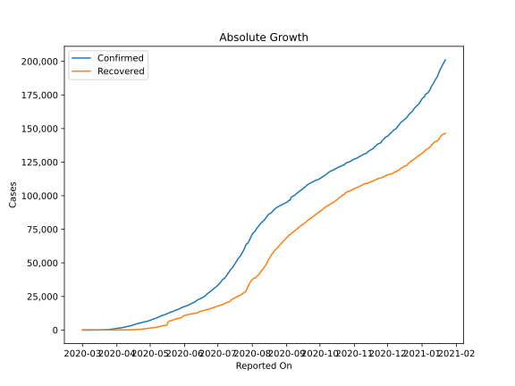
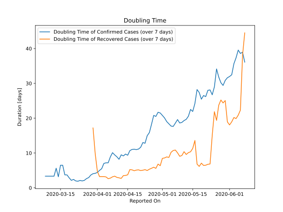

# Country Figures: Doubling Time of Infections for DominicanRepublic 

The doubling time below are calculated based on
* an exponential growth assumption
* for time difference of past seven (7) days.
The doubling time's unit is "days".

The first doubling time indicates the increase of confirmed (infected)
cases. There, the *higher* the number is, the better is to take control
of the disease.

The second doubling time indicates the increase of recovered (healed)
cases. There, the *lower* the number is, the better it is to take
control of the disease.

| Reported On | Confirmed | Doubling Time (Confirmed) | Recovered | Doubling Time (Recovered) |
|-------------|-----------|---------------------------|-----------|---------------------------|
| 2020-04-20 | 4964 |  11.1 days  | 416 |  5.2 days  | 
| 2020-04-19 | 4680 |  11.0 days  | 363 |  5.1 days  | 
| 2020-04-18 | 4335 |  11.1 days  | 312 |  4.9 days  | 
| 2020-04-17 | 4126 |  11.0 days  | 268 |  5.2 days  | 
| 2020-04-16 | 3755 |  10.7 days  | 215 |  5.2 days  | 
| 2020-04-15 | 3614 |  9.4 days  | 208 |  3.7 days  | 
| 2020-04-14 | 3286 |  9.7 days  | 162 |  3.6 days  | 
| 2020-04-13 | 3167 |  9.2 days  | 152 |  3.5 days  | 
| 2020-04-12 | 2967 |  9.5 days  | 131 |  2.7 days  | 
| 2020-04-11 | 2759 |  8.2 days  | 108 |  2.9 days  | 
| 2020-04-10 | 2620 |  8.9 days  | 98 |  3.0 days  | 
| 2020-04-09 | 2349 |  9.5 days  | 80 |  3.3 days  | 
| 2020-04-08 | 2111 |  10.1 days  | 50 |  3.2 days  | 
| 2020-04-07 | 1956 |  8.9 days  | 36 |  2.8 days  | 
| 2020-04-06 | 1828 |  7.2 days  | 33 |  2.6 days  | 
| 2020-04-05 | 1745 |  7.2 days  | 17 |  3.1 days  | 
| 2020-04-04 | 1488 |  7.0 days  | 16 |  3.2 days  | 
| 2020-04-03 | 1488 |  5.5 days  | 16 |  3.2 days  | 
| 2020-04-02 | 1380 |  5.0 days  | 16 |  3.2 days  | 
| 2020-04-01 | 1284 |  4.4 days  | 9 |  4.8 days  | 
| 2020-03-31 | 1109 |  4.2 days  | 5 |  9.8 days  | 
| 2020-03-30 | 901 |  4.1 days  | 4 |  17.2 days  | 
| 2020-03-29 | 859 |  3.7 days  | 3 |  None  | 
| 2020-03-28 | 719 |  2.9 days  | 3 |  None  | 
| 2020-03-27 | 581 |  2.7 days  | 3 |  None  | 
| 2020-03-26 | 488 |  2.1 days  | 3 |  None  | 
| 2020-03-25 | 392 |  2.0 days  | 3 |  None  | 
| 2020-03-24 | 312 |  2.1 days  | 3 |  None  | 
| 2020-03-23 | 245 |  1.9 days  | 3 |  None  | 
| 2020-03-22 | 202 |  2.0 days  | 0 |  None  | 
| 2020-03-21 | 112 |  2.4 days  | 0 |  None  | 
| 2020-03-20 | 72 |  2.1 days  | 0 |  None  | 
| 2020-03-19 | 34 |  2.9 days  | 0 |  None  | 
| 2020-03-18 | 21 |  3.7 days  | 0 |  None  | 
| 2020-03-17 | 21 |  3.7 days  | 0 |  None  | 
| 2020-03-16 | 11 |  6.5 days  | 0 |  None  | 
| 2020-03-15 | 11 |  6.5 days  | 0 |  None  | 
| 2020-03-14 | 11 |  3.2 days  | 0 |  None  | 
| 2020-03-13 | 5 |  5.6 days  | 0 |  None  | 
| 2020-03-12 | 5 |  3.3 days  | 0 |  None  | 
| 2020-03-11 | 5 |  3.3 days  | 0 |  None  | 
| 2020-03-10 | 5 |  3.3 days  | 0 |  None  | 
| 2020-03-09 | 5 |  3.3 days  | 0 |  None  | 
| 2020-03-08 | 5 |  3.3 days  | 0 |  None  | 
| 2020-03-07 | 2 |  None  | 0 |  None  | 
| 2020-03-06 | 2 |  None  | 0 |  None  | 
| 2020-03-05 | 1 |  None  | 0 |  None  | 
| 2020-03-04 | 1 |  None  | 0 |  None  | 
| 2020-03-03 | 1 |  None  | 0 |  None  | 
| 2020-03-02 | 1 |  None  | 0 |  None  | 
| 2020-03-01 | 1 |  None  | 0 |  None  | 

