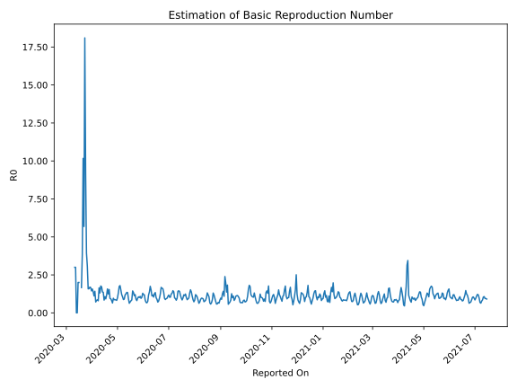

# Country Figures: Time Series for Basic Reproduction Number of DominicanRepublic 

| Reported On | &Delta; Confirmed | Total &Delta; Confirmed First Interval | Total &Delta; Confirmed Second Interval | Estimated Basic Reproduction Number R0 | 
|-------------|-------------------|----------------------------------------|-----------------------------------------|---------------------------------------------------|
| 2020-05-09 | 506 |  1141  |  1263  |  0.90  | 
| 2020-05-08 | 281 |  1141  |  1302  |  0.88  | 
| 2020-05-07 | 288 |  1229  |  1162  |  1.06  | 
| 2020-05-06 | 327 |  1192  |  995  |  1.20  | 
| 2020-05-05 | 245 |  1263  |  837  |  1.51  | 
| 2020-05-04 | 281 |  1302  |  726  |  1.79  | 
| 2020-05-03 | 376 |  1162  |  667  |  1.74  | 
| 2020-05-02 | 290 |  995  |  750  |  1.33  | 
| 2020-05-01 | 316 |  837  |  835  |  1.00  | 
| 2020-04-30 | 320 |  726  |  882  |  0.82  | 
| 2020-04-29 | 236 |  667  |  785  |  0.85  | 
| 2020-04-28 | 123 |  750  |  863  |  0.87  | 
| 2020-04-27 | 158 |  835  |  965  |  0.87  | 
| 2020-04-26 | 209 |  882  |  918  |  0.96  | 
| 2020-04-25 | 177 |  785  |  1209  |  0.65  | 
| 2020-04-24 | 206 |  863  |  1066  |  0.81  | 
| 2020-04-23 | 243 |  965  |  1049  |  0.92  | 
| 2020-04-22 | 256 |  918  |  959  |  0.96  | 
| 2020-04-21 | 80 |  1209  |  788  |  1.53  | 
| 2020-04-20 | 284 |  1066  |  855  |  1.25  | 
| 2020-04-19 | 345 |  1049  |  666  |  1.58  | 
| 2020-04-18 | 209 |  959  |  818  |  1.17  | 
| 2020-04-17 | 371 |  788  |  856  |  0.92  | 
| 2020-04-16 | 141 |  855  |  803  |  1.06  | 
| 2020-04-15 | 328 |  666  |  792  |  0.84  | 
| 2020-04-14 | 119 |  818  |  604  |  1.35  | 
| 2020-04-13 | 200 |  856  |  623  |  1.37  | 
| 2020-04-12 | 208 |  803  |  468  |  1.72  | 
| 2020-04-11 | 139 |  792  |  448  |  1.77  | 
| 2020-04-10 | 271 |  604  |  461  |  1.31  | 
| 2020-04-09 | 238 |  623  |  379  |  1.64  | 
| 2020-04-08 | 155 |  468  |  587  |  0.80  | 
| 2020-04-07 | 128 |  448  |  521  |  0.86  | 
| 2020-04-06 | 83 |  461  |  565  |  0.82  | 
| 2020-04-05 | 257 |  379  |  528  |  0.72  | 
| 2020-04-04 | 0 |  587  |  413  |  1.42  | 
| 2020-04-03 | 108 |  521  |  467  |  1.12  | 
| 2020-04-02 | 96 |  565  |  407  |  1.39  | 
| 2020-04-01 | 175 |  528  |  336  |  1.57  | 
| 2020-03-31 | 208 |  413  |  286  |  1.44  | 
| 2020-03-30 | 42 |  467  |  280  |  1.67  | 
| 2020-03-29 | 140 |  407  |  240  |  1.70  | 
| 2020-03-28 | 138 |  336  |  211  |  1.59  | 
| 2020-03-27 | 93 |  286  |  181  |  1.58  | 
| 2020-03-26 | 96 |  280  |  91  |  3.08  | 
| 2020-03-25 | 80 |  240  |  61  |  3.93  | 
| 2020-03-24 | 67 |  211  |  23  |  9.17  | 
| 2020-03-23 | 43 |  181  |  10  |  18.10  | 
| 2020-03-22 | 90 |  91  |  16  |  5.69  | 
| 2020-03-21 | 40 |  61  |  6  |  10.17  | 
| 2020-03-20 | 38 |  23  |  6  |  3.83  | 
| 2020-03-19 | 13 |  10  |  6  |  1.67  | 
| 2020-03-18 | 0 |  16  |  None  |  None  | 
| 2020-03-17 | 10 |  6  |  None  |  None  | 
| 2020-03-16 | 0 |  6  |  3  |  2.00  | 
| 2020-03-15 | 0 |  6  |  3  |  2.00  | 
| 2020-03-14 | 6 |  None  |  4  |  None  | 
| 2020-03-13 | 0 |  None  |  4  |  None  | 
| 2020-03-12 | 0 |  3  |  1  |  3.00  | 
| 2020-03-11 | 0 |  3  |  1  |  3.00  | 
| 2020-03-10 | 0 |  4  |  None  |  None  | 
| 2020-03-09 | 0 |  4  |  None  |  None  | 
| 2020-03-08 | 3 |  1  |  None  |  None  | 
| 2020-03-07 | 0 |  1  |  None  |  None  | 
| 2020-03-06 | 1 |  None  |  None  |  None  | 
| 2020-03-05 | 0 |  None  |  None  |  None  | 
| 2020-03-04 | 0 |  None  |  None  |  None  | 
| 2020-03-03 | 0 |  None  |  None  |  None  | 
| 2020-03-02 | 0 |  None  |  None  |  None  | 
| 2020-03-01 | None |  None  |  None  |  None  | 

