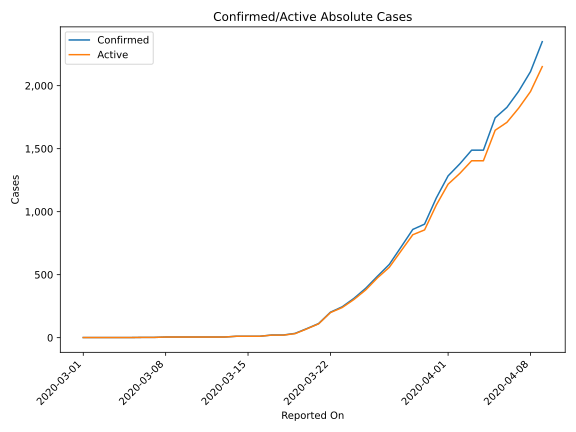
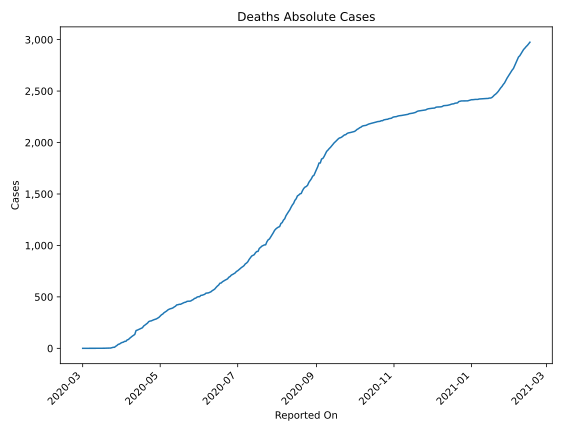
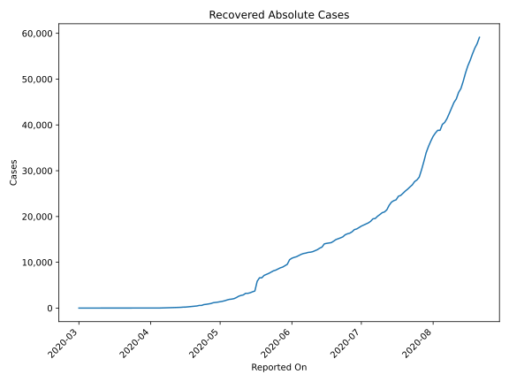
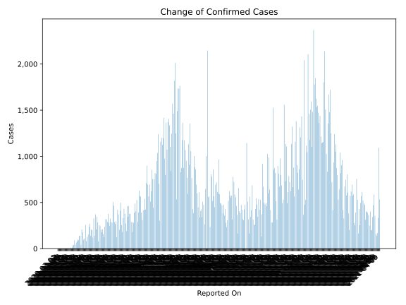
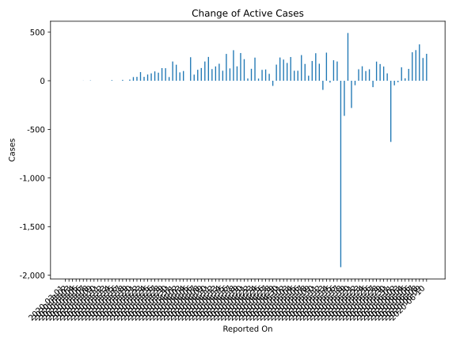
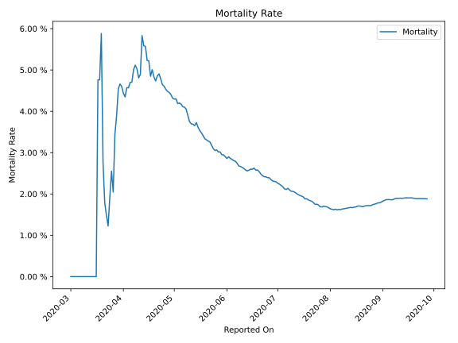

# Country Figures: Time Series for DominicanRepublic 

| Reported On | Confirmed | Deaths | Recovered | Active | Mortality | &Delta; Confirmed | &Delta; Deaths | &Delta; Active | % Active of Population |
|-------------|-----------|--------|-----------|--------|-----------|-------------------|----------------|----------------|------------------------|
| 2020-04-08 | 2111 | 108 | 50 | 1953 |  5.12 %  | 155 | 10 | 131 |  0.018 %  | 
| 2020-04-07 | 1956 | 98 | 36 | 1822 |  5.01 %  | 128 | 12 | 113 |  0.017 %  | 
| 2020-04-06 | 1828 | 86 | 33 | 1709 |  4.70 %  | 83 | 4 | 63 |  0.016 %  | 
| 2020-04-05 | 1745 | 82 | 17 | 1646 |  4.70 %  | 257 | 14 | 242 |  0.015 %  | 
| 2020-04-04 | 1488 | 68 | 16 | 1404 |  4.57 %  | 0 | 0 | 0 |  0.013 %  | 
| 2020-04-03 | 1488 | 68 | 16 | 1404 |  4.57 %  | 108 | 8 | 100 |  0.013 %  | 
| 2020-04-02 | 1380 | 60 | 16 | 1304 |  4.35 %  | 96 | 3 | 86 |  0.012 %  | 
| 2020-04-01 | 1284 | 57 | 9 | 1218 |  4.44 %  | 175 | 6 | 165 |  0.011 %  | 
| 2020-03-31 | 1109 | 51 | 5 | 1053 |  4.60 %  | 208 | 9 | 198 |  0.010 %  | 
| 2020-03-30 | 901 | 42 | 4 | 855 |  4.66 %  | 42 | 3 | 38 |  0.008 %  | 
| 2020-03-29 | 859 | 39 | 3 | 817 |  4.54 %  | 140 | 11 | 129 |  0.008 %  | 
| 2020-03-28 | 719 | 28 | 3 | 688 |  3.89 %  | 138 | 8 | 130 |  0.006 %  | 
| 2020-03-27 | 581 | 20 | 3 | 558 |  3.44 %  | 93 | 10 | 83 |  0.005 %  | 
| 2020-03-26 | 488 | 10 | 3 | 475 |  2.05 %  | 96 | 0 | 96 |  0.004 %  | 
| 2020-03-25 | 392 | 10 | 3 | 379 |  2.55 %  | 80 | 4 | 76 |  0.004 %  | 
| 2020-03-24 | 312 | 6 | 3 | 303 |  1.92 %  | 67 | 3 | 64 |  0.003 %  | 
| 2020-03-23 | 245 | 3 | 3 | 239 |  1.22 %  | 43 | 0 | 40 |  0.002 %  | 
| 2020-03-22 | 202 | 3 | 0 | 199 |  1.49 %  | 90 | 1 | 89 |  0.002 %  | 
| 2020-03-21 | 112 | 2 | 0 | 110 |  1.79 %  | 40 | 0 | 40 |  0.001 %  | 
| 2020-03-20 | 72 | 2 | 0 | 70 |  2.78 %  | 38 | 0 | 38 |  0.001 %  | 
| 2020-03-19 | 34 | 2 | 0 | 32 |  5.88 %  | 13 | 1 | 12 |  0.000 %  | 
| 2020-03-18 | 21 | 1 | 0 | 20 |  4.76 %  | 0 | 0 | 0 |  0.000 %  | 
| 2020-03-17 | 21 | 1 | 0 | 20 |  4.76 %  | 10 | 1 | 9 |  0.000 %  | 
| 2020-03-16 | 11 | 0 | 0 | 11 |  None  | 0 | 0 | 0 |  0.000 %  | 
| 2020-03-15 | 11 | 0 | 0 | 11 |  None  | 0 | 0 | 0 |  0.000 %  | 
| 2020-03-14 | 11 | 0 | 0 | 11 |  None  | 6 | 0 | 6 |  0.000 %  | 
| 2020-03-13 | 5 | 0 | 0 | 5 |  None  | 0 | 0 | 0 |  0.000 %  | 
| 2020-03-12 | 5 | 0 | 0 | 5 |  None  | 0 | 0 | 0 |  0.000 %  | 
| 2020-03-11 | 5 | 0 | 0 | 5 |  None  | 0 | 0 | 0 |  0.000 %  | 
| 2020-03-10 | 5 | 0 | 0 | 5 |  None  | 0 | 0 | 0 |  0.000 %  | 
| 2020-03-09 | 5 | 0 | 0 | 5 |  None  | 0 | 0 | 0 |  0.000 %  | 
| 2020-03-08 | 5 | 0 | 0 | 5 |  None  | 3 | 0 | 3 |  0.000 %  | 
| 2020-03-07 | 2 | 0 | 0 | 2 |  None  | 0 | 0 | 0 |  0.000 %  | 
| 2020-03-06 | 2 | 0 | 0 | 2 |  None  | 1 | 0 | 1 |  0.000 %  | 
| 2020-03-05 | 1 | 0 | 0 | 1 |  None  | 0 | 0 | 0 |  0.000 %  | 
| 2020-03-04 | 1 | 0 | 0 | 1 |  None  | 0 | 0 | 0 |  0.000 %  | 
| 2020-03-03 | 1 | 0 | 0 | 1 |  None  | 0 | 0 | 0 |  0.000 %  | 
| 2020-03-02 | 1 | 0 | 0 | 1 |  None  | 0 | 0 | 0 |  0.000 %  | 
| 2020-03-01 | 1 | 0 | 0 | 1 |  None  | None | None | None |  0.000 %  | 

