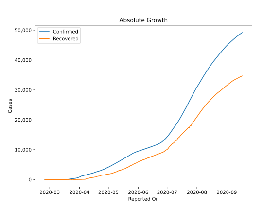
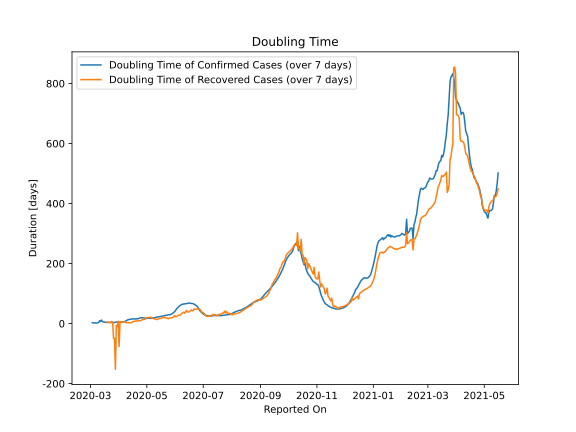

# Country Figures: Doubling Time of Infections for Algeria 

The doubling time below are calculated based on
* an exponential growth assumption
* for time difference of past seven (7) days.
The doubling time's unit is "days".

The first doubling time indicates the increase of confirmed (infected)
cases. There, the *higher* the number is, the better is to take control
of the disease.

The second doubling time indicates the increase of recovered (healed)
cases. There, the *lower* the number is, the better it is to take
control of the disease.

| Reported On | Confirmed | Doubling Time (Confirmed) | Recovered | Doubling Time (Recovered) |
|-------------|-----------|---------------------------|-----------|---------------------------|
| 2020-05-05 | 4838 |  17.5 days  | 2067 |  21.9 days  | 
| 2020-05-04 | 4648 |  17.7 days  | 1998 |  19.9 days  | 
| 2020-05-03 | 4474 |  17.7 days  | 1936 |  19.8 days  | 
| 2020-05-02 | 4295 |  17.9 days  | 1872 |  20.9 days  | 
| 2020-05-01 | 4154 |  17.4 days  | 1821 |  19.2 days  | 
| 2020-04-30 | 4006 |  17.3 days  | 1779 |  18.2 days  | 
| 2020-04-29 | 3848 |  17.7 days  | 1702 |  14.4 days  | 
| 2020-04-28 | 3649 |  18.9 days  | 1651 |  13.8 days  | 
| 2020-04-27 | 3517 |  19.2 days  | 1558 |  14.2 days  | 
| 2020-04-26 | 3382 |  19.6 days  | 1508 |  13.6 days  | 
| 2020-04-25 | 3256 |  19.7 days  | 1479 |  10.0 days  | 
| 2020-04-24 | 3127 |  19.2 days  | 1408 |  9.9 days  | 
| 2020-04-23 | 3007 |  17.5 days  | 1355 |  9.2 days  | 
| 2020-04-22 | 2910 |  16.6 days  | 1204 |  9.5 days  | 
| 2020-04-21 | 2811 |  16.2 days  | 1152 |  9.8 days  | 
| 2020-04-20 | 2718 |  15.7 days  | 1099 |  8.4 days  | 
| 2020-04-19 | 2629 |  15.6 days  | 1047 |  8.8 days  | 
| 2020-04-18 | 2534 |  15.1 days  | 894 |  7.6 days  | 
| 2020-04-17 | 2418 |  15.6 days  | 846 |  6.9 days  | 
| 2020-04-16 | 2268 |  16.1 days  | 783 |  6.3 days  | 
| 2020-04-15 | 2160 |  15.6 days  | 708 |  4.8 days  | 
| 2020-04-14 | 2070 |  14.5 days  | 691 |  3.0 days  | 
| 2020-04-13 | 1983 |  15.0 days  | 601 |  2.9 days  | 
| 2020-04-12 | 1914 |  13.4 days  | 591 |  2.9 days  | 
| 2020-04-11 | 1825 |  13.2 days  | 460 |  3.3 days  | 
| 2020-04-10 | 1761 |  12.2 days  | 405 |  2.9 days  | 
| 2020-04-09 | 1666 |  9.6 days  | 347 |  3.1 days  | 
| 2020-04-08 | 1572 |  8.2 days  | 237 |  3.9 days  | 
| 2020-04-07 | 1468 |  7.1 days  | 113 |  5.7 days  | 
| 2020-04-06 | 1423 |  5.8 days  | 90 |  5.8 days  | 
| 2020-04-05 | 1320 |  5.5 days  | 90 |  4.9 days  | 
| 2020-04-04 | 1251 |  5.1 days  | 90 |  4.9 days  | 
| 2020-04-03 | 1171 |  5.0 days  | 62 |  6.7 days  | 
| 2020-04-02 | 986 |  5.2 days  | 61 |  6.9 days  | 
| 2020-04-01 | 847 |  5.0 days  | 61 |  -76.0 days  | 
| 2020-03-31 | 716 |  5.2 days  | 46 |  7.8 days  | 
| 2020-03-30 | 584 |  5.5 days  | 37 |  -8.3 days  | 
| 2020-03-29 | 511 |  5.5 days  | 31 |  -6.2 days  | 
| 2020-03-28 | 454 |  4.4 days  | 31 |  -152.5 days  | 
| 2020-03-27 | 409 |  3.5 days  | 29 |  -48.9 days  | 
| 2020-03-26 | 367 |  3.7 days  | 29 |  -48.9 days  | 
| 2020-03-25 | 302 |  3.8 days  | 65 |  3.2 days  | 
| 2020-03-24 | 264 |  3.6 days  | 24 |  7.3 days  | 
| 2020-03-23 | 230 |  3.7 days  | 65 |  3.2 days  | 
| 2020-03-22 | 201 |  3.7 days  | 65 |  3.2 days  | 
| 2020-03-21 | 139 |  4.0 days  | 32 |  5.3 days  | 
| 2020-03-20 | 90 |  4.2 days  | 32 |  3.8 days  | 
| 2020-03-19 | 87 |  4.1 days  | 32 |  3.8 days  | 
| 2020-03-18 | 74 |  4.0 days  | 12 |  None  | 
| 2020-03-17 | 60 |  4.8 days  | 12 |  None  | 
| 2020-03-16 | 54 |  5.2 days  | 12 |  None  | 
| 2020-03-15 | 48 |  5.6 days  | 12 |  None  | 
| 2020-03-14 | 37 |  6.6 days  | 12 |  None  | 
| 2020-03-13 | 26 |  11.8 days  | 8 |  None  | 
| 2020-03-12 | 24 |  7.3 days  | 8 |  None  | 
| 2020-03-11 | 20 |  9.8 days  | 0 |  None  | 
| 2020-03-10 | 20 |  3.8 days  | 0 |  None  | 
| 2020-03-09 | 20 |  2.9 days  | 0 |  None  | 
| 2020-03-08 | 19 |  2.0 days  | 0 |  None  | 
| 2020-03-07 | 17 |  2.0 days  | 0 |  None  | 
| 2020-03-06 | 17 |  2.0 days  | 0 |  None  | 
| 2020-03-05 | 12 |  2.3 days  | 0 |  None  | 
| 2020-03-04 | 12 |  2.3 days  | 0 |  None  | 
| 2020-03-03 | 5 |  3.3 days  | 0 |  None  | 
| 2020-03-02 | 3 |  None  | 0 |  None  | 
| 2020-03-01 | 1 |  None  | 0 |  None  | 
| 2020-02-29 | 1 |  None  | 0 |  None  | 
| 2020-02-28 | 1 |  None  | 0 |  None  | 
| 2020-02-27 | 1 |  None  | 0 |  None  | 
| 2020-02-26 | 1 |  None  | 0 |  None  | 
| 2020-02-25 | 1 |  None  | 0 |  None  | 

