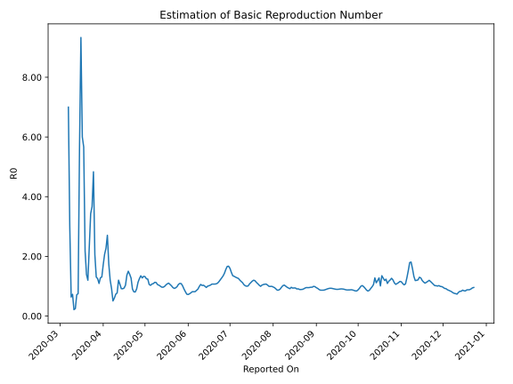

# Country Figures: Time Series for Basic Reproduction Number of Algeria 

| Reported On | &Delta; Confirmed | Total &Delta; Confirmed First Interval | Total &Delta; Confirmed Second Interval | Estimated Basic Reproduction Number R0 | 
|-------------|-------------------|----------------------------------------|-----------------------------------------|---------------------------------------------------|
| 2020-05-06 | 159 |  684  |  637  |  1.07  | 
| 2020-05-05 | 190 |  642  |  624  |  1.03  | 
| 2020-05-04 | 174 |  626  |  592  |  1.06  | 
| 2020-05-03 | 179 |  646  |  522  |  1.24  | 
| 2020-05-02 | 141 |  637  |  510  |  1.25  | 
| 2020-05-01 | 148 |  624  |  472  |  1.32  | 
| 2020-04-30 | 158 |  592  |  445  |  1.33  | 
| 2020-04-29 | 199 |  522  |  409  |  1.28  | 
| 2020-04-28 | 132 |  510  |  378  |  1.35  | 
| 2020-04-27 | 135 |  472  |  376  |  1.26  | 
| 2020-04-26 | 126 |  445  |  393  |  1.13  | 
| 2020-04-25 | 129 |  409  |  450  |  0.91  | 
| 2020-04-24 | 120 |  378  |  469  |  0.81  | 
| 2020-04-23 | 97 |  376  |  464  |  0.81  | 
| 2020-04-22 | 99 |  393  |  435  |  0.90  | 
| 2020-04-21 | 93 |  450  |  354  |  1.27  | 
| 2020-04-20 | 89 |  469  |  335  |  1.40  | 
| 2020-04-19 | 95 |  464  |  309  |  1.50  | 
| 2020-04-18 | 116 |  435  |  317  |  1.37  | 
| 2020-04-17 | 150 |  354  |  342  |  1.04  | 
| 2020-04-16 | 108 |  335  |  357  |  0.94  | 
| 2020-04-15 | 90 |  309  |  338  |  0.91  | 
| 2020-04-14 | 87 |  317  |  346  |  0.92  | 
| 2020-04-13 | 69 |  342  |  321  |  1.07  | 
| 2020-04-12 | 89 |  357  |  297  |  1.20  | 
| 2020-04-11 | 64 |  338  |  437  |  0.77  | 
| 2020-04-10 | 95 |  346  |  473  |  0.73  | 
| 2020-04-09 | 94 |  321  |  535  |  0.60  | 
| 2020-04-08 | 104 |  297  |  587  |  0.51  | 
| 2020-04-07 | 45 |  437  |  475  |  0.92  | 
| 2020-04-06 | 103 |  473  |  393  |  1.20  | 
| 2020-04-05 | 69 |  535  |  307  |  1.74  | 
| 2020-04-04 | 80 |  587  |  217  |  2.71  | 
| 2020-04-03 | 185 |  475  |  209  |  2.27  | 
| 2020-04-02 | 139 |  393  |  190  |  2.07  | 
| 2020-04-01 | 131 |  307  |  179  |  1.72  | 
| 2020-03-31 | 132 |  217  |  166  |  1.31  | 
| 2020-03-30 | 73 |  209  |  163  |  1.28  | 
| 2020-03-29 | 57 |  190  |  174  |  1.09  | 
| 2020-03-28 | 45 |  179  |  143  |  1.25  | 
| 2020-03-27 | 42 |  166  |  127  |  1.31  | 
| 2020-03-26 | 65 |  163  |  79  |  2.06  | 
| 2020-03-25 | 38 |  174  |  36  |  4.83  | 
| 2020-03-24 | 34 |  143  |  39  |  3.67  | 
| 2020-03-23 | 29 |  127  |  37  |  3.43  | 
| 2020-03-22 | 62 |  79  |  34  |  2.32  | 
| 2020-03-21 | 49 |  36  |  30  |  1.20  | 
| 2020-03-20 | 3 |  39  |  28  |  1.39  | 
| 2020-03-19 | 13 |  37  |  17  |  2.18  | 
| 2020-03-18 | 14 |  34  |  6  |  5.67  | 
| 2020-03-17 | 6 |  30  |  5  |  6.00  | 
| 2020-03-16 | 6 |  28  |  3  |  9.33  | 
| 2020-03-15 | 11 |  17  |  3  |  5.67  | 
| 2020-03-14 | 11 |  6  |  8  |  0.75  | 
| 2020-03-13 | 2 |  5  |  7  |  0.71  | 
| 2020-03-12 | 4 |  3  |  12  |  0.25  | 
| 2020-03-11 | 0 |  3  |  14  |  0.21  | 
| 2020-03-10 | 0 |  8  |  11  |  0.73  | 
| 2020-03-09 | 1 |  7  |  11  |  0.64  | 
| 2020-03-08 | 2 |  12  |  4  |  3.00  | 
| 2020-03-07 | 0 |  14  |  2  |  7.00  | 
| 2020-03-06 | 5 |  11  |  None  |  None  | 
| 2020-03-05 | 0 |  11  |  None  |  None  | 
| 2020-03-04 | 7 |  4  |  None  |  None  | 
| 2020-03-03 | 2 |  2  |  None  |  None  | 
| 2020-03-02 | 2 |  None  |  None  |  None  | 
| 2020-03-01 | 0 |  None  |  None  |  None  | 
| 2020-02-29 | 0 |  None  |  None  |  None  | 
| 2020-02-28 | 0 |  None  |  None  |  None  | 
| 2020-02-27 | 0 |  None  |  None  |  None  | 
| 2020-02-26 | 0 |  None  |  None  |  None  | 
| 2020-02-25 | None |  None  |  None  |  None  | 

