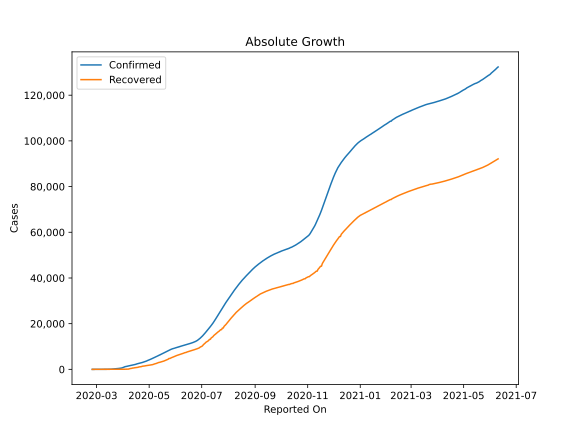
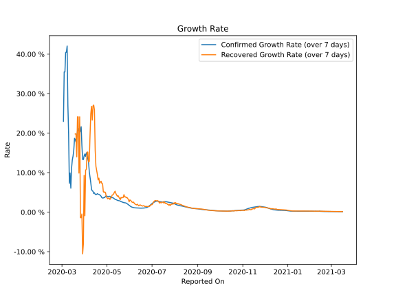

# Country Figures: Growth Rate for Algeria 

The growth rates below are calculated based on
* an exponential growth assumption
* for time difference of past seven (7) days.
The growth rate is to be understood as on "growth per day".

The first growth rate indicates the increase of confirmed (infected) cases.

The second growth rate indicates the increase of recovered (healed) cases.

| Reported On | Confirmed | Growth Rate (Confirmed) | Recovered | Growth Rate (Recovered) |
|-------------|-----------|-------------------------|-----------|-------------------------|
| 2020-05-06 | 4997 |  3.73 %  | 2197 |  3.647 %  | 
| 2020-05-05 | 4838 |  4.03 %  | 2067 |  3.210 %  | 
| 2020-05-04 | 4648 |  3.98 %  | 1998 |  3.553 %  | 
| 2020-05-03 | 4474 |  4.00 %  | 1936 |  3.569 %  | 
| 2020-05-02 | 4295 |  3.96 %  | 1872 |  3.366 %  | 
| 2020-05-01 | 4154 |  4.06 %  | 1821 |  3.675 %  | 
| 2020-04-30 | 4006 |  4.10 %  | 1779 |  3.889 %  | 
| 2020-04-29 | 3848 |  3.99 %  | 1702 |  4.945 %  | 
| 2020-04-28 | 3649 |  3.73 %  | 1651 |  5.141 %  | 
| 2020-04-27 | 3517 |  3.68 %  | 1558 |  4.986 %  | 
| 2020-04-26 | 3382 |  3.60 %  | 1508 |  5.212 %  | 
| 2020-04-25 | 3256 |  3.58 %  | 1479 |  7.192 %  | 
| 2020-04-24 | 3127 |  3.67 %  | 1408 |  7.277 %  | 
| 2020-04-23 | 3007 |  4.03 %  | 1355 |  7.835 %  | 
| 2020-04-22 | 2910 |  4.26 %  | 1204 |  7.585 %  | 
| 2020-04-21 | 2811 |  4.37 %  | 1152 |  7.302 %  | 
| 2020-04-20 | 2718 |  4.50 %  | 1099 |  8.622 %  | 
| 2020-04-19 | 2629 |  4.53 %  | 1047 |  8.170 %  | 
| 2020-04-18 | 2534 |  4.69 %  | 894 |  9.493 %  | 
| 2020-04-17 | 2418 |  4.53 %  | 846 |  10.523 %  | 
| 2020-04-16 | 2268 |  4.41 %  | 783 |  11.626 %  | 
| 2020-04-15 | 2160 |  4.54 %  | 708 |  15.634 %  | 
| 2020-04-14 | 2070 |  4.91 %  | 691 |  25.868 %  | 
| 2020-04-13 | 1983 |  4.74 %  | 601 |  27.126 %  | 
| 2020-04-12 | 1914 |  5.31 %  | 591 |  26.886 %  | 
| 2020-04-11 | 1825 |  5.39 %  | 460 |  23.306 %  | 
| 2020-04-10 | 1761 |  5.83 %  | 405 |  26.811 %  | 
| 2020-04-09 | 1666 |  7.49 %  | 347 |  24.835 %  | 
| 2020-04-08 | 1572 |  8.83 %  | 237 |  19.388 %  | 
| 2020-04-07 | 1468 |  10.26 %  | 113 |  12.839 %  | 
| 2020-04-06 | 1423 |  12.72 %  | 90 |  12.698 %  | 
| 2020-04-05 | 1320 |  13.56 %  | 90 |  15.226 %  | 
| 2020-04-04 | 1251 |  14.48 %  | 90 |  15.226 %  | 
| 2020-04-03 | 1171 |  15.03 %  | 62 |  10.855 %  | 
| 2020-04-02 | 986 |  14.12 %  | 61 |  10.623 %  | 
| 2020-04-01 | 847 |  14.73 %  | 61 |  -0.907 %  | 
| 2020-03-31 | 716 |  14.25 %  | 46 |  9.294 %  | 
| 2020-03-30 | 584 |  13.31 %  | 37 |  -8.050 %  | 
| 2020-03-29 | 511 |  13.33 %  | 31 |  -10.577 %  | 
| 2020-03-28 | 454 |  16.91 %  | 31 |  -0.454 %  | 
| 2020-03-27 | 409 |  21.63 %  | 29 |  -1.406 %  | 
| 2020-03-26 | 367 |  20.56 %  | 29 |  -1.406 %  | 
| 2020-03-25 | 302 |  20.09 %  | 65 |  24.135 %  | 
| 2020-03-24 | 264 |  21.17 %  | 24 |  9.902 %  | 
| 2020-03-23 | 230 |  20.70 %  | 65 |  24.135 %  | 
| 2020-03-22 | 201 |  20.46 %  | 65 |  24.135 %  | 
| 2020-03-21 | 139 |  18.91 %  | 32 |  14.012 %  | 
| 2020-03-20 | 90 |  17.74 %  | 32 |  19.804 %  | 
| 2020-03-19 | 87 |  18.40 %  | 32 |  19.804 %  | 
| 2020-03-18 | 74 |  18.69 %  | 12 |  None  | 
| 2020-03-17 | 60 |  15.69 %  | 12 |  None  | 
| 2020-03-16 | 54 |  14.19 %  | 12 |  None  | 
| 2020-03-15 | 48 |  13.24 %  | 12 |  None  | 
| 2020-03-14 | 37 |  11.11 %  | 12 |  None  | 
| 2020-03-13 | 26 |  6.07 %  | 8 |  None  | 
| 2020-03-12 | 24 |  9.90 %  | 8 |  None  | 
| 2020-03-11 | 20 |  7.30 %  | 0 |  None  | 
| 2020-03-10 | 20 |  19.80 %  | 0 |  None  | 
| 2020-03-09 | 20 |  27.10 %  | 0 |  None  | 
| 2020-03-08 | 19 |  42.06 %  | 0 |  None  | 
| 2020-03-07 | 17 |  40.47 %  | 0 |  None  | 
| 2020-03-06 | 17 |  40.47 %  | 0 |  None  | 
| 2020-03-05 | 12 |  35.50 %  | 0 |  None  | 
| 2020-03-04 | 12 |  35.50 %  | 0 |  None  | 
| 2020-03-03 | 5 |  22.99 %  | 0 |  None  | 
| 2020-03-02 | 3 |  None  | 0 |  None  | 
| 2020-03-01 | 1 |  None  | 0 |  None  | 
| 2020-02-29 | 1 |  None  | 0 |  None  | 
| 2020-02-28 | 1 |  None  | 0 |  None  | 
| 2020-02-27 | 1 |  None  | 0 |  None  | 
| 2020-02-26 | 1 |  None  | 0 |  None  | 
| 2020-02-25 | 1 |  None  | 0 |  None  | 

