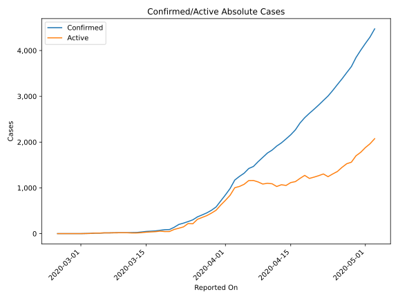
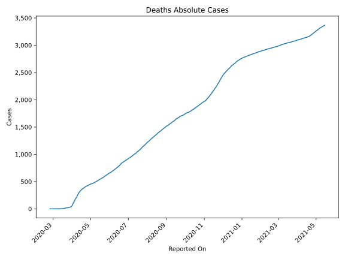
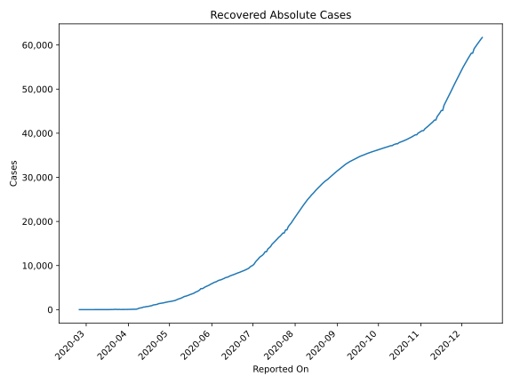
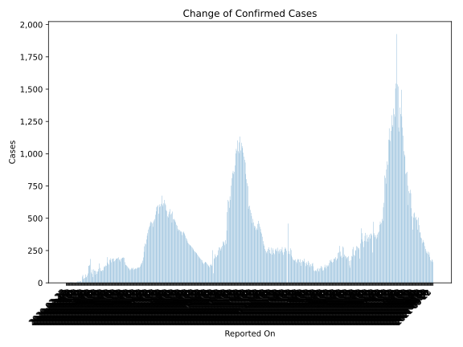
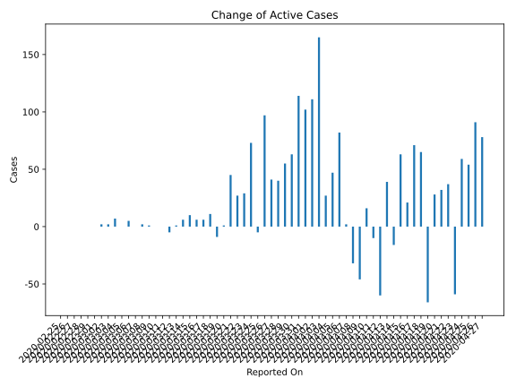
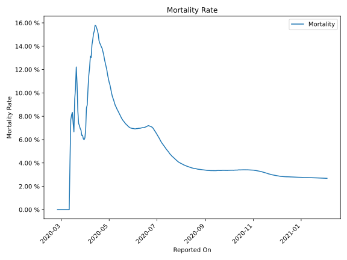

# Country Figures: Time Series for Algeria 

| Reported On | Confirmed | Deaths | Recovered | Active | Mortality | &Delta; Confirmed | &Delta; Deaths | &Delta; Active | % Active of Population |
|-------------|-----------|--------|-----------|--------|-----------|-------------------|----------------|----------------|------------------------|
| 2020-04-08 | 1572 | 205 | 237 | 1130 |  13.04 %  | 104 | 12 | -32 |  0.003 %  | 
| 2020-04-07 | 1468 | 193 | 113 | 1162 |  13.15 %  | 45 | 20 | 2 |  0.003 %  | 
| 2020-04-06 | 1423 | 173 | 90 | 1160 |  12.16 %  | 103 | 21 | 82 |  0.003 %  | 
| 2020-04-05 | 1320 | 152 | 90 | 1078 |  11.52 %  | 69 | 22 | 47 |  0.003 %  | 
| 2020-04-04 | 1251 | 130 | 90 | 1031 |  10.39 %  | 80 | 25 | 27 |  0.002 %  | 
| 2020-04-03 | 1171 | 105 | 62 | 1004 |  8.97 %  | 185 | 19 | 165 |  0.002 %  | 
| 2020-04-02 | 986 | 86 | 61 | 839 |  8.72 %  | 139 | 28 | 111 |  0.002 %  | 
| 2020-04-01 | 847 | 58 | 61 | 728 |  6.85 %  | 131 | 14 | 102 |  0.002 %  | 
| 2020-03-31 | 716 | 44 | 46 | 626 |  6.15 %  | 132 | 9 | 114 |  0.001 %  | 
| 2020-03-30 | 584 | 35 | 37 | 512 |  5.99 %  | 73 | 4 | 63 |  0.001 %  | 
| 2020-03-29 | 511 | 31 | 31 | 449 |  6.07 %  | 57 | 2 | 55 |  0.001 %  | 
| 2020-03-28 | 454 | 29 | 31 | 394 |  6.39 %  | 45 | 3 | 40 |  0.001 %  | 
| 2020-03-27 | 409 | 26 | 29 | 354 |  6.36 %  | 42 | 1 | 41 |  0.001 %  | 
| 2020-03-26 | 367 | 25 | 29 | 313 |  6.81 %  | 65 | 4 | 97 |  0.001 %  | 
| 2020-03-25 | 302 | 21 | 65 | 216 |  6.95 %  | 38 | 2 | -5 |  0.001 %  | 
| 2020-03-24 | 264 | 19 | 24 | 221 |  7.20 %  | 34 | 2 | 73 |  0.001 %  | 
| 2020-03-23 | 230 | 17 | 65 | 148 |  7.39 %  | 29 | 0 | 29 |  0.000 %  | 
| 2020-03-22 | 201 | 17 | 65 | 119 |  8.46 %  | 62 | 2 | 27 |  0.000 %  | 
| 2020-03-21 | 139 | 15 | 32 | 92 |  10.79 %  | 49 | 4 | 45 |  0.000 %  | 
| 2020-03-20 | 90 | 11 | 32 | 47 |  12.22 %  | 3 | 2 | 1 |  0.000 %  | 
| 2020-03-19 | 87 | 9 | 32 | 46 |  10.34 %  | 13 | 2 | -9 |  0.000 %  | 
| 2020-03-18 | 74 | 7 | 12 | 55 |  9.46 %  | 14 | 3 | 11 |  0.000 %  | 
| 2020-03-17 | 60 | 4 | 12 | 44 |  6.67 %  | 6 | 0 | 6 |  0.000 %  | 
| 2020-03-16 | 54 | 4 | 12 | 38 |  7.41 %  | 6 | 0 | 6 |  0.000 %  | 
| 2020-03-15 | 48 | 4 | 12 | 32 |  8.33 %  | 11 | 1 | 10 |  0.000 %  | 
| 2020-03-14 | 37 | 3 | 12 | 22 |  8.11 %  | 11 | 1 | 6 |  0.000 %  | 
| 2020-03-13 | 26 | 2 | 8 | 16 |  7.69 %  | 2 | 1 | 1 |  0.000 %  | 
| 2020-03-12 | 24 | 1 | 8 | 15 |  4.17 %  | 4 | 1 | -5 |  0.000 %  | 
| 2020-03-11 | 20 | 0 | 0 | 20 |  None  | 0 | 0 | 0 |  0.000 %  | 
| 2020-03-10 | 20 | 0 | 0 | 20 |  None  | 0 | 0 | 0 |  0.000 %  | 
| 2020-03-09 | 20 | 0 | 0 | 20 |  None  | 1 | 0 | 1 |  0.000 %  | 
| 2020-03-08 | 19 | 0 | 0 | 19 |  None  | 2 | 0 | 2 |  0.000 %  | 
| 2020-03-07 | 17 | 0 | 0 | 17 |  None  | 0 | 0 | 0 |  0.000 %  | 
| 2020-03-06 | 17 | 0 | 0 | 17 |  None  | 5 | 0 | 5 |  0.000 %  | 
| 2020-03-05 | 12 | 0 | 0 | 12 |  None  | 0 | 0 | 0 |  0.000 %  | 
| 2020-03-04 | 12 | 0 | 0 | 12 |  None  | 7 | 0 | 7 |  0.000 %  | 
| 2020-03-03 | 5 | 0 | 0 | 5 |  None  | 2 | 0 | 2 |  0.000 %  | 
| 2020-03-02 | 3 | 0 | 0 | 3 |  None  | 2 | 0 | 2 |  0.000 %  | 
| 2020-03-01 | 1 | 0 | 0 | 1 |  None  | 0 | 0 | 0 |  0.000 %  | 
| 2020-02-29 | 1 | 0 | 0 | 1 |  None  | 0 | 0 | 0 |  0.000 %  | 
| 2020-02-28 | 1 | 0 | 0 | 1 |  None  | 0 | 0 | 0 |  0.000 %  | 
| 2020-02-27 | 1 | 0 | 0 | 1 |  None  | 0 | 0 | 0 |  0.000 %  | 
| 2020-02-26 | 1 | 0 | 0 | 1 |  None  | 0 | 0 | 0 |  0.000 %  | 
| 2020-02-25 | 1 | 0 | 0 | 1 |  None  | None | None | None |  0.000 %  | 

