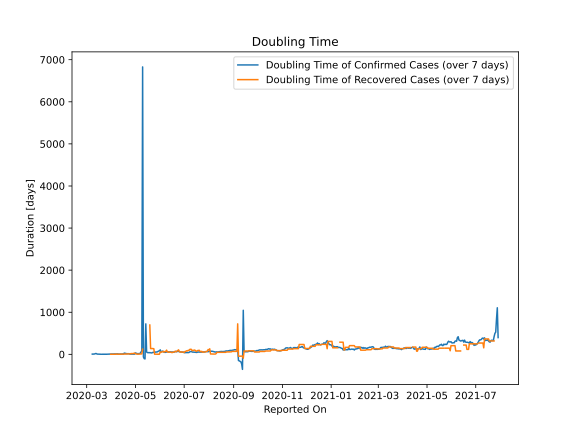

# Country Figures: New Infections in Previous 7 Days per 100,000 Population for Ecuador 

<!--  --> 

| Reported On | &Delta; Confirmed (on the day) | &Delta; Confirmed (last 7 days) | New Cases in Previous 7 Days per 100,000 Population |
|-------------|--------------------------------|---------------------------------|-----------------------------------------------------|
| 2020-05-08 |  -1480  |  2482  |  14.528  |
| 2020-05-07 |  -1583  |  5364  |  31.397  |
| 2020-05-06 |  None  |  7206  |  42.179  |
| 2020-05-05 |  None  |  7623  |  44.620  |
| 2020-05-04 |  2343  |  8641  |  50.578  |
| 2020-05-03 |  2074  |  6819  |  39.914  |
| 2020-05-02 |  1128  |  4745  |  27.774  |
| 2020-05-01 |  1402  |  3617  |  21.171  |
| 2020-04-30 |  259  |  13751  |  80.489  |
| 2020-04-29 |  417  |  13825  |  80.922  |
| 2020-04-28 |  1018  |  13860  |  81.127  |
| 2020-04-27 |  521  |  13112  |  76.749  |
| 2020-04-26 |  None  |  13251  |  77.562  |
| 2020-04-25 |  None  |  13697  |  80.173  |
| 2020-04-24 |  11536  |  14269  |  83.521  |
| 2020-04-23 |  333  |  2958  |  17.314  |
| 2020-04-22 |  452  |  2992  |  17.513  |
| 2020-04-21 |  270  |  2795  |  16.360  |
| 2020-04-20 |  660  |  2599  |  15.213  |
| 2020-04-19 |  446  |  2002  |  11.718  |
| 2020-04-18 |  572  |  1765  |  10.331  |
| 2020-04-17 |  225  |  1289  |  7.545  |
| 2020-04-16 |  367  |  3260  |  19.082  |
| 2020-04-15 |  255  |  3408  |  19.948  |
| 2020-04-14 |  74  |  3856  |  22.570  |
| 2020-04-13 |  63  |  3782  |  22.137  |
| 2020-04-12 |  209  |  3820  |  22.360  |
| 2020-04-11 |  96  |  3792  |  22.196  |
| 2020-04-10 |  2196  |  3793  |  22.202  |
| 2020-04-09 |  515  |  1802  |  10.548  |
| 2020-04-08 |  703  |  1702  |  9.962  |
| 2020-04-07 |  None  |  1507  |  8.821  |
| 2020-04-06 |  101  |  1785  |  10.448  |
| 2020-04-05 |  181  |  1722  |  10.079  |
| 2020-04-04 |  97  |  1642  |  9.611  |
| 2020-04-03 |  205  |  1773  |  10.378  |
| 2020-04-02 |  415  |  1760  |  10.302  |
| 2020-04-01 |  508  |  1575  |  9.219  |
| 2020-03-31 |  278  |  1158  |  6.778  |
| 2020-03-30 |  38  |  981  |  5.742  |
| 2020-03-29 |  101  |  1135  |  6.644  |
| 2020-03-28 |  228  |  1317  |  7.709  |
| 2020-03-27 |  192  |  1228  |  7.188  |
| 2020-03-26 |  230  |  1204  |  7.047  |
| 2020-03-25 |  91  |  1062  |  6.216  |
| 2020-03-24 |  101  |  1024  |  5.994  |
| 2020-03-23 |  192  |  944  |  5.526  |
| 2020-03-22 |  283  |  761  |  4.454  |
| 2020-03-21 |  139  |  478  |  2.798  |
| 2020-03-20 |  168  |  350  |  2.049  |
| 2020-03-19 |  88  |  182  |  1.065  |
| 2020-03-18 |  53  |  94  |  0.550  |
| 2020-03-17 |  21  |  43  |  0.252  |
| 2020-03-16 |  9  |  22  |  0.129  |
| 2020-03-15 |  None  |  14  |  0.082  |
| 2020-03-14 |  11  |  15  |  0.088  |
| 2020-03-13 |  None  |  4  |  0.023  |
| 2020-03-12 |  None  |  4  |  0.023  |
| 2020-03-11 |  2  |  7  |  0.041  |
| 2020-03-10 |  None  |  8  |  0.047  |
| 2020-03-09 |  1  |  9  |  0.053  |
| 2020-03-08 |  1  |  8  |  0.047  |
| 2020-03-07 |  None  |  7  |  0.041  |
| 2020-03-06 |  None  |  7  |  0.041  |
| 2020-03-05 |  3  |  7  |  0.041  |
| 2020-03-04 |  3  |  4  |  0.023  |
| 2020-03-03 |  1  |  1  |  0.006  |
| 2020-03-02 |  None  |  None  |  None  |
| 2020-03-01 |  None  |  None  |  None  |

