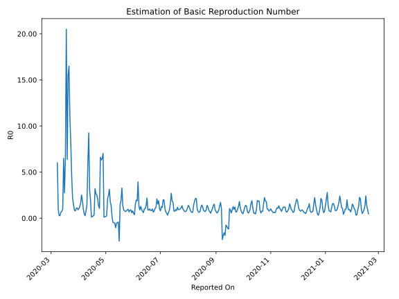

# Country Figures: Time Series for Basic Reproduction Number of Ecuador 

| Reported On | &Delta; Confirmed | Total &Delta; Confirmed First Interval | Total &Delta; Confirmed Second Interval | Estimated Basic Reproduction Number R0 | 
|-------------|-------------------|----------------------------------------|-----------------------------------------|---------------------------------------------------|
| 2020-05-02 | 1128 |  3096  |  12057  |  0.26  | 
| 2020-05-01 | 1402 |  2215  |  11869  |  0.19  | 
| 2020-04-30 | 259 |  1956  |  12321  |  0.16  | 
| 2020-04-29 | 417 |  1539  |  12591  |  0.12  | 
| 2020-04-28 | 1018 |  12057  |  1715  |  7.03  | 
| 2020-04-27 | 521 |  11869  |  1828  |  6.49  | 
| 2020-04-26 | 0 |  12321  |  1948  |  6.32  | 
| 2020-04-25 | 0 |  12591  |  1903  |  6.62  | 
| 2020-04-24 | 11536 |  1715  |  1610  |  1.07  | 
| 2020-04-23 | 333 |  1828  |  1419  |  1.29  | 
| 2020-04-22 | 452 |  1948  |  921  |  2.12  | 
| 2020-04-21 | 270 |  1903  |  759  |  2.51  | 
| 2020-04-20 | 660 |  1610  |  601  |  2.68  | 
| 2020-04-19 | 446 |  1419  |  442  |  3.21  | 
| 2020-04-18 | 572 |  921  |  2564  |  0.36  | 
| 2020-04-17 | 225 |  759  |  3016  |  0.25  | 
| 2020-04-16 | 367 |  601  |  3510  |  0.17  | 
| 2020-04-15 | 255 |  442  |  3414  |  0.13  | 
| 2020-04-14 | 74 |  2564  |  1319  |  1.94  | 
| 2020-04-13 | 63 |  3016  |  985  |  3.06  | 
| 2020-04-12 | 209 |  3510  |  379  |  9.26  | 
| 2020-04-11 | 96 |  3414  |  584  |  5.85  | 
| 2020-04-10 | 2196 |  1319  |  898  |  1.47  | 
| 2020-04-09 | 515 |  985  |  1225  |  0.80  | 
| 2020-04-08 | 703 |  379  |  1406  |  0.27  | 
| 2020-04-07 | 0 |  584  |  1239  |  0.47  | 
| 2020-04-06 | 101 |  898  |  925  |  0.97  | 
| 2020-04-05 | 181 |  1225  |  645  |  1.90  | 
| 2020-04-04 | 97 |  1406  |  559  |  2.52  | 
| 2020-04-03 | 205 |  1239  |  751  |  1.65  | 
| 2020-04-02 | 415 |  925  |  741  |  1.25  | 
| 2020-04-01 | 508 |  645  |  614  |  1.05  | 
| 2020-03-31 | 278 |  559  |  614  |  0.91  | 
| 2020-03-30 | 38 |  751  |  667  |  1.13  | 
| 2020-03-29 | 101 |  741  |  715  |  1.04  | 
| 2020-03-28 | 228 |  614  |  782  |  0.79  | 
| 2020-03-27 | 192 |  614  |  678  |  0.91  | 
| 2020-03-26 | 230 |  667  |  448  |  1.49  | 
| 2020-03-25 | 91 |  715  |  330  |  2.17  | 
| 2020-03-24 | 101 |  782  |  171  |  4.57  | 
| 2020-03-23 | 192 |  678  |  83  |  8.17  | 
| 2020-03-22 | 283 |  448  |  41  |  10.93  | 
| 2020-03-21 | 139 |  330  |  20  |  16.50  | 
| 2020-03-20 | 168 |  171  |  11  |  15.55  | 
| 2020-03-19 | 88 |  83  |  13  |  6.38  | 
| 2020-03-18 | 53 |  41  |  2  |  20.50  | 
| 2020-03-17 | 21 |  20  |  3  |  6.67  | 
| 2020-03-16 | 9 |  11  |  4  |  2.75  | 
| 2020-03-15 | 0 |  13  |  2  |  6.50  | 
| 2020-03-14 | 11 |  2  |  2  |  1.00  | 
| 2020-03-13 | 0 |  3  |  4  |  0.75  | 
| 2020-03-12 | 0 |  4  |  6  |  0.67  | 
| 2020-03-11 | 2 |  2  |  7  |  0.29  | 
| 2020-03-10 | 0 |  2  |  7  |  0.29  | 
| 2020-03-09 | 1 |  4  |  4  |  1.00  | 
| 2020-03-08 | 1 |  6  |  1  |  6.00  | 
| 2020-03-07 | 0 |  7  |  None  |  None  | 
| 2020-03-06 | 0 |  7  |  None  |  None  | 
| 2020-03-05 | 3 |  4  |  None  |  None  | 
| 2020-03-04 | 3 |  1  |  None  |  None  | 
| 2020-03-03 | 1 |  None  |  None  |  None  | 
| 2020-03-02 | 0 |  None  |  None  |  None  | 
| 2020-03-01 | None |  None  |  None  |  None  | 

